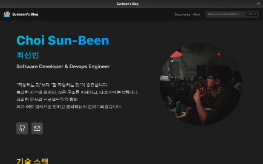

# Nextra Docs TypeScript Sample

This is Sunbeen Choi's Nextra Blog
---

## 🚀 Getting Started

To run this project locally:

```bash
# Install dependencies
npm install
# or
yarn
# or
pnpm install
# or
bun install

# Start the dev server
npm run dev
# or
yarn dev
# or
pnpm dev
# or
bun dev

```


