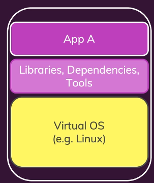

# Docker

## 🔹 Docker란 무엇인가?

**Docker는 "컨테이너 기술"을 이용해 소프트웨어를 실행하는 도구 (컨테이너 런타임)이다.**

### ✅ 핵심 정의

- **Docker는 컨테이너를 생성하고 관리하는 도구다.**

## 🔹 컨테이너란?

**컨테이너는 코드와 그 코드가 실행되기 위한 모든 종속성을 포함한 패키지이다.**

### 컨테이너 내부 요소

- 애플리케이션 소스코드 (예: `app.js`)
- 런타임 (예: Node.js)
- 실행에 필요한 라이브러리, 설정파일, 기타 툴

이 모든 것이 포함된 상태로 **하나의 단위로 포장(packaged)** 되어 있다.

### 컨테이너 특징

| 특징      | 설명                                                                 |
| --------- | -------------------------------------------------------------------- |
| ✅ 독립성 | 다른 시스템, 운영체제, 장비와 무관하게 동일하게 실행됨               |
| ✅ 이식성 | 개발 환경에서 만든 컨테이너를 운영 환경에서도 **동일하게** 실행 가능 |
| ✅ 일관성 | "내 PC에선 되는데 서버에선 안돼"라는 문제가 사라짐                   |

## 🔹 도커는 무엇을 해주는가?

- **컨테이너 런타임**이라고 불리며 **컨테이너를 만들고**, **실행하고**, **관리해주는 도구**다.
- 도커 자체가 애플리케이션을 실행시키는 것이 아니라, **컨테이너를 통해 실행 환경을 제공**하는 것이다.

---

### 🔹 왜 Docker와 컨테이너가 필요한가?

### 문제: 실행 환경의 불일치

### ⚠️ 개발 ↔ 운영 환경이 다름

- 개발자는 로컬에서 Node.js 14로 실행
- 운영 서버는 Node.js 18 → 예기치 못한 에러 발생

> 💡 “개발 환경과 운영 환경이 같아야 한다”

### ⚠️ 팀원 간 로컬 개발 환경이 다름

- A는 되는데 B는 안 됨
- 이유: OS, 라이브러리 버전, Node 버전 다름

> 💡 “팀 전체가 동일한 개발 환경을 써야 한다”

### ⚠️ 여러 프로젝트 간 도구 충돌

- 프로젝트 A는 Python 3.9
- 프로젝트 B는 Python 3.11

> 💡 “프로젝트마다 독립적인 환경이 필요하다”

기존 해결책: **버츄얼 머신(VM)**

재현 가능한 환경문제는 버츄얼 머신으로 해결가능 하지만, 다음과 같은 장단점이 존재합니다.

- 장점
  - 완전히 격리된 환경 제공 (OS 포함)
  - 재현 가능하고 이식 가능
- 단점
  - VM은 OS 전체를 포함하여 리소스를 많이 씀 (RAM, CPU, 디스크)
  - 부팅 시간 길고 실행 속도 느림
  - 하나의 앱을 위해 전체 운영체제까지 포함하므로 낭비
  - 배포와 복제가 번거롭고 느림
    - 버츄얼 머신에서 돌아가는것을 납품받는 업체가 그렇게 사용하고 싶지 않을 수 있다.

버츄어 머신을 사용한다는것은 가상 OS를 캡슐화시켜 사용한다는 의미와 동일합니다.

1. 개인 운영체제 위에(Windows) 가상 운영체제 (Linux)를 설치한다.
2. 소스코드와 필요 종속성을 가상 운영체제에 설치한다.
3. 모든 종속성을 포함한 가상 환경을 배포하여, 사용한다.

버츄얼 머신을 사용하면 필요한 작업 외에 추가로 들어가는 자원/시간/비용이 증가합니다.

- 메모리 오버헤드
  - VM마다 자체 OS를 구동하니까 메모리를 많이 잡아먹음
- 성능 오버헤드
  - 실제 머신 위에 또 다른 머신을 얹는 구조라 실행 속도가 느려짐
- 디스크 오버헤드
  - 각각의 VM이 전체 운영체제 + 애플리케이션을 가지니까 용량 낭비
- 관리 오버헤드
  - VM마다 업데이트, 설정, 보안 패치 등 관리할 게 많아짐
- ※ 오버 헤드 : 필요한 작업 외에 추가로 들어가는 자원/시간/비용

### 버츄얼 머신

- 각 VM이 **자기만의 운영체제(OS)**를 갖고 있음
- 마치 진짜 컴퓨터처럼 작동해서 무겁고 느림
- 예: Windows 안에 우분투를 설치한 VM을 3개 돌린다고 하면, **OS만 3개**가 돌아가고 있음 → 오버헤드

### 컨테이너

- 컨테이너는 **호스트 운영체제의 커널(핵심 부분)**을 **공유**함
- 즉, **운영체제를 또 설치하지 않고**, 마치 가상 머신처럼 **분리된 실행 환경만 만든다**
- 이걸 가능하게 하는 게 **도커 엔진 (Docker Engine)**

### 컨테이너 배포 (공유와 재현이 쉽다)

- Dockerfile **컨테이너 정의**
  - 사용 OS 설정
  - 언어 런타임(Node.js 등) 설정
  - 파일 복사
  - 명령어 수행
- **이미지(Image) 빌드**
  - `Dockerfile` 이용해 **Docker 이미지**를 만들 수 있습니다.
  - 이미지는 **컨테이너의 실행 사본**
  - 이미지에는 앱 실행에 필요한 모든 것(코드, 런타임, 설정 등)이 포함
- 쉬운 공유
  - 만들어진 이미지를 **다른 사람들과 공유** 가능
    - DockerHub, AWS ECR, GitHub Container Registry 등
  - 이미지를 내려받아 **바로 컨테이너 실행** 가능
    - 개발자 A → 개발자 B 운영 서버도 **그대로 재현** 가능
      도

도커 설치시

Windows 10 Hyper-V

**WSL 2 (Windows Subsystem for Linux 2)** 기능을 활성화

본 문서는 [Udemy 강의: Docker & Kubernetes : 실전 가이드](https://www.udemy.com/course/docker-kubernetes-2022/?couponCode=ST16MT230625G2)의 내용을 바탕으로 학습한 내용을 정리한 것입니다.