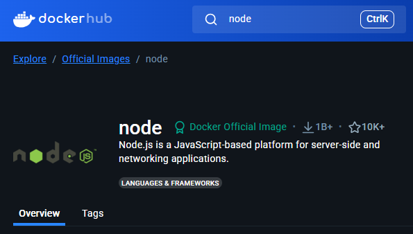

# 컨테이너와 이미지

## 컨테이너

- 애플리케이션 실행 단위
- 웹사이트, Node 서버, 앱 등 실제로 실행 중인 소프트웨어 환경을 의미
- 이미지를 바탕으로 만들어진 **실행 인스턴스**
- 컨테이너는 **이미지를 읽어서 사용하며, 바꿀 수는 없습니다.**
- 컨테이너 안에서 변경이 생기면 → **변경된 내용만 따로 얇은 레이어(쓰기 가능한 영역)에 저장**
  - 컨테이너 레이어
- 여러 컨테이너가 **동일한 이미지를 공유**할 수 있음
- 컨테이너마다 변경사항은 분리되어 **서로 간섭하지 않음**
- 이미지 자체는 **절대 변하지 않음 (불변성, reproducibility)**

## **이미지**

- 이미지는 컨테이너를 만들기 위한 설계도 (템플릿)
- 코드, 라이브러리, 설정 파일 등 실행에 필요한 모든 요소가 들어있는 패키지
- 이미지 = 실행할 준비가 끝난 "앱 패키지”
- 이미지를 기반으로 컨테이너가 만들어지고 실행

```docker
┌──────────────────────────────────┐
│     Docker Image (읽기 전용)     │ ← 모든 컨테이너가 공유
│  - Ubuntu OS                     │
│  - Node.js 런타임                │
│  - 내 코드                       │
│  - npm install 결과              │
└──────────────────────────────────┘
▲          ▲
│          │
│          │
│    ┌────────────────────────────┐
│    │  Container A               │ ← 위 이미지 + A만의 실행 변화 저장
│    │  - 로그                    │
│    │  - temp.txt 파일 생성       │
│    └────────────────────────────┘
│
└┌────────────────────────────┐
 │  Container B               │ ← 같은 이미지 사용하지만 A와는 별개
 │  - 다른 설정 파일          │
 │  - 다른 로그               │
 └────────────────────────────┘
```

### 이미지 vs 컨테이너

| 항목 | 이미지(Image)                          | 컨테이너(Container)            |
| ---- | -------------------------------------- | ------------------------------ |
| 역할 | 설계도, 템플릿                         | 실행된 인스턴스                |
| 상태 | 정적 (읽기 전용)                       | 동적 (실행 중)                 |
| 내용 | 코드 + 실행 도구 + 설정 명령 포함      | 실행되는 애플리케이션 환경     |
| 예시 | Node.js 앱의 설정과 코드가 담긴 이미지 | 해당 앱이 실제로 실행되는 환경 |

### 컨테이너를 실행하기 위한 이미지 준비 방법

- 이미 존재하는 이미지 사용
- 직접 **이미지를 생성** (→ Dockerfile)

### 이미 존재하는 이미지 사용하기

- 이미지 저장소 = [hub.docker.com](https://hub.docker.com/)
- Google에 `Docker Hub` 검색해도 됨

### 예시) Docker Hub- node



- Node.js 공식 이미지 확인 가능
- 해당 이미지는 공식 Node 팀이 관리

터미널 docker run node 실행

```bash
docker run node
```

- 로컬에 Node 이미지가 없다면 Docker Hub에서 가져온다.
- 다운로드 완료 후, 컨테이너 실행
- 기본적으로 컨테이너는 주변과 격리 된 상태
- 컨테이너 내부에서 실행 중이기 때문에 우리에게 바로 보여지지 않음
- 눈에 띄는 결과가 없고, 곧 종료됨

- docker ps :
  - 현재 **실행 중인 컨테이너 목록** 출력
- docker ps -a
- 종료된 컨테이너를 포함한 모든 컨테이너 목록 출력

```bash
docker ps

CONTAINER ID   IMAGE     COMMAND       STATUS         PORTS     NAMES
f8e1d2a678b4   node      "node"        Up 5 minutes   ...       quirky_hopper

docker ps -a

CONTAINER ID   IMAGE     COMMAND       STATUS                     NAMES
c2f3b8d456a8   node      "node"        Exited (0) 2 minutes ago   epic_brown
f8e1d2a678b4   node      "node"        Up 10 seconds              quirky_hopper
```

인터랙티브 모드로 다시 실행

```bash
docker run -it node
```

- -it 플래그:
  - i : 인터랙티브 모드
  - t : 터미널 모드

Node.js REPL 터미널에 직접 접근 가능

본 문서는 [Udemy 강의: Docker & Kubernetes : 실전 가이드](https://www.udemy.com/course/docker-kubernetes-2022/?couponCode=ST16MT230625G2)의 내용을 바탕으로 학습한 내용을 정리한 것입니다.