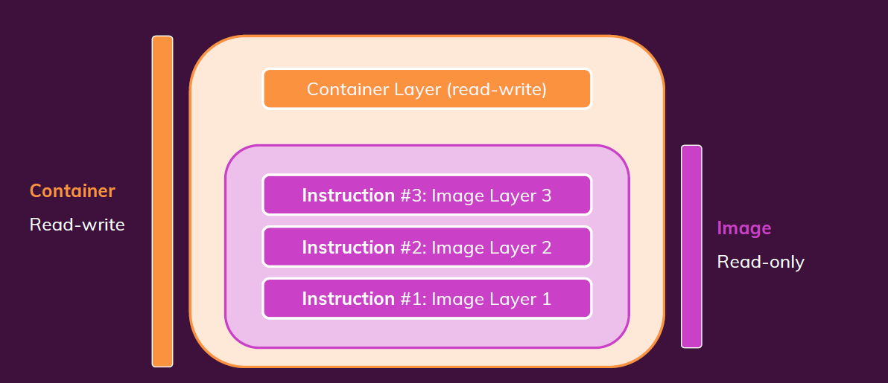

# Docker 데이터 관리 및 볼륨

### ✅ 이번 모듈의 핵심 목표

1. **이미지와 컨테이너의 데이터 관리 방식 이해**
   - 지금까지는 코드가 포함된 형태로만 다뤘지만,
   - 이제는 **다양한 종류의 데이터**를 어떻게 다룰 수 있는지 배움.
2. **데이터 연결 방식 학습**
   - 다른 폴더(호스트의 디렉터리 등)와 연결하는 방법
   - \*볼륨(Volumes)\*\*이라는 도커 내장 기능에 대한 심층 학습
3. **환경 설정 요소 탐구**
   - \*인수(Arguments)**와 **환경 변수(Environment Variables)\*\* 사용법
   - 이미지 및 컨테이너에서 이를 어떻게 설정하고 활용하는지

### 🟣 1. Application (Code + Environment)

- 우리가 작성한 소스 코드와 환경 설정입니다.
- 일반적으로 `Dockerfile`을 통해 이미지에 포함됩니다.
- 예: `index.js`, `package.json`, 환경변수 설정 등

| 항목      | 설명                                      |
| --------- | ----------------------------------------- |
| 작성자    | 개발자(나)                                |
| 포함 시점 | 이미지 빌드 단계에서 추가됨               |
| 특성      | 고정됨 — 이미지가 만들어진 뒤엔 변경 불가 |
| 저장 위치 | 📦 **읽기 전용 → Docker Image**           |

💡 **이유**: 실행 중인 컨테이너에서 소스 코드를 변경하지 않도록 보장하기 위해 **불변(immutable)** 구조로 설계됩니다.

---

### 🟠 2. Temporary App Data (예: 사용자 입력값)

- 실행 중인 컨테이너 내에서 생성되는 **일시적인 데이터**입니다.
- 예: 사용자 입력, 처리 중 생긴 캐시 파일, 임시 로그 등

| 항목      | 설명                                            |
| --------- | ----------------------------------------------- |
| 생성 시점 | 컨테이너가 실행 중일 때                         |
| 저장 위치 | 메모리 또는 임시 파일                           |
| 특성      | 자주 변경되고, 컨테이너 종료 시 삭제됨          |
| 저장 위치 | 🧱 **읽기/쓰기 가능 → 컨테이너 내부(RW Layer)** |

💡 **이유**: 휘발성이므로, 특별한 보존이 필요하지 않습니다.

개발 중 디버깅, 세션 관리 등에서 사용될 수 있습니다.



---

### 🟤 3. Permanent App Data (예: 사용자 계정, DB)

- 애플리케이션이 생성하며 **장기 보존이 필요한 데이터**입니다.
- 예: 데이터베이스, 설정파일, 로그 기록 등

| 항목      | 설명                                                       |
| --------- | ---------------------------------------------------------- |
| 생성 시점 | 컨테이너 실행 중                                           |
| 저장 위치 | 파일 또는 데이터베이스                                     |
| 특성      | 컨테이너가 재시작/삭제되어도 **절대 사라지면 안 됨**       |
| 저장 위치 | 🧱 + 📁 **읽기/쓰기 가능 + 영구 저장 → 컨테이너 + Volume** |

💡 **이유**: 배포를 반복해도 데이터가 살아 있어야 하므로,

컨테이너 바깥의 **Volume**에 따로 보관합니다.

## 🔍 Docker Volume의 정의

Docker에서 실행되는 컨테이너는 **격리된 환경** 을 가지며,

컨테이너 내부에서 생성된 데이터는 기본적으로 **휘발성** 입니다.

따라서 컨테이너가 삭제되면 해당 데이터도 함께 사라집니다.

- **Docker Volume은 컨테이너 외부**, 즉 **호스트 머신에 위치한 디렉토리입니다.**
- 도커가 **공식적으로 지원하는 데이터 지속성 방법**입니다.
- 여러 컨테이너에서 하나의 볼륨을 공용으로 사용할 수 도 있습니다.
- 컨테이너 내부의 특정 경로와 **양방향으로 연결(매핑)**됩니다.
- Docker가 **자체적으로 관리**하는 호스트의 저장 공간에서 관리됩니다.
  - 사용자가 직접적으로 접근해서 사용하면 안됩니다.

```bash
Dockerfile

# VOLUME 영역으로 사용할 컨테이너 내부 디렉토리
VOLUME [ "/app/feedback"]
```

### Docker 컨테이너 생성 및 실행 (익명 볼륨)

- 도커를 실행하면 볼륨이 생성되며 docker volume ls 로 생성된 리스트를 확인할 수 있습니다.
- 명명하지 않고 생성된 볼륨을 익명 볼륨이라고 부릅니다.
- 익명 볼륨은 만들어진 용도를 파악하기 힘들며, 사용하기 힘듭니다.

```bash
docker run -d -p 3000:80 --rm --name feedback-app feedback-node
```


### 1. 컨테이너 실행 `--rm` 옵션 사용 ON:

- 컨테이너 종료 시 **컨테이너와 함께 익명 볼륨도 자동 삭제**됨

### 2. 컨테이너 실행 `--rm` 옵션 사용 OFF

- 컨테이너를 수동으로 `docker rm`으로 삭제해도
  **익명 볼륨은 자동 삭제되지 않음**
- 컨테이너를 새로 실행하면 **새 익명 볼륨이 생성되서 사용**
- 결과적으로 사용되지 않는 익명 볼륨이 계속 **쌓임 (사용 공간 낭비)**
- 익명 볼륨 하나씩 삭제
  ```bash
  docker volume rm <볼륨이름>
  ```
- 한 번에 정리
  ```bash
  docker volume prune
  ```

### 명명된 볼륨 사용하기

```bash
docker run -d --rm -p 3000:80 \
  -v feedback:/app/feedback \ # 볼륨 명명하기
  --name feedback-app feedback-node

 docker run -d --rm -p 3000:80 \
  -v feedback:/app/feedback \ # 볼륨 명명하기
  -v "D:/00_Mario/99.Sunbeen/01 Study/04 Docker/46 data-volumes-01-starting-setup/data-volumes-01-starting-setup:/app" \
  --name feedback-app feedback-node
```

- `-v feedback:/app/feedback`
  → `feedback`이라는 이름의 볼륨을 만들어 `/app/feedback`에 연결합니다.
- 컨테이너 제거 (예: `docker stop` + `-rm`) 후에도
  → 볼륨에 있는 데이터는 **영구 보존**
- 동일한 `-v feedback:/app/feedback` 옵션으로 새로운 컨테이너를 실행하면
  → **이전 데이터 그대로 사용 가능**

### 바인드 마운트 (Bind Mounts)

- 문제점
  - 컨테이너 내부에서 실행되는 앱은 **이미지에 스냅샷처럼 복사된 코드만 사용**함
  - 따라서 **로컬에서 코드 수정 → 컨테이너에 자동 반영되지 않음**
- 개념
  - 호스트의 **특정 폴더**를 **컨테이너 내부 경로에 직접 연결**
  - 컨테이너는 실시간으로 **호스트의 변경사항을 바로 반영**
  - 개발 중에는 매우 유용

```bash
docker run -v /경로:/컨테이너/경로 …
```

### 바인드 마운트 예제

- Dockerfile 및 소스 코드 전부가 포함된 ./
- 컨테이너 폴더 /app

```docker
#Dockerfile

FROM node:14
WORKDIR /app
COPY package.json /app
RUN npm install
COPY . .
EXPOSE 80
VOLUME [ "/app/feedback"] # Volume 생성
CMD ["node", "server.js"]
```

임시 볼륨을 생성하여, 현재 폴더와 컨테이너 /app간 바인드 마운트

```docker
docker run \
  -v $(pwd):/app \        # 바인드 마운트 (소스코드 반영)
	-v feedback:/app/feedback \
  feedback-node           # 이미지 명
```

### 문제점

현재 경로로 npm install이 수행되어도, 바인드 마운트에 의해

node_modules에 사용된 모든 의존성들이 지워지게 된다.

### 해결법

더 구체적인 경로의 볼륨을 바인드 하면 `/app/node_modules` 경로의 바인드 마운트보다 우선됩니다.
컨테이너 내부에서 생성된 `node_modules`를 유지 가능

## 볼륨의 종류

## 1. 익명 볼륨 (Anonymous Volume)

- `docker run -v /app/data`처럼 **이름 없이 경로만 지정**하면 생성됩니다.
- 컨테이너가 제거되면 함께 삭제됩니다.
- `-rm` 옵션을 사용할 경우, 컨테이너 종료 시 자동 삭제됩니다.
- **재사용이나 공유 목적에는 부적합**하지만,
  - `node_modules`와 같이 덮어쓰기를 방지하거나,
  - `/app/temp`처럼 일시적 데이터를 성능 최적화 목적으로 분리할 때 유용합니다.
- 호스트 시스템 어딘가에 실제 디렉토리가 생성되며, 실행 중에만 존재합니다.

## 2. 명명된 볼륨 (Named Volume)

- `docker run -v my-volume:/app/data`처럼 **이름을 명시**하면 생성됩니다.
- 컨테이너를 제거해도 **볼륨은 유지**됩니다.
- **컨테이너 간 데이터 공유**나 **데이터 지속성 유지**에 적합합니다.
- 도커 명령어로만 제거 가능 (`docker volume rm`, `docker volume prune` 등)
- Dockerfile에서 직접 생성할 수는 없고, `docker run` 시 지정해야 합니다.

> 사용 예: 데이터베이스의 데이터, 업로드 파일 저장 등

## 3. 바인드 마운트 (Bind Mount)

- `docker run -v /host/path:/app/data`처럼 **호스트 시스템의 절대 경로**를 명시합니다.
- 실제 내 컴퓨터의 디렉토리와 컨테이너 내부 디렉토리를 직접 연결합니다.
- **로컬에서 코드를 수정하면 즉시 반영**되므로, 개발 환경에서 매우 유용합니다.
- 도커 명령으로는 삭제할 수 없으며, 직접 로컬 디렉토리를 삭제해야 합니다.
- 컨테이너 종료 후에도 데이터는 그대로 남아 있습니다.

> 사용 예: 로컬 개발 중 코드 핫 리로드, 환경설정 파일 관리

## 읽기 전용 바인드 마운트

도커에서 볼륨은 기본적으로 **읽기/쓰기 가능(read-write)** 합니다.

바인드 마운트를 통해 **컨테이너 내부에서 해당 디렉토리를 읽기 전용으로 제한**할 수 있습니다.

```bash
docker run -v /로컬/경로:/컨테이너/경로:ro ...
```

위처럼 `:ro`를 추가하면, 컨테이너는 해당 경로에 **쓰기(write)** 할 수 없고 **읽기(read)** 만 할 수 있게 됩니다.

- 읽기 전용으로 사용하는 이유
  - **보안**: 실수로 컨테이너 내부 애플리케이션이 로컬 소스를 변경하는 것을 방지합니다.
  - **명확한 의도**: 코드 수정은 개발자가 로컬에서만 가능하도록 제한합니다.
  - **신뢰성**: 개발 환경과 배포 환경의 일관성을 유지할 수 있습니다.

### 읽기 전용 바인드 마운트 + 쓰기 가능한 볼륨 예시

```bash
docker run \
-v $(pwd):/app:ro \
-v feedback-vol:/app/feedback \
-v /app/node_modules \
-v /app/temp \
```

### Docker Volume 주요 명령어

```bash
# 볼륨 목록 보기
docker volume ls

# 볼륨 생성
docker volume create my-volume

# 볼륨 정보 확인
docker volume inspect my-volume

# 볼륨 삭제
docker volume rm my-volume

# 사용하지 않는 모든 볼륨 삭제
docker volume prune
```

## Bind Mount vs COPY

- **바인드 마운트 : 개발 환경**
- **COPY : 배포(프로덕션)용 이미지 스냅샷 활용**

### 개발 환경

- `docker run -v $(pwd):/app` 으로 **호스트 소스 코드를 바인드 마운트**
- Dockerfile의 `COPY . .`는 **불필요**하며, 주석 처리해도 동작
  - 바인드 마운트를 수행하며 모든 파일이 덮어 씌워지는 동작 수행

### 배포 환경

- `docker run` 시 `v` 옵션을 **사용하지 않음** (바인드 마운트 없음)
- 이때는 이미지에 코드가 **포함되어 있어야만** 앱이 동작함

`COPY`는 소스 코드의 **스냅샷을 이미지에 고정**하는 방식
완성된 코드와 의존성만 담긴 **재현 가능한 배포 이미지**가 만들어짐
