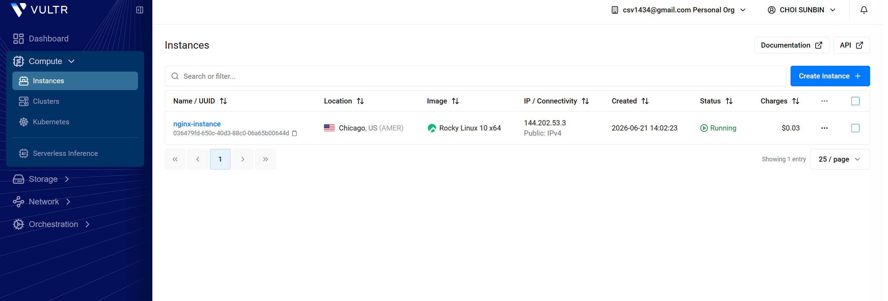
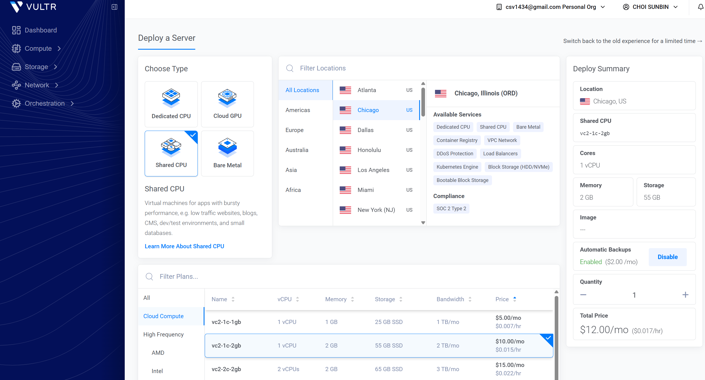
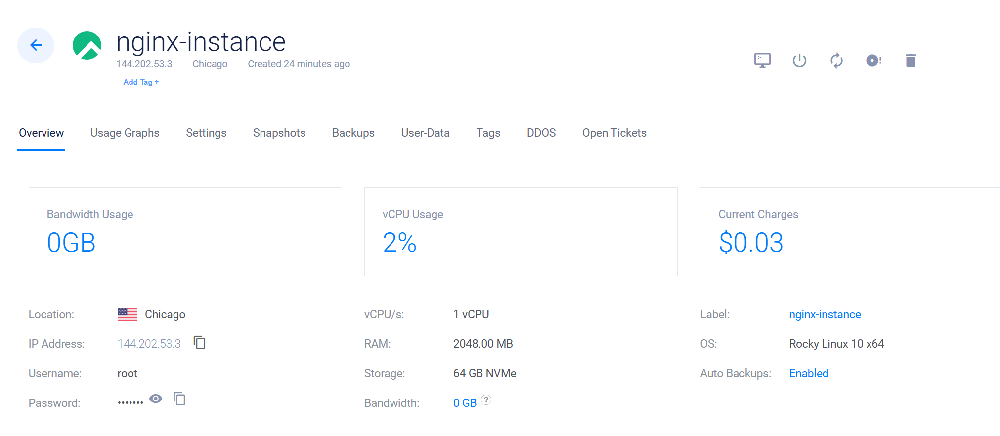
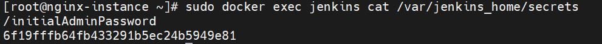
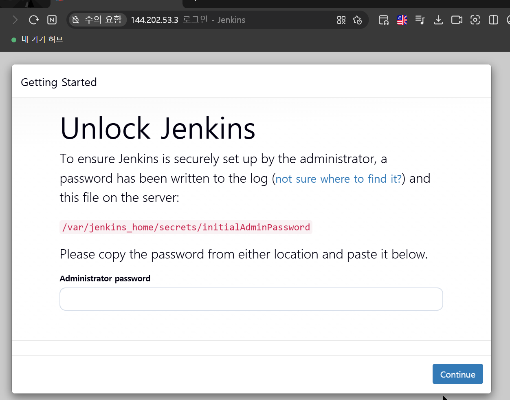
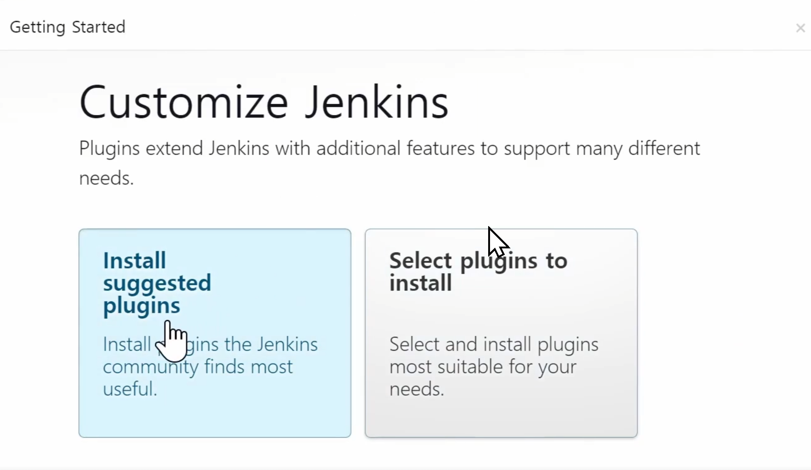
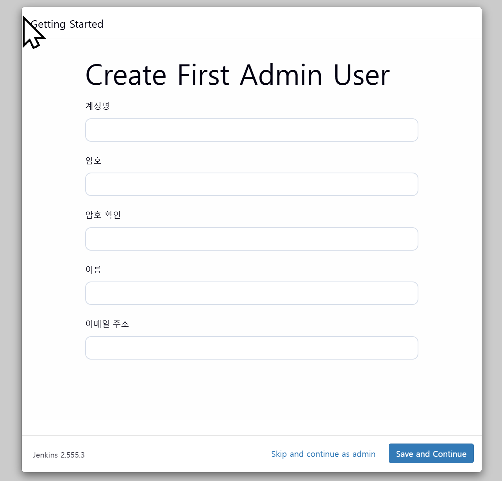

# Jenkins 시작하기

## VULTR 서버 대여하기


 - Create Instance -> 서버 생성하기



 - 최소 Memory : 2GB (1GB 부족)


 - IP Adress : SSH 접속 가능
 - root : Password 확인 후 접속 

## SSH 접속 및 Jenkins 설치하기

```md
# 1. 리눅스 업데이트
sudo dnf update -y

# 2. 도커 설치
sudo dnf install dnf-plugins-core -y
sudo dnf config-manager --add-repo https://download.docker.com/linux/centos/docker-ce.repo
sudo dnf install docker-ce docker-ce-cli containerd.io -y

# 3. 도커 서비스 시작
sudo systemctl start docker
sudo systemctl enable docker

# 4. 젠킨스 도커 이미지 Pull & 컨테이너 시작
Docker 로 Jenkins 이미지 설치

포트 포워딩 
 - 8080:8080
 - 50000:50000

컨터이너 이미지 이름 
Jenkins

재시작시 항상 재시작 
--restart=always

볼륨 생성 
jenkins_home : /var/jenkins_home

설치 이미지
jenkins/jenkins:lts

sudo docker run -d -p 8080:8080 -p 50000:50000 --name jenkins --restart=always -v jenkins_home:/var/jenkins_home jenkins/jenkins:lts


#5. 초기 비밀번호 보기
sudo docker exec jenkins cat /var/jenkins_home/secrets/initialAdminPassword

6f19fffb64fb433291b5ec24b5949e81

#6. Jenkins 접속
http://144.202.53.3/8080
```


## SSH Jenkins 초기 비밀번호 


## Jenkins 접속하기 Http


## Jenkins 설치


## Jenkins 유저 생성


