# Jenkins Pipe Line

```txt
# 사용한 서버 (현재는 닫혀있습니다.)
 
nginx-instance : Jenkins Server
IP : 144.202.53.3
PW : nT4(YeZ,K.Qxp*9C
 
Application-instance : 
IP : 45.76.231.32 
PW : yE$2}4oV5qVNDfj[
```

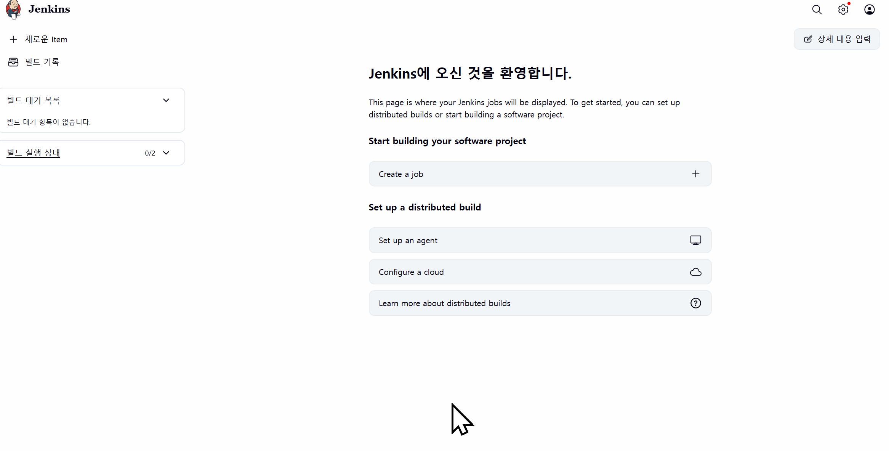
 - Create a Job 선택

## PIPE Line 설정 
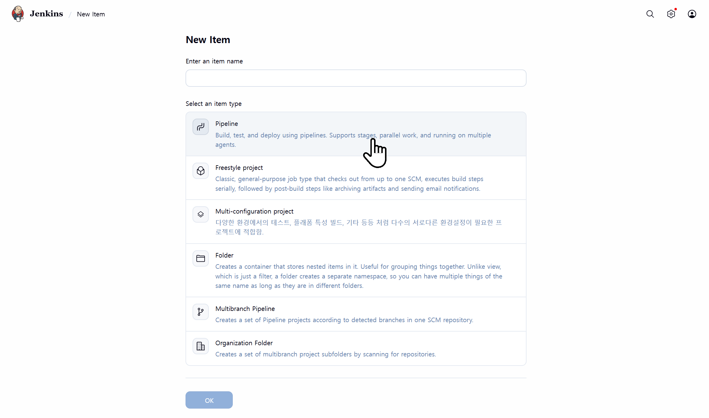

## Jenkins Groovy 예시

```
    GitHub에서 소스 가져오기 
    → Maven 빌드
    → jar 파일을 원격 서버로 복사 
    → 원격 서버에서 실행
```

```Groovy
pipeline {
    agent any

    tools {
        maven "M3" // Jenkins에서 설정한 Maven의 이름
                   // Jenkins 관리 -> Tools -> Maven installations
    }

    stages {
        stage('Checkout') {
            steps {
                git url: 'https://github.com/lleellee0/deploy-test', branch: 'main'
            }
        }
        
        stage('Build') {
            steps {
                script {
                    // mvn clean : 이전 빌드 결과물 삭제
                    //             프로젝트의 target 폴더를 통째로 지운다.
                    // mvn package : 소스코드 컴파일 및 실행 가능한 결과물 Jar 파일 생성
                    sh 'mvn clean package'
                }
            }
        }
        
        stage('Deploy') {
            steps {
                script {
                    // Maven 빌드로 생성된 jar 파일의 위치
                    def jarFile = 'target/shortenurlservice-0.0.1-SNAPSHOT.jar'

                    // 원격 배포 대상 서버 IP
                    def serverIp = '45.76.231.32'

                    // 원격 서버의 배포 경로
                    def deployPath = '/root'

                    // 원격 서버에서 실행할 명령어
                    def runAppCommand = "java -jar $deployPath/shortenurlservice-0.0.1-SNAPSHOT.jar"
                    
                    // Jenkins 서버에 있는 jar 파일을 원격 서버 root 계정의 /root 경로로 복사
                    // scp : SSH 기반 파일 복사 명령어
                    // -o StrictHostKeyChecking=no 처음 접속할 때 묻는 finger print 생략
                    sh "scp -o StrictHostKeyChecking=no $jarFile root@$serverIp:$deployPath/"
                    
                    // 원격 서버에서 애플리케이션 실행
                    sshagent(['deploy_ssh_key']) { // 'server-ssh-credentials'는 Jenkins에서 설정한 credentials ID
                        sh "ssh -o StrictHostKeyChecking=no root@$serverIp '$runAppCommand'"
                    }
                }
            }
        }
    }
    
    post {
        success {
            echo 'Deployment was successful.'
        }
        failure {
            echo 'Deployment failed.'
        }
    }
}
```

## Tools -> Maven 설정

### 🔶 첫 번째 실패 : Maven 설정 오류

빌드를 실행하면 다음과 같은 오류가 발생할 수 있습니다.
```
Maven M3 not found
```

- 원인
    - Jenkins에 Maven이 등록되지 않음

- 해결 방법
   - Jenkins 관리 → Tools → Maven Installation → Add Maven

Pipeline에서 사용한 이름과 동일하게 설정합니다.

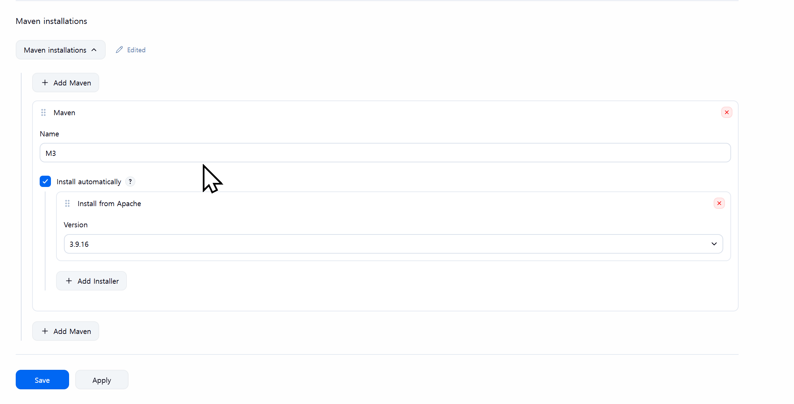


설정 후 다시 빌드를 수행합니다.

## Jenkins 서버에서 SSH-KEY 생성하기

### 🔶 두 번째 실패 : SSH 인증 오류
- 빌드가 성공하더라도 배포 단계에서 다음 오류가 발생할 수 있습니다.

```
Host key verification failed
```
 - 원인
    - Jenkins가 Application 서버에 SSH 접속할 수 없음
 - 배포 과정

``` 
Jenkins
    ↓ SCP
Application Server
```
따라서 Jenkins가 서버에 접속할 수 있도록 SSH 인증을 구성해야 합니다.


 - Jenkins 서버의 Jenkins 컨테이너에서 공개키/개인키 생성
    - docker exec -it 6a4741e77b80 sh
    - docker ps
        - CONTAINER ID : 6a4741e77b80

```sh
ssh-keygen -t rsa -b 4096

id_rsa       → 개인키
id_rsa.pub   → 공개키
```
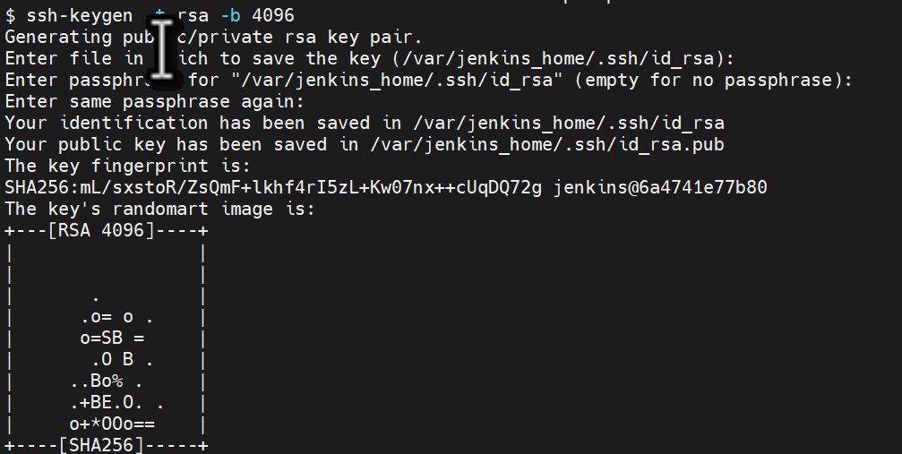

 - Jenkins 컨테이너의 생성 위치 : /var/jenkins_home/.ssh/id_rsa.pub
 
 ### 공개키 등록
- Jenkins 컨테이너의 공개키 -> Application 서버 

```
Jenkins Server 
cat /var/jenkins_home/.ssh/id_rsa.pub
  
ssh-rsa AAAAB3NzaC1yc2EAAAADAQABAAACAQCVceAWNoiJls0FR3MbI/BgLpp+DJ0o4H9VolNHK6H0UcXIawiCTMqNBiLr93B5DBo/OL89OYY216lVfFAYez2v9yzSIiPRM/CIlMtOom5DAZTnnfwon8L8u6HKqrHOIhEbLnqa3g4Gh1pLeZ6KxL5tx25ECa1Uy/IRXodcRhH/QxtWNY1ScZC5jlonIXTgLfz8unZLDXI1v/fKSEH5cNK3sOx7sUEx6a+dXRzZw14ylcs/VokRGE70pHyykW4wXAufUIj+ceQ+8t5I/kxPfjoYZkqOZmpOz+AAqT6DO6YG3oBrfSGTh6tFRzxsm1/JHba2P1dRISQPD+nIMbHhqNOFTzLCuaH19HNb1eqSKBr2gLKvE/ot47puMA7dv/z0lmigt3JBfPohpDV79GDXxjcQk9Z+dVYnUiD20nNCiowYkwOwXAHM7UxOAIQaaTWhtXj9ibAL7kO5/Z3I2UdGdIEz7E46+1WY9EZaOB6+uW9xENE0IXPu9vqLWWVtdu0xGfZgAVMbIoOttWiDJkX5MX+f+8pVVQH2a0k42SvdyhgUVi8GDyb+I62AL0JDfrPXkYxlCSkQfRnq6ETxzm011csmmf5m4vFEQmYy+Om5/NUXbBXtF+WI50Oa5p/sjvTBF2GXo7fzUFtZIlGsPLaZ9A9VE64KX56StP7La83eRf9sUw== jenkins@6a4741e77b80
 
 →
 
Application Server
 
vi ~/.ssh/authorized_keys -> SSH 키 붙여넣기
```


## sshagent 설치 

### 🔶 세 번째 실패 : SSH Agent Plugin 미설치

 - 오류
```
No such DSL method 'sshagent'
```

 - 원인
```
SSH Agent 플러그인이 없음
```

 - Jenkins 관리 → Plugins 
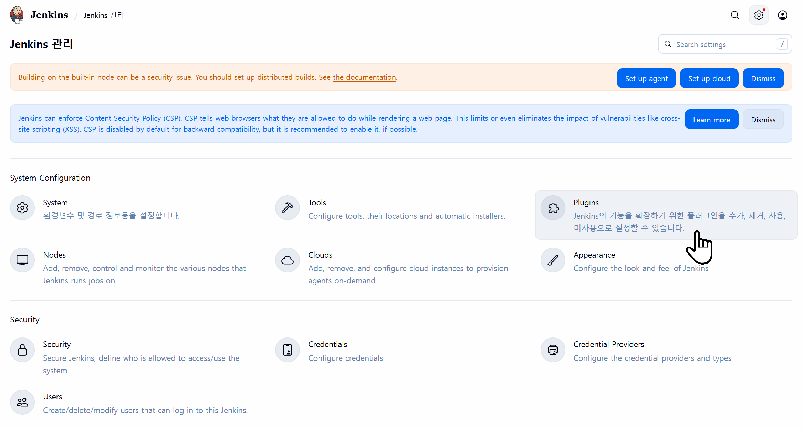

 - Available Plugins → SSH Agent
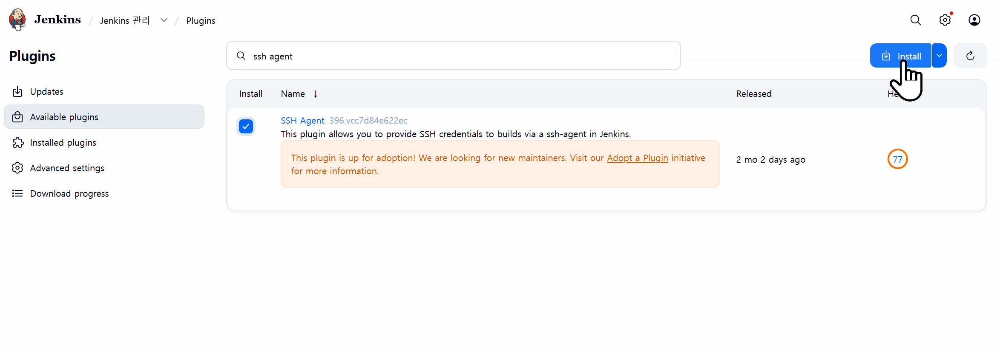


## sshagent 적용하기
### 🔶 네 번째 실패 : Credential 미등록

 - 오류
```
Could not find specified credentials
```
 - 원인
    - Jenkins가 어떤 개인키를 사용할지 모름
 - 해결 (Credentials 추가)
```
Jenkins 관리
→ Credentials
→ Add Credentials
```
cat /var/jenkins_home/.ssh/id_rsa

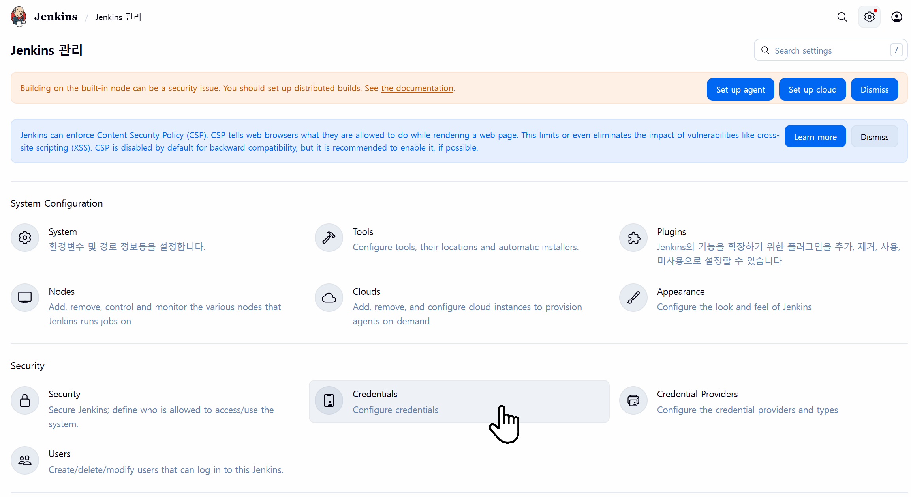


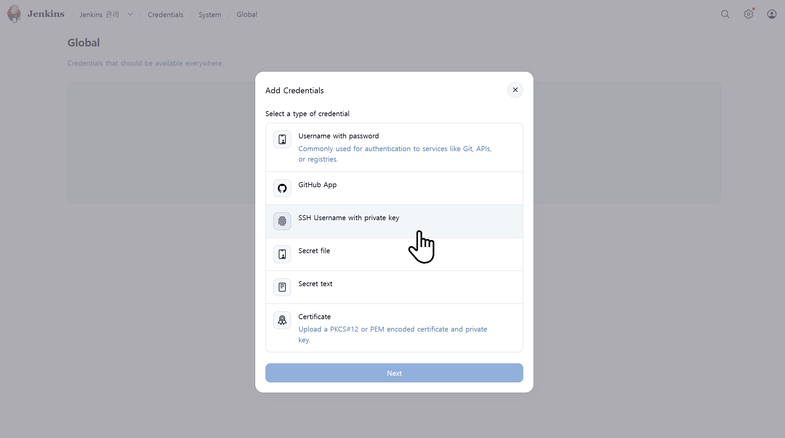


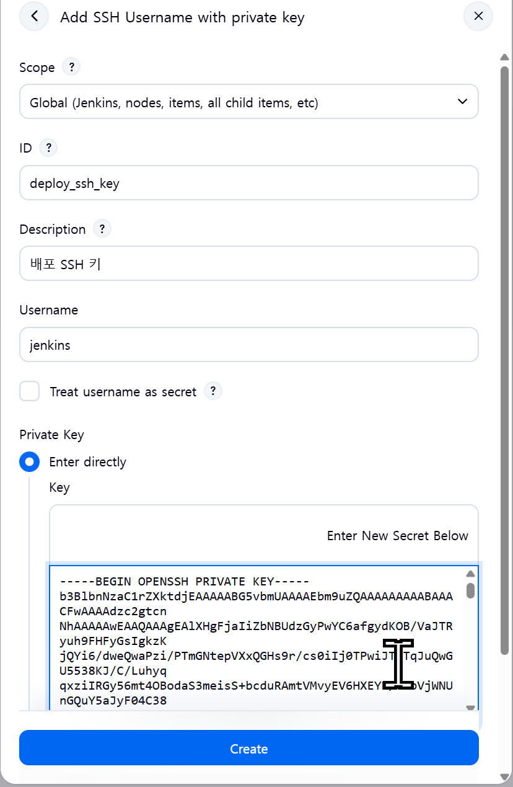


## Java 버전 설치

### 🔶 다섯 번째 실패 :Java Error (자바 설치 필요)
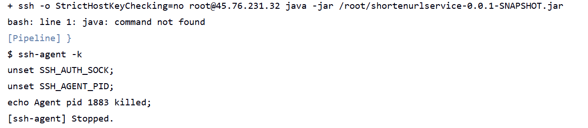

```sh

# Rocky Linux 9
sudo dnf install java-17-openjdk

# Rocky Linux 10
sudo dnf install java-21-openjdk
```

#### 이미 JAVA가 설치되어 있을경우

```sh
# 설치 후 기본 버전 변경
sudo alternatives --config java
```

## 방화벽 세팅
### 🔶 여섯 번째 실패 : 외부 접속 불가
- 8080 Port 열어주기
sudo firewall-cmd --zone=public --add-port=8080/tcp --permanent

- 방화벽 껏다 키기
sudo firewall-cmd --reload

## 배포가 종료되지 않음
### 🔶 일곱 번째 : Jenkins가 종료되지 않음

- 실행 중인 화면
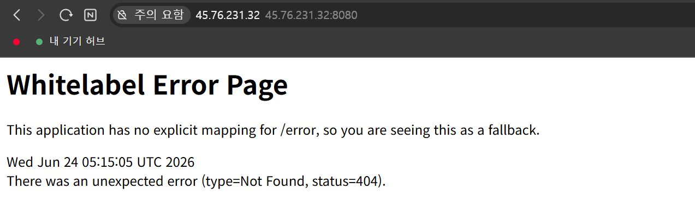

- 실행 중인 테스트 페이지 링크
http://45.76.231.32:8080/ui/create-shortenurl.html


#### 해결 방법 : nohup 사용
```Groovy
def runAppCommand = "java -jar $deployPath/shortenurlservice-0.0.1-SNAPSHOT.jar"

def runAppCommand = "nohup java -jar $deployPath/shortenurlservice-0.0.1-SNAPSHOT.jar > $deployPath/app.log 2>&1 &"
```  

🔶 전체 배포 흐름 정리
```
GitHub Push
    ↓
Jenkins Pipeline 실행
    ↓
Git Clone
    ↓
Maven Build
    ↓
JAR 생성
    ↓
SSH 인증
    ↓
SCP 전송
    ↓
Application Server 배포
    ↓
Spring Boot 실행
    ↓
서비스 오픈
```