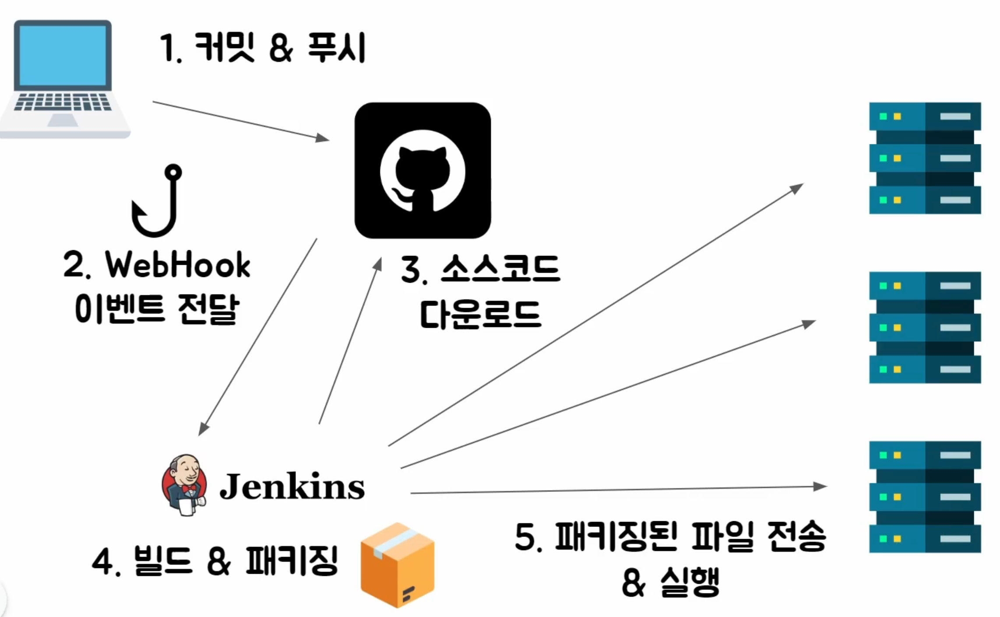
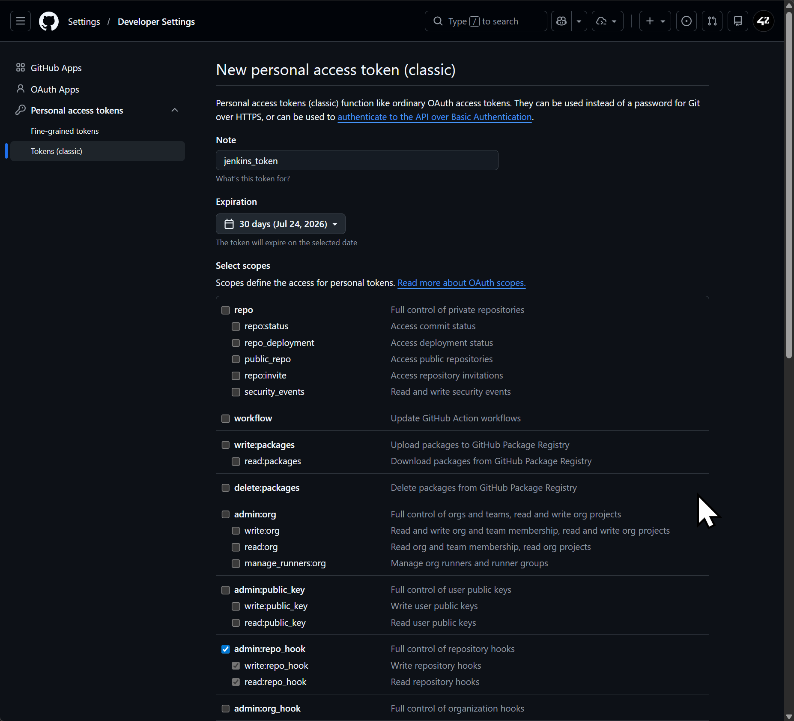
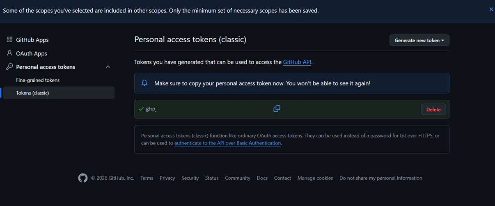
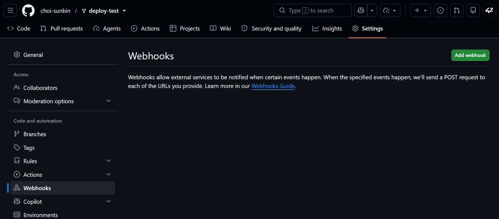
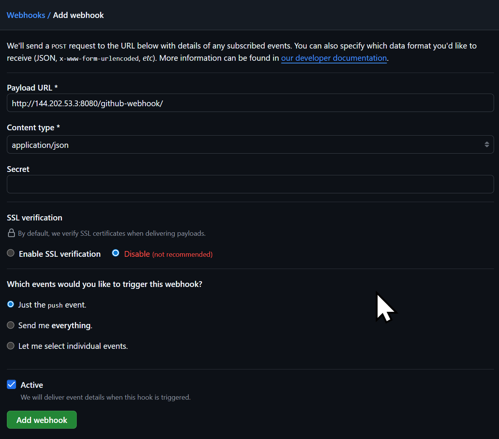
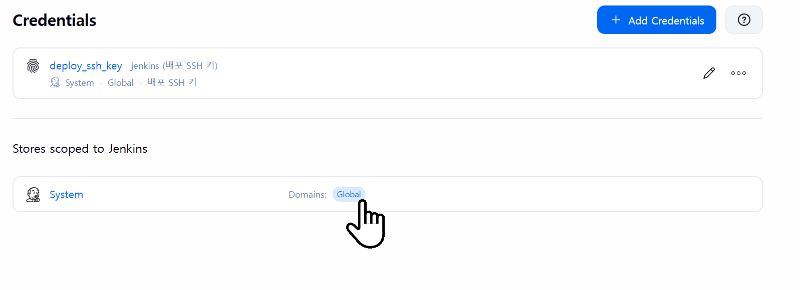
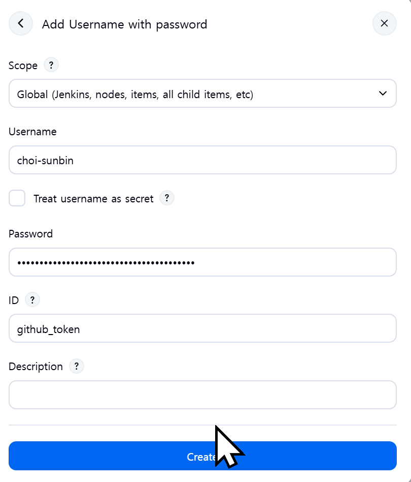
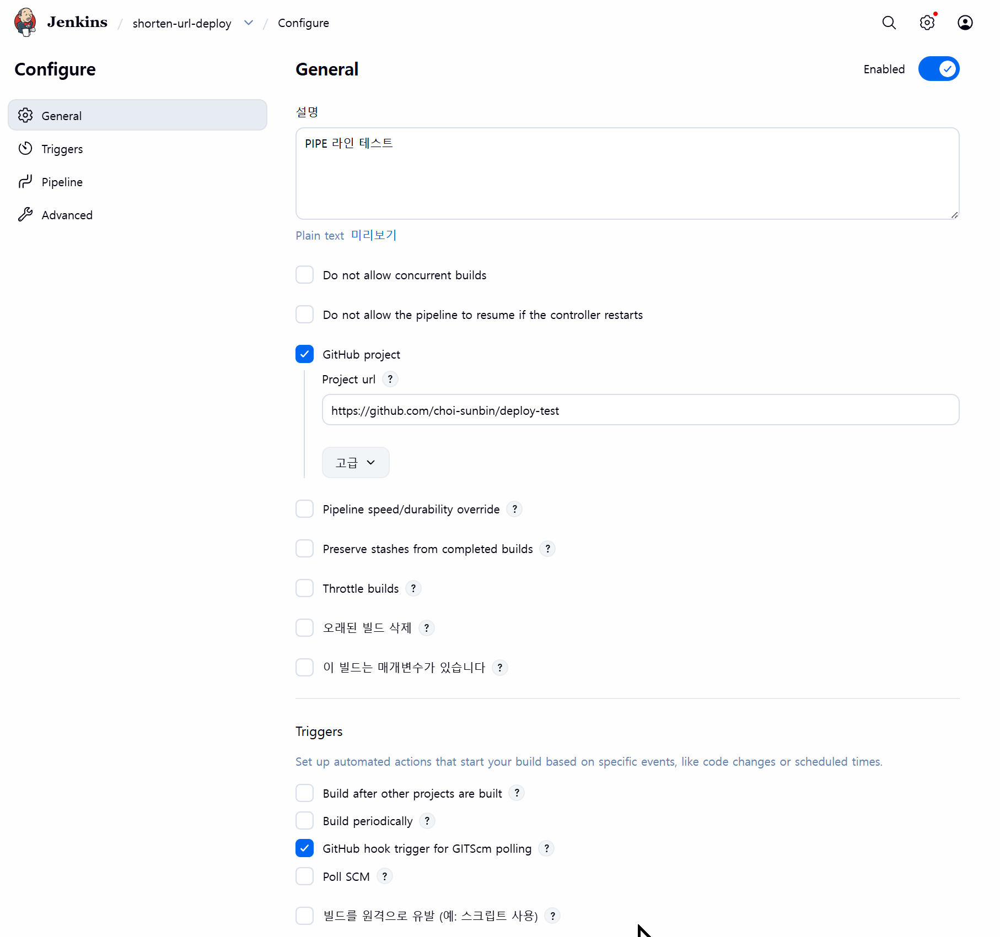

# GitHub WebHook


## 🔶 GitHub WebHook으로 Jenkins 자동 배포(CI/CD) 구축하기

이번 글에서는 **GitHub WebHook**을 이용하여, **코드를 Push하는 순간 Jenkins가 자동으로 빌드 및 배포를 수행하는 CI/CD 환경**을 구축해보겠습니다.

```
Jenkins에서 Build 버튼을 직접 눌러 배포를 진행
↓
GitHub에 Push만 하면 자동으로 배포가 시작되는 환경
```



## 🔶 WebHook이란?

> WebHook은 **특정 이벤트가 발생했을 때 미리 지정한 서버로 HTTP 요청을 보내는 기능**

GitHub에서는 수많은 이벤트를 WebHook으로 전달할 수 있습니다.

이벤트가 발생하면 지정한 URL로 JSON 데이터를 전송합니다

    - GitHub 이벤트 예시
        - Push
        - Pull Request
        - Issue 생성
        - Branch 생성
        - Release 생성

## 🔶 GitHub Personal Access Token 생성

```
Settings
↓
Developer Settings
↓
Personal Access Tokens (Classic)
↓
Generate New Token
```



> 토큰은 생성 직후 한 번만 확인할 수 있으므로 반드시 안전한 곳에 저장해야 합니다.


## 🔶 GitHub WebHook 등록


```
Settings
↓
WebHooks
↓
Add WebHook
```



```
Payload URL : http://Jenkins_IP:8080/github-webhook/

Content Type : application/json

Webhook 이벤트 
Just the push event
```
## 🔶 Jenkins WebHook 등록

```
Manage Jenkins
↓
Credentials
↓
Global
↓
Add Credentials
↓
Add Username with Password
```



```
Username : GitHub 아이디
PW : Personal Access Token
ID : github-token
```

## 🔶 Jenkins Pipeline에서 WebHook 활성화



```
GitHub Project
 - https://github.com/사용자명/Repository

Triggers 
 - GitHub hook trigger for GITScm polling 체크
```