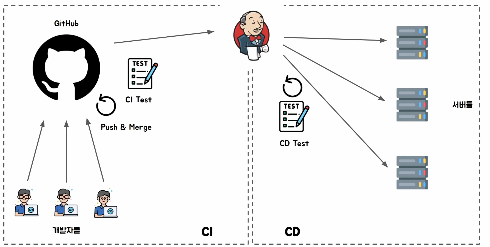

# CI/CD

 - CI : Continuous Integration
 - CD : Continuous Deployment / Delivery




## 🔶 왜 CI/CD가 필요할까?

 - 여러 명의 개발자가 동시에 하나의 프로젝트를 원활히 개발하고 배포 위해
 - 임의로 배포된 코드가 기존 기능을 망가뜨릴 수도 있다.
 - 테스트를 하지 않은 코드가 운영 서버에 배포될 수 있다.

안전하게 코드를 통합(CI)하고 안정적으로 서비스를 배포(CD)하기 위해 사용합니다.

## 🔶 CI/CD란?

### 🔹 CI (Continuous Integration)

```
CI는 지속적인 통합(Continuous Integration) 을 의미합니다.

여러 개발자가 작성한 코드를 하나의 메인 브랜치로 통합하는 과정에서

자동으로 테스트를 수행하여 문제가 없는 경우에만 Merge가 가능하도록 만드는 프로세스입니다.
```

- 새로운 코드가 추가되어도 기존 기능이 정상적으로 동작하는지를 검증하는 것입니다.

### 🔹 CD (Continuous Deployment / Continuous Delivery)

```
CD는 지속적인 배포를 의미합니다.

CI를 통과한 애플리케이션을 운영 서버까지 자동으로 배포하고,

배포 이후에도 정상적으로 서비스가 동작하는지 검증하는 과정입니다.
```

## 🔶 CI/CD 전체 흐름


```
개발자
    │
Webhook Event 발생
    │
GitHub
    │
Webhook Json 전송
    ▼
Jenkins
    │
    ├── CI 테스트
    │      │
    │      ├── 실패 → Merge 중단
    │      └── 성공
    │
Main Merge
    │
CD 시작
    │
배포
    │
CD 테스트
    │
서비스 운영
```

## 🔶 CI 테스트를 자주 수행하는 시점

  1. 🔹 Push
    - Main Branch가 아니어야 CI 테스트 실패 시, Merge를 막을 수 있다. 
  2. 🔹 Pull Request
    - 테스트가 실패하면 Merge를 막을 수도 있습니다.
  3. 🔹 Merge 이후
    - Main 브랜치에 Merge가 완료된 뒤 한 번 더 테스트를 수행하는 경우
  4. 🔹 배포 시작 전
    - 최종 검증을 위해 다시 실행

```
CI 테스트에 사용하는 테스트들은 Spring Boot 기준

test 폴더에 있는 테스트 코드들이 실행됩니다.

테스트 코드가 없다면, CI는 자동화만 되어 있을 뿐 안정성을 보장하지 못합니다.
```

## 🔶 CD 테스트

CI를 통과했더라도 운영 서버에서는 다른 문제가 발생할 수 있습니다.

### 🔹 토큰 만료

운영 서버에서 사용하는 API Token이 만료된 경우, 개발 환경에서는 정상인데 운영에서만 실패할 수 있습니다.

### 🔹 방화벽 문제

개발 PC에서는 정상인데 운영 서버에서는 방화벽 때문에 통신이 막힐 수도 있습니다.

### 🔹 DNS 장애

도메인 조회 실패로 인해 서비스가 정상 동작하지 않을 수도 있습니다.

### 🔹 네트워크 장애

일시적인 네트워크 장애로 외부 API 호출이 실패할 수도 있습니다.

### 🔹 저장소 장애

DB 또는 Object Storage 문제로 애플리케이션이 정상 동작하지 않을 수도 있습니다.

## 🔶 배포 전략

### 🔹 Rolling Deployment

하나씩 순차적으로 배포하는 가장 기본적인 방식입니다.
새로운 파드의 정상 동작을 확인하면, 기존 파드가 종료되는 방식

### 🔹 Blue-Green

새로운 버전을 모두 준비한 뒤 트래픽을 한 번에 전환합니다.


### 🔹 Canary

일부 사용자에게만 새 버전을 먼저 배포합니다.

문제가 없으면 점진적으로 배포 범위를 확대합니다.