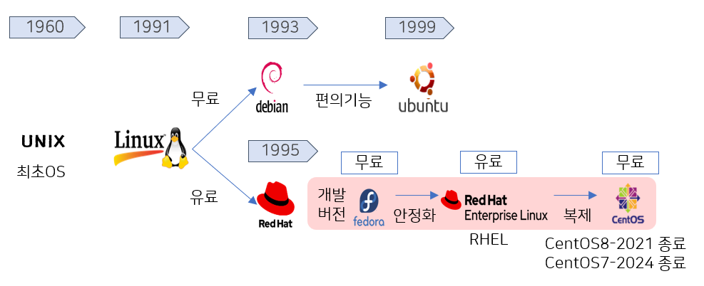

# 쿠버네티스 한방 정리

## Linux OS 흐름

### Linux 커널 두 가지 배포판

**debian**이랑 **redhat** 계열 (쿠버네티스도 크게 이 두가지 계열을 지원한다.)

- **debian linux**: 커뮤니티용 → **무료**
- **redhat linux**: 기업(RedHat)에서 제작 → **유료**

---

### Redhat에서 Linux 배포판이 만들어지는 순서

- 개발버전: **Fedora**
- 안정화 버전: **RHEL (Red Hat Enterprise Linux)**
- 복사버전: **CentOS**

Linux

```text
├── Debian (17%)
│ └── Ubuntu (47%)
└── Redhat
    ├── 개발버전 Fedora
    ├── RedHat Enterprise Linux (RHEL) (2%)
    └── CentOS(19%)
```

- CentOS 8: 2021년 지원 종료
- CentOS 7: 2024년 지원 종료 예정
  

2019년 IBM 인수이후

Fedora → CentOS Stream (테스트) → RHEL (안정화)

- CentOS Stream: 테스트용
- RHEL: 안정화용
- Rocky Linux, AlmaLinux: RHEL 복제 및 CentOS 대체재
  

## Container 흐름

**Container**: 컨테이너가 나오게 된 계기가 리눅스가 발전하면서 만들어진 커널기술 중 **격리기술**이다.

**Container** : 실행중인 컴퓨터의 호스트 운영체제에 격리된 공간을 설정하고, 이 격리공간 내에 호스트 운영체제로부터 독립된 프로세스를 실행시키는 기술과 이를 위한 소프트웨어 구성 일체를 이야기한다. 동일한 하드웨어 아키텍쳐(특히 CPU)와 동일한 OS 커널을 보유한 수많은 컴퓨터에서 컨테이너로 이미지화한 소프트웨어의 동일한 동작을 보장한다. (나무위키)

---

### 기술 흐름 타임라인


### 자원 가상화

프로세스를 격리 시켜주는 기술이 만들어짐

- chroot: 유저 격리, 파일 격리, 네트워크 격리
- cgroup: 자원 격리 (CPU, memory)
- namespace: 프로세스 격리

이 프로세스를 격리 시켜주는 기술이 만들어 지면서 우리는 이제 각각의 App을 소위 말하는 **[독립적인 환경]**에서 실행을 시킬 수 있게 됨.

이런 기술들을 집약 정리한 게 **LXC → Linux Container**이다.

### LXC (LinuX Container) - 최초의 컨테이너 런타임

**최초의 컨테이너**

자원 가상화를 통해 우리는 이제 각각의 App을 소위 말하는 **독립적인 환경**에서 실행을 시킬 수 있게 됨.

### Docker

Docker에서 자체 개발한 컨테이너 런타임 libcontainer(Low-Level) 을 사용하여

High-Level 컨테이너 런타임을 개발한것이 Docker

Root권한으로 설치 및 실행이 필요했었지만, 현재, rootless모드 개발됨

미란티스에 인수된 상태, Virtual생태계에서, 가장 선두를 달리고 있던 Openstack을 관리하는 회사

### rkt


Docker 는 Root권한으로 설치 및 실행이 필요했었음, 보안이 약한 부분을 보완한 컨테이너 런타임

컨테이너 전용 OS (Core OS)에서 사용하는 전용 컨테이너 런타임


2014년 CoreOS는 RedHat에 인수되고

CoreOS는 fedora CoreOS로 명칭을 바꾸게 됨

RedHat이 밀고있는 Container는 cri-o 이기 때문에 rkt의 입지는 줄어드는 상황

## Container, Container Orchestration 차이

### Container

- 사용자는 컨테이너에게 App 생성 명령을 내리면 컨테이너를 만들어 App v.1을 만들게 됨
- 사용자가 App v.2를 만들어 새로 배포하는 과정 (사용자가 직접 운용)
  1. App v.2를 컨테이너가 생성되고 정상 동작 까지의 시간이 필요 (1)
  2. App v.2 기동 확인 : 기동이 완료될때 까지 기동을 지속적으로 확인 과정 필요(2)
  3. App v.2 트래픽 전환 : App v.1에 물려있던 네트워크를 v.2로 전환하는 과정 필요 (3)
  4. App v.1 삭제 : App v.1을 삭제하여, 공간을 확보하게됨

기존에 앱을 업데이트하는 방식과 유사


### Container Orchestration

사용자가 쿠버네티스에 App 생성 명령을 내리면 쿠버네티스는 도커에 컨테이너에게 컨테이너 생성 명령을 내리고 App v.1이 생성됨

- 사용자는 쿠버네티스에게 App v.2 생성 명령을 내리면 컨테이너를 만들어 App v.1을 만들게 됨
- 사용자가 App v.2를 만들어 새로 배포하는 과정
  1. App v.2를 컨테이너가 생성되고 정상 동작 까지의 시간이 필요 (1)
  2. App v.2 기동 확인 : 쿠버네티스가 기동의 완료를 모니터링 지원(2)
  3. App v.2 트래픽 전환 : 쿠버네티스가 기동 완료를 확인하면 네트워크를 수정해서 트래픽 전환해줌(3)
  4. App v.1 삭제 : App v.1을 삭제하여, 공간을 확보하게됨00


### Container Orchestration

여러 Container Orchestration이 존재하지만, 현재는 Kubernates의 점유율이 압도적임


결과로 Kubernates와 호환성이 좋은 Container runtime를 선택하는 것의 중요성이 높아짐


## 🔽 Low-level container runtime

- 커널레벨의 기술 기반
- **LXC (Linux Container)**: 초기 low-level 컨테이너 기술
- 이후 Docker에서 **libcontainer** 개발
- 현재는 **runC**로 발전

## 🔼 High-level container runtime

- 사용자 친화적으로 만든 고급 컨테이너 런타임
- 대표적인 것이 **Docker**

### Docker의 아키텍처 기능


Docker는 단순한 런타임이 아니라, 다양한 기능이 포함된 **엔진**이다.

**부가 기능**들이 사용자 입장에서는 편리하지만, **쿠버네티스 관점**에서는 **과해 보일 수 있음**.

## containerd의 역할

- Docker의 핵심 기능 중 실제 컨테이너를 실행시키는 역할만 따로 분리된 것이 **containerd**
- containerd는 내부적으로 **libcontainer → runC**를 이용해 동작
- 클라우드 분야의 표준을 관장하는 CNCF에 기부되어 (Graduated Project)를 받게됨

```
Docker Engine
 └─ dockerd (고급 관리 기능 포함)
     └─ containerd (컨테이너 실행 역할)
         └─ libcontainer → runC (실제 실행 엔진)
```

---

## Kubernetes Container Orchestration 핵심 컴포넌트 정리

- Kebe-apiserver :
  - 모든 요청(API 호출)을 수신하고 인증/인가 후 각 컴포넌트에 전달
- Kubelet :
  - 노드 내의 Pod 생성/상태 모니터링을 담당. 컨테이너 런타임과 연동하여 실제 컨테이너 생성

kubelet은 과거 Docker, rkt 등 다양한 컨테이너 런타임과 연동 가능하도록 맞춤형 API를 호출 지원

### Kubernetes 명령 구조

> ! Kubernetes에서는 컨테이너 생성 명령이 아니라 Pod 생성 명령만 존재합니다.

- **Pod**: Kubernetes의 최소 배포 단위 (하나 이상의 컨테이너 포함 가능)

### 쿠버네티스 동작 예시

```
사용자
└─ Pod 생성 요청
		└─ kube-apiserver (Pod 생성 명령)
				└─ kubelet (Container 생성 명령)
						└─ container runtime (실제 Container 생성)
```

## containerd와 CRI(Container Runtime Interface)

### 배경 설명

과거에는 컨테이너 런타임이 많아질수록 `kubelet`이 각 런타임의 소스를 **직접 호출해서 구현해야** 했음.

> 즉, 런타임이 추가되면 kubelet 소스도 수정해야 하는 구조였음.

---

### Kubernetes의 변화

Kubernetes 1.5버전부터 **컨테이너 런타임 인터페이스 (CRI)** 라는 **표준 인터페이스**를 추가함.

- kubelet은 이제 CRI라는 인터페이스만 호출하면 되고
- 각 컨테이너 런타임들은 이 인터페이스를 **구현한 구현체**만 제공하면 됨.


이렇게 하면 kubelet 입장에서는 어떤 런타임이든 동일하게 다룰 수 있음.

---

### 구조 요약

- kubelet은 **interface만 선언**
- 실제 실행은 각 컨테이너 런타임 쪽의 **CRI 구현체**가 담당
- CRI 구현부는 쿠버네티스 프로젝트 안에 존재
- 이처럼 런타임과 kubelet 사이를 표준화한 인터페이스를 **CRI(Container Runtime Interface)** 라고 함

```
kubelet
  │
  └── interface (선언만)
       └── CRI (구현체)
            ├── dockershim (Docker를 위한 CRI 구현체)
            ├── CRI-containerd (containerd를 위한 CRI 구현체)
            └── rktshim (	rkt를 위한 CRI 구현체 )

```

현재 dockersim kubelet에서 빠졋지만,

미란티스가 docker를 인수하고 cri-dockerd라는 어댑터를 만듦 (dockersim 과 유사)

여기서 컨테이너 런타임의 이름을 미란티스 컨테이너 런타임으로 명칭을 바꾸게됨

## 컨테이너 런타임 교체 시 고려사항

- **컨테이너 런타임을 바꿀 때 가장 고민되는 부분은 `container image` 호환성이다.**
- 예: `docker`에서 `containerd`로 런타임을 바꾸면 이미지를 다시 만들어야 할까?

---

### 표준화의 등장: OCI (Open Container Initiative)


- 다양한 컨테이너 런타임이 생기면서, **컨테이너를 만들 때 따라야 할 표준**이 필요해짐
- Docker는 **OCI 규격**(표준 컨테이너 이미지 형식)을 맞추기 위해 low-level인 **runC**를 만듦
- `containerd`도 이 표준을 따르며, runC를 통해 컨테이너를 실행

→ 즉, **이미지를 다시 만들 필요 없음** (표준 포맷만 맞추면 됨)

- runC는 기존 libcontainer와 다른 점은 LXC없이 바로 커널 레벨을 바로 사용할 수있도록 구동됨

---

### Kubernetes 입장에서의 아쉬운 점

- kubelet의 CRI 인터페이스는 **gRPC 기반 통신**을 함
- 하지만 여전히 쿠버네티스 입장에서는 **런타임 종속성**이 아쉬운 부분이 있음


---

### 컨테이너 런타임과 쿠버네티스의 개발 속도 불일치 문제

- `docker`에 새로운 기능이 생기면 **CRI 구현체도 패치가 필요**
- 결국 **쿠버네티스도 같이 수정/패치**해야 하는 번거로움

### 구조 개선

- kubelet에서 컨테이너 런타임으로 **바로 명령 전달이 가능하도록 구조 개선**

---

### 해결책: `containerd`의 CRI-Plugin

- `containerd`에는 **CRI-Plugin**이 추가되어 kubelet 인터페이스에 직접 맞춤
- `cri-o`도 처음부터 CRI 규격에 맞춘 런타임으로 개발됨 (Redhat)

---

### 미란티스와 cri-dockerd

- Docker를 대체할 수 있도록 **cri-dockerd**를 미란티스에서 개발
- `v1.27`(stable)부터는 **kubelet이 CRI 구조를 기본적으로 사용**

---

## 핵심 정리

| 항목        | 설명                                                                   |
| ----------- | ---------------------------------------------------------------------- |
| OCI         | 컨테이너 이미지 포맷과 런타임 표준화 규격                              |
| runC        | 컨테이너 실행을 담당하는 low-level 런타임                              |
| containerd  | 표준을 따르는 컨테이너 런타임. CRI-Plugin으로 kubelet과 바로 연결 가능 |
| CRI         | Kubernetes에서 다양한 런타임을 추상화하기 위한 인터페이스              |
| cri-o       | CRI에 맞게 설계된 또 다른 런타임                                       |
| cri-dockerd | Docker를 CRI 규격에 맞게 쓸 수 있게 해주는 런타임 (미란티스 개발)      |

---

**결론**:

이미지 형식이 **OCI 규격**만 맞추면, 어떤 런타임이든 (`docker`, `containerd`, `cri-o`) 동일하게 사용할 수 있다.

Kubernetes는 이제 표준 구조로 컨테이너 런타임을 유연하게 선택할 수 있게 되었다.

##
