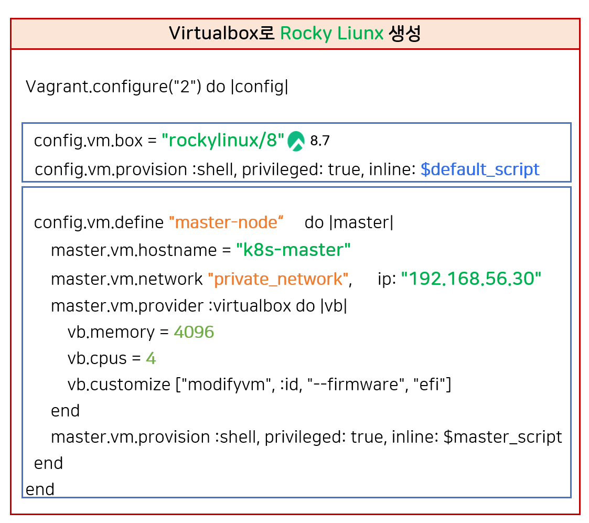

# 쿠버네티스 설치

### 쿠버네티스 기본 구조

```
쿠버네티스는 클러스터 단위로 설치된다.
각 노드에 배포된 컴포넌트들이 컨테이너를 통제하고 실행한다.
전체 시스템을 자동화하는 분산 오케스트레이션 플랫폼이다.

1. 쿠버네티스(Kubernetes)
		└─ 분산 시스템 전체를 아우르는 "오케스트레이션 플랫폼"
2. 클러스터(Cluster)
		└─ 쿠버네티스가 관리하는 "논리적 하나의 단위"
		└─ 하나의 클러스터 = 하나의 쿠버네티스 우주
3. 마스터 노드 + 워커 노드
		├─ 마스터 노드 (Control Plane): 지휘자, 지시 내림
		└─ 워커 노드 (Worker Node): 실제 컨테이너 실행, 일꾼
4. 각 노드에는 쿠버네티스 컴포넌트들이 설치됨
		└─ kubelet, kube-proxy, container runtime 등
5. 이 컴포넌트들이 컨테이너 환경을 조성함
		└─ 컨테이너는 Pod로 감싸져 실행됨 (쿠버네티스의 최소 단위)
6. 전체가 통합되어 쿠버네티스 클러스터가 동작함

[ 쿠버네티스 ]
       │
       ▼
 ┌────────────┐
 │ 클러스터 1 │ ◀── 가장 큰 단위
 └────────────┘
       │
       ├── 📡 마스터 노드
       │     └─ API Server, Scheduler, etcd, ...
       │
       ├── 🧱 워커 노드 1
       │     └─ kubelet, kube-proxy, container runtime
       │
       └── 🧱 워커 노드 2 ...

```

# 설치 순서

- Vagrant 설치
- Virtual Box설치
- Script 파일 실행 → 쿠버네티스 설치 완료
- MobaXterm을 확인해서
- 원격접속
- Kubernates Pods 상태확인
- 대시보드 접속

### 예시 컴퓨터 자원

## VirtualBox Rocky Linux 생성




- config.vm.box = "rockylinux/8"
  - "Rocky linux 8 설치" - 이미지 다운로드 시간 걸림
- config.vm.define "master-node" do |master|
  - Virtual 박스 VM의 이름을 "master-node"로 설정
- master.vm.hostname = "k8s-master"
  - Hostname 설정 : k8s-maste
- master.vm.network "private_network", ip: "192.168.56.30"
  - private_network : Host Only Network 설정
    - Host Only Network : 내 PC에서만 사용할 수 있는 네트워크 망
  - ip: "192.168.56.30" 리눅스의 IP 설정
- 자원 할당
  - vb.memory = **4096 (메모리)**
    - **컴퓨터 자원 16g 에서 4g 할당 받아 사용**
  - vb.cpus = **4 (CPU 4 core) 사용**
    - CPU는 필요한 순간 자원을 가져와 사용하는 처리 프로세서
    - 실제로는 **호스트의 CPU를 공유**하므로, 동일한 4코어를 사용해도 항상 4코어를 점유하지 않음
    - 쿠버네티스에서 권고 하는 최소 CPU 할당량은 2 코어이상

### NAT (Network Address Translation)

- Vagrant가 VM을 생성하면 기본으로 NAT 네트워크를 설정함
- VM이 인터넷(외부)과 통신 가능하게 해줌
- **예: 패키지 설치, yum update, containerd, kubeadm 다운로드 시 사용됨**

## Kubernates Cluster 설치

여러 가지 방법이 있지만, **Kubeadm**을 이용한다.

**쿠버네티스 클러스터를 빠르게 설치(bootstrap)** 하기 위한 **공식 설치 도구**

### 공식 문서

[https://kubernetes.io/ko/docs/setup/production-environment/tools/kubeadm/install-kubeadm/](https://kubernetes.io/ko/docs/setup/production-environment/tools/kubeadm/install-kubeadm/)


필요 준비 사항

- 데비안 기반 Linux 머신 or 레드햇 기반 Linux 머신
- 2 GB Ram 이상
- 2 Core CPU 이상
- 각각의 워커 노드의 고유성
  - 여러 워커 노드를 구성할때 : VM 으로 워커노드를 만들어 복사해서 늘려 사용하기도 함
  - 기본 세팅을 할때는 똑같으니까 VM 복사 기능을 사용하기도 하지만 이때 고유한 속성(Mac 주소, 호스트 이름, product_uuid)등까지 그대로 복사하거나 새로 부여할 수 있는 옵션이 존재
  - 고유 속성까지 복사하면 오류가 난다.
- 쿠버네티스 구성들 끼리 서로 통신할 목적의 특정 포트를 개방해야한다.
  - 방화벽 자체를 내려버리면, 어떠한 포트도 막히지 않는다. (교육 목적)
- 스왑 비활성화
  - 스왑 : RAM이 부족할 때 디스크 공간 일부를 임시 메모리처럼 사용하는 기술

서로 네트워크 연결이 되어있어야된다.

## 쿠버네티스 설치 ( 모든 Node )

1. Rocky linux 기본 설정 : 패키지 업데이트, 타임존 설정
2. kubeadm 설치 전 사전작업 : 방화벽 해제, 스왑 비활성화
3. 컨테이너 런타임 설치
   - [3-1] 컨테이너 런타임을 설치하기 전 사전 작업
     - IPv4 포워딩 iptables 세팅
     - cgroup 드라이버 설정
   - [3-2] 컨테이너 런타임 (containerd 설치)
     - [3-2-1] containerd 설치 (option 2)
       - [3-2-1-1] Docker Engine 설치 : repo 설정, containerd 설치
   - [3-3] 컨테이너 런타임 : cri 활성화
4. kubeadm 설치
   - 설정
     - repo 설정
     - SELinux 설정
   - 패키지 설치
     - kubelet
     - kubeadm
     - kubectl

Master Node 세팅

1. Kubeadm으로 클러스터 생성
   - [1-1] 클러스터 초기화 (Pod Network 세팅)
   - [1-2] kubectl 사용 설정
   - [1-3] CNI Plugin 설치 (calico)
   - [1-4] Master에 Pod 를 생성 할 수 있도록 설정
2. 쿠버네티스 편의 기능 설치
   - [2-1] kubectl 자동완성 기능
   - [2-2] Dashboard 설치
   - [2-3] Metrics Server 설치

## cgroup (control groups)

- 리눅스에서 **CPU, 메모리, 디스크, 네트워크 등의 리소스를 프로세스 단위로 제어**할 수 있게 해주는 기능
- 컨테이너도 결국 리눅스 프로세스이므로, **쿠버네티스와 컨테이너 런타임은 cgroup을 통해 리소스를 제한함**
- 쿠버네티스랑 컨테이너 런타임을 설치할 때 **동일 설정**하는것이 좋다.

### cgroup 드라이버란?

> 누가 이 cgroup 기능을 **관리하고 추적할지 선택하는 것**

| 드라이버 이름 | 설명                                                                        |
| ------------- | --------------------------------------------------------------------------- |
| `cgroupfs`    | 독립적으로 cgroup을 제어 (Docker의 기본 설정)                               |
| `systemd`     | systemd(리눅스 서비스 매니저)가 cgroup을 관리함 (최근 쿠버네티스 권장 방식) |

- 최근 **쿠버네티스 공식 가이드도 `systemd`를 권장**합니다
- 특히 Ubuntu, CentOS, RockyLinux 등 systemd 기반이면 거의 필수

### containerd 설치

공식 Github :

[https://github.com/containerd/containerd/blob/main/docs/getting-started.md](https://github.com/containerd/containerd/blob/main/docs/getting-started.md)


**Option 1: From the official binaries**

공식 바이너리를 받아서 설치하기

`containerd-<VERSION>-<OS>-<ARCH>.tar.gz` archive from

[https://github.com/containerd/containerd/releases](https://github.com/containerd/containerd/releases)

- Typically, you will have to install [runc](https://github.com/opencontainers/runc/releases) and [CNI plugins](https://github.com/containernetworking/plugins/releases) from their official sites too.
  - runC와 CNI는 별도로 설치 해야된다.

runC는 별도의 의존성 패키지들이 많다.

CNI도 설치 예정

**Option 2: From `apt-get` or `dnf`**

- The `containerd.io` packages in DEB and RPM formats are distributed by Docker (not by the containerd project)
  - Docker에서 제공하는 Containerd.io를 사용하기

도커를 설치할때 Containerd와 runC가 필요하기 때문에 사용자 친화적인 docker문서를 확인해 보면 패키지를 한번에 설치하는 방법이 나와있음

일단 containerd.io만 설치 예정

### Docker 를 이용해 Containerd 설치

URL : [https://docs.docker.com/engine/install/centos/](https://docs.docker.com/engine/install/centos/)


containerd 설치를 위해

```
//Containerd.io 설치 (최신 버전)

sudo dnf install containerd.io
```

### containerd 호환성 체크

Kubernates 1.2.7버전을 사용한다고 하면,

1.7.0+, 1.6.15+ 버전을 이용하면 된다.

[https://github.com/containerd/containerd/blob/main/RELEASES.md](https://github.com/containerd/containerd/blob/main/RELEASES.md)


무조건적으로 1.7.0버전을 선택하는것이 아니라,

현재 (2025.05.21) 최신 기술들을 꼭 사용해야 되는게 아니라면, 기준 LTS를 확인하고 사용하는것이 좋은데

- 1.6 LTS
- 1.7 LTS

상태 이기 때문에 1.7 버전을 사용하는것이 좋다.

하지만, 강의로는 1.6버전을 사용하고있으니 1.6.21 버전을 사용할 예정이다.


