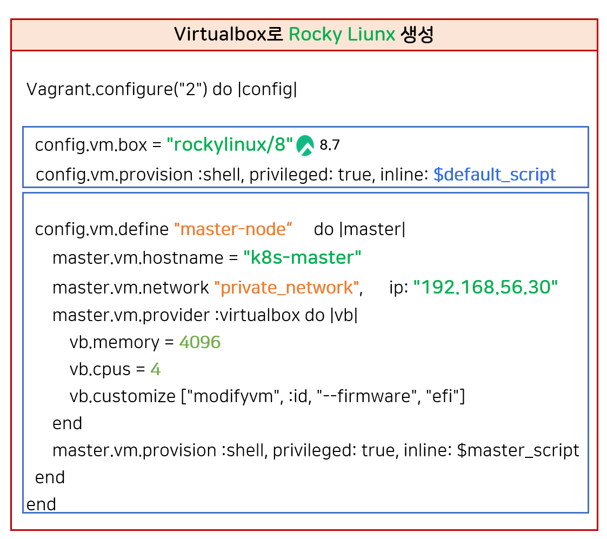

# 쿠버네티스 설치

## 쿠버네티스 기본 구조

```
쿠버네티스는 클러스터 단위로 설치된다.
각 노드에 배포된 컴포넌트들이 컨테이너를 통제하고 실행한다.
전체 시스템을 자동화하는 분산 오케스트레이션 플랫폼이다.

1. 쿠버네티스(Kubernetes)
		└─ 분산 시스템 전체를 아우르는 "오케스트레이션 플랫폼"
2. 클러스터(Cluster)
		└─ 쿠버네티스가 관리하는 "논리적 하나의 단위"
		└─ 하나의 클러스터 = 하나의 쿠버네티스 우주
3. 마스터 노드 + 워커 노드
		├─ 마스터 노드 (Control Plane): 지휘자, 지시 내림
		└─ 워커 노드 (Worker Node): 실제 컨테이너 실행, 일꾼
4. 각 노드에는 쿠버네티스 컴포넌트들이 설치됨
		└─ kubelet, kube-proxy, container runtime 등
5. 이 컴포넌트들이 컨테이너 환경을 조성함
		└─ 컨테이너는 Pod로 감싸져 실행됨 (쿠버네티스의 최소 단위)
6. 전체가 통합되어 쿠버네티스 클러스터가 동작함

[ 쿠버네티스 ]
       │
       ▼
 ┌────────────┐
 │ 클러스터 1 │ ◀── 가장 큰 단위
 └────────────┘
       │
       ├── 📡 마스터 노드
       │     └─ API Server, Scheduler, etcd, ...
       │
       ├── 🧱 워커 노드 1
       │     └─ kubelet, kube-proxy, container runtime
       │
       └── 🧱 워커 노드 2 ...

```

## 설치 순서

- Vagrant 설치
- Virtual Box설치
- Script 파일 실행 → 쿠버네티스 설치 완료
- MobaXterm을 확인해서
- 원격접속
- Kubernates Pods 상태확인
- 대시보드 접속


### Vagrant 명령어 참고
Vagrant up : 가상머신 기동
Vagrant halt : 가상머신 Shutdown
Vagrant ssh : 가상머신 접속 (Vagrant ssh k8s-master)
Vagrant destroy : 가상머신 삭제

## VirtualBox Rocky Linux 생성




- config.vm.box = "rockylinux/8"
  - "Rocky linux 8 설치" - 이미지 다운로드 시간 걸림
- config.vm.define "master-node" do |master|
  - Virtual 박스 VM의 이름을 "master-node"로 설정
- master.vm.hostname = "k8s-master"
  - Hostname 설정 : k8s-maste
- master.vm.network "private_network", ip: "192.168.56.30"
  - private_network : Host Only Network 설정
    - Host Only Network : 내 PC에서만 사용할 수 있는 네트워크 망
  - ip: "192.168.56.30" 리눅스의 IP 설정
- 자원 할당
  - vb.memory = **4096 (메모리)**
    - **컴퓨터 자원 16g 에서 4g 할당 받아 사용**
  - vb.cpus = **4 (CPU 4 core) 사용**
    - CPU는 필요한 순간 자원을 가져와 사용하는 처리 프로세서
    - 실제로는 **호스트의 CPU를 공유**하므로, 동일한 4코어를 사용해도 항상 4코어를 점유하지 않음
    - 쿠버네티스에서 권고 하는 최소 CPU 할당량은 2 코어이상

### NAT (Network Address Translation)

- Vagrant가 VM을 생성하면 기본으로 NAT 네트워크를 설정함
- VM이 인터넷(외부)과 통신 가능하게 해줌
- **예: 패키지 설치, yum update, containerd, kubeadm 다운로드 시 사용됨**

## Kubernates Cluster 설치

여러 가지 방법이 있지만, **Kubeadm**을 이용한다.

**쿠버네티스 클러스터를 빠르게 설치(bootstrap)** 하기 위한 **공식 설치 도구**

### 공식 문서

[https://kubernetes.io/ko/docs/setup/production-environment/tools/kubeadm/install-kubeadm/](https://kubernetes.io/ko/docs/setup/production-environment/tools/kubeadm/install-kubeadm/)


필요 준비 사항

- 데비안 기반 Linux 머신 or 레드햇 기반 Linux 머신
- 2 GB Ram 이상
- 2 Core CPU 이상
- 각각의 워커 노드의 고유성
  - 여러 워커 노드를 구성할때 : VM 으로 워커노드를 만들어 복사해서 늘려 사용하기도 함
  - 기본 세팅을 할때는 똑같으니까 VM 복사 기능을 사용하기도 하지만 이때 고유한 속성(Mac 주소, 호스트 이름, product_uuid)등까지 그대로 복사하거나 새로 부여할 수 있는 옵션이 존재
  - 고유 속성까지 복사하면 오류가 난다.
- 쿠버네티스 구성들 끼리 서로 통신할 목적의 특정 포트를 개방해야한다.
  - 방화벽 자체를 내려버리면, 어떠한 포트도 막히지 않는다. (교육 목적)
- 스왑 비활성화
  - 스왑 : RAM이 부족할 때 디스크 공간 일부를 임시 메모리처럼 사용하는 기술

서로 네트워크 연결이 되어있어야된다.

### **쿠버네티스 설치(모든 node)**

- [1] rocky linux 기본 설정:
  - 패키지 업데이트
  - 타임존 설정
- [2] kubeadm 설치 전 사전 작업
  - 방화벽 해제 (port 신경 X)
  - 스왑 비활성화 (메모리 충돌 방지)
- [3] 컨테이너 런타임 설치
  - [3-1] 컨테이너 런타임 설치 전 사전작업:
    - iptables 세팅
    - cgroup 드라이버 설정 (Default 사용)
  - [3-2] 컨테이너 런타임 설치 (containerd 설치)
    - [3-2-1] containerd 패키지 설치 (option2)
      - [3-2-1-1] docker engine 설치: repo 설정, containerd 설치
  - [3-3] 컨테이너 런타임: cri 활성화
- [4] kubeadm 설치
  - 설정
    - repo 설정
    - SELinux 설정
  - 패키지 설치
    - kubelet
    - kubeadm
    - kubectl

### **Master node 세팅**

- [5] kubeadm 으로 클러스터 생성
  - [5-1] 클러스터 초기화 (Pod Network 세팅)
  - [5-2] kubectl 사용 설정
  - [5-3] CNI Plugin 설치 (calico)
  - [5-4] Master에 Pod를 생성 할 수 있도록 설정
- [6] 쿠버네티스 편의 기능 설치
  - [6-1] kubectl 자동완성 기능
  - [6-2] Dashboard 설치
  - [6-3] Metrics Server 설치

### cgroup (control groups)

- 리눅스에서 **CPU, 메모리, 디스크, 네트워크 등의 리소스를 프로세스 단위로 제어**할 수 있게 해주는 기능
- 컨테이너도 결국 리눅스 프로세스이므로, **쿠버네티스와 컨테이너 런타임은 cgroup을 통해 리소스를 제한함**
- 쿠버네티스랑 컨테이너 런타임을 설치할 때 **동일 설정**하는것이 좋다.

### cgroup 드라이버란?

> 누가 이 cgroup 기능을 **관리하고 추적할지 선택하는 것**

| 드라이버 이름 | 설명                                                                        |
| ------------- | --------------------------------------------------------------------------- |
| `cgroupfs`    | 독립적으로 cgroup을 제어 (Docker의 기본 설정)                               |
| `systemd`     | systemd(리눅스 서비스 매니저)가 cgroup을 관리함 (최근 쿠버네티스 권장 방식) |

- 최근 **쿠버네티스 공식 가이드도 `systemd`를 권장**합니다
- 특히 Ubuntu, CentOS, RockyLinux 등 systemd 기반이면 거의 필수

### containerd 설치

공식 Github :

[https://github.com/containerd/containerd/blob/main/docs/getting-started.md](https://github.com/containerd/containerd/blob/main/docs/getting-started.md)


- 방법 1 : 공식 바이너리를 받아서 설치하기
  **Option 1: From the official binaries**
- 다운로드 :
  - `containerd-<VERSION>-<OS>-<ARCH>.tar.gz` archive from
  - [https://github.com/containerd/containerd/releases](https://github.com/containerd/containerd/releases)
    - 아카이브한 Containerd를 다운로드 받는다.
- 주의사항 :
  - Typically, you will have to install [runc](https://github.com/opencontainers/runc/releases) and [CNI plugins](https://github.com/containernetworking/plugins/releases) from their official sites too.
    - runC와 CNI는 별도로 설치 해야된다.

---

- 방법 2 : **`apt-get` or `dnf` 을 이용하여 다운로드 받기**
  **Option 2: From `apt-get` or `dnf`**
- The `containerd.io` packages in DEB and RPM formats are distributed by Docker (not by the containerd project)
  - Docker에서 제공하는 Containerd.io를 사용하기

도커를 설치 및 사용에는 Containerd와 runC 필요

High Level 컨테이너 런타임 엔진인 사용자 친화적인 Docker 문서 확인하면 패키지를 설치하는 방법이 존재

일단 containerd.io만 설치 예정

### Docker 를 이용해 Containerd 설치

URL : [https://docs.docker.com/engine/install/centos/](https://docs.docker.com/engine/install/centos/)


containerd 설치를 위해

```
//Containerd.io 설치 (최신 버전)

sudo dnf install containerd.io
```

### containerd 호환성 체크

Kubernates 1.2.7버전을 사용한다고 하면,

1.7.0+, 1.6.15+ 버전을 이용하면 된다.

[https://github.com/containerd/containerd/blob/main/RELEASES.md](https://github.com/containerd/containerd/blob/main/RELEASES.md)


무조건적으로 1.7.0버전을 선택하는것이 아니라,

현재 (2025.05.21) 최신 기술들을 꼭 사용해야 되는게 아니라면, 기준 LTS를 확인하고 사용하는것이 좋은데

- 1.6 LTS
- 1.7 LTS

상태 이기 때문에 1.7 버전을 사용하는것이 좋다.

하지만, 강의로는 1.6버전을 사용하고있으니 1.6.21 버전을 사용할 예정이다.


## 마스트 노드 설치

### **Master node 세팅**

- [5] kubeadm 으로 클러스터 생성
  - [5-1] 클러스터 초기화 (Pod Network 세팅)
  - [5-2] kubectl 사용 설정
  - [5-3] CNI Plugin 설치 (calico)
  - [5-4] Master에 Pod를 생성 할 수 있도록 설정
- [6] 쿠버네티스 편의 기능 설치
  - [6-1] kubectl 자동완성 기능
  - [6-2] Dashboard 설치
  - [6-3] Metrics Server 설치


**추가설명**

[5-1] **Pod Network** 세팅 : **cidr로 쿠버네티스의 ip 대역을 지정**할 수 있다

ex - cidr: 20.96.0.0/12 → 20.96.0.1(App1) ~ 20.111.255.254(App2), 약 100만개 이상

[5-2] **kubectl** **사용** 설정

- 쿠버네티스 설치가 끝나면 **쿠버네티스에 접속할 수 있는 인증서**가 만들어져 있다
- 이 인증서를 가져와서 **kubectl이 사용**할 수 있도록 설정하는 것
- 그러면 **kubectl로 kube-apiserver**에 API 를 날리면서 **CLI 통신**을 할 수 있게 된다

[5-3] **CNI Plugin 설치**

- **CRI: 컨테이너를 생성**하고 **관리**하는 부분에 있어서 **쿠버네티스와 런타임간 인터페이스**
- **CNI(Container Network Interface)**
  - **컨테이너들간 통신을 관리**하는 부분에 대한 **쿠버네티스와 네트워크간의 인터페이스**
    - **calico : 네트워크를 제공하는 여러 솔루션 중 하나**
- **iptables 세팅**: 현재 Linux에 할당된 네트워크(192.168.56.30)가 있고, 이 네트워크가 쿠버네티스의 Pod Network로 연결이 되려면 iptables를 통과해야 하고, 이 과정에서 문제가 없도록 설정을 하는 것임
- Dashboard를 설치하면 자동으로 Pod network로 부터 ip가 할당

  1. 브라우저에서 Linux ip:30000 으로 접속

  2. 이 트래픽은 리눅스의 **iptables를 거쳐서 calico의 네트워크 망**으로 들어간다

  3. 이 망 내에서 Dashboard IP를 찾는다

  4. **iptables를 확인해보면 ip:30000과 dashboard ip가 매핑**되어 있음

[5-4]: Master 에 Pod를 생성할 수 있도록 하는 부분

- kubeadm에서 생성되는 컴포넌트들이나 대시보드는 이 **Pod들이 Master에 올라가도 되도록 기본 세팅**이 되어 있음
- **일반적으로는 Master에는 User Pod를 올리지 않는게 정석**
- 그러나 우리는 Master만 만들거기 때문에 **App1과 App2가 Master node에 Pod가 생성될 수 있도록 설정**을 해 줘야 한다

[6-3] Metrics Server 설치

- **컨테이너에 대한 CPU, Memory**는 컨테이너 **런타임에 의해 기본적으로 관리**가 되고 있음
- 그래서 **Metrics Server를 설치**하면 **이 정보를 조회**하여 Dashboard에 CPU와 메모리 정보가 표시된다
