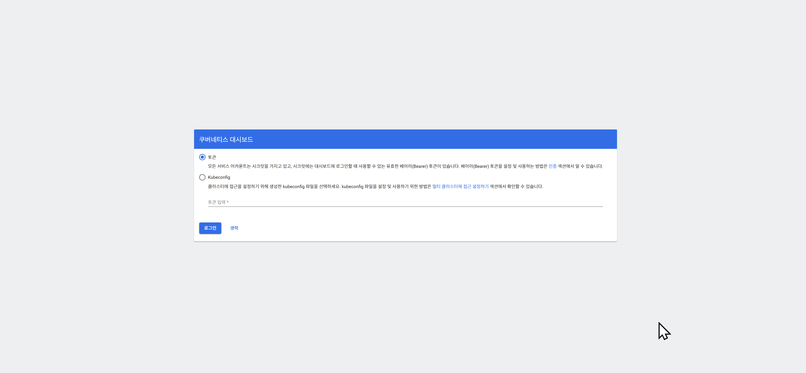

# Kubernates 명령어

## 쿠버네티스 대시보드 접속

 - URL : https://192.168.56.30:30000/#/login 



## 쿠버네티스 토큰 발급

```
입력
kubeadm token create --print-join-command

출력 : node에 그대로 복사해서 입력
kubeadm join 192.168.56.30:6443 --token 8f5bdu.i3x9dz0nn6ay2xnp --discovery-token-ca-cert-hash sha256:477eb4649cde130485971c51ae9cfe49deaa2c1261cfe7a1c5a5a39a3bf74037 
```

## kubectl get nodes

```
출력 예시

    NAME          STATUS   ROLES           AGE   VERSION
    k8s-master    Ready    control-plane   2d    v1.27.2
    k8s-worker1   Ready    <none>          2d    v1.27.2
    k8s-worker2   Ready    <none>          2d    v1.27.2

```

| 컬럼        | 의미                    | 판단 기준                       |
| --------- | --------------------- | --------------------------- |
| `NAME`    | 노드 이름                 | kubelet이 API Server에 등록한 이름 |
| `STATUS`  | 노드가 정상 동작 가능한지        | kubelet 상태, 네트워크, 리소스 압박 등  |
| `ROLES`   | 노드 역할                 | control-plane / worker      |
| `AGE`     | 노드가 클러스터에 등록된 뒤 지난 시간 | join 이후 시간                  |
| `VERSION` | 해당 노드의 kubelet 버전     | Kubernetes 노드 에이전트 버전       |

### STATUS
 - Ready : 정상 상태입니다.
 - NotReady : 노드가 정상적으로 Pod를 받을 수 없는 상태입니다.
    - kubelet 문제	kubelet 죽음 / 설정 오류
    - 컨테이너 런타임 문제	containerd, CRI-O 문제
    - 네트워크 플러그인 문제	Calico, Flannel, CNI 미정상
    - API Server 통신 문제	노드가 마스터와 통신 불가
    - 리소스 부족	CPU, 메모리, 디스크 압박
    - 인증서 문제	kubelet 인증서 만료/오류 
 - Unknown : API Server가 해당 노드 상태를 알 수 없는 상태입니다.

### ROLES
 - control-plane : 마스터 노드
 - none : worker node
    - 직접 worker 라벨을 붙일 수 있습니다. 

## kubectl get nodes -o wide

```
[root@k8s-master ~]# kubectl get nodes -o wide
NAME          STATUS   ROLES           AGE   VERSION   INTERNAL-IP     EXTERNAL-IP   OS-IMAGE                           KERNEL-VERSION                 CONTAINER-RUNTIME
k8s-master    Ready    control-plane   11h   v1.27.2   192.168.56.30   <none>        Rocky Linux 8.8 (Green Obsidian)   4.18.0-477.10.1.el8_8.x86_64   containerd://1.6.21
k8s-worker1   Ready    <none>          11h   v1.27.2   192.168.56.31   <none>        Rocky Linux 8.8 (Green Obsidian)   4.18.0-477.10.1.el8_8.x86_64   containerd://1.6.21
k8s-worker2   Ready    <none>          11h   v1.27.2   192.168.56.32   <none>        Rocky Linux 8.8 (Green Obsidian)   4.18.0-477.10.1.el8_8.x86_64   containerd://1.6.21
```

| 컬럼                  | 의미                          |
| ------------------- | --------------------------- |
| `INTERNAL-IP`       | 클러스터 내부 통신용 IP              |
| `EXTERNAL-IP`       | 외부 접근용 IP                   |
| `OS-IMAGE`          | 노드 OS                       |
| `KERNEL-VERSION`    | Linux 커널 버전                 |
| `CONTAINER-RUNTIME` | containerd, Docker, CRI-O 등 |


## kubectl get pod -A

 - kubectl get pods --all-namespaces
```
[root@k8s-master ~]# kubectl get pod -A
NAMESPACE              NAME                                         READY   STATUS    RESTARTS   AGE
calico-apiserver       calico-apiserver-697c8c5497-bhrqj            1/1     Running   0          11h
calico-apiserver       calico-apiserver-697c8c5497-rgllj            1/1     Running   0          11h
calico-system          calico-kube-controllers-68fbb6c8d6-jhqlp     1/1     Running   0          11h
calico-system          calico-node-fwdtf                            1/1     Running   0          11h
...

```

| 컬럼         | 의미            |
| ---------- | ------------- |
| `NAME`     | Pod 이름        |
| `READY`    | 준비 완료된 컨테이너 수 |
| `STATUS`   | Pod 상태        |
| `RESTARTS` | 컨테이너 재시작 횟수   |
| `AGE`      | 생성 후 경과 시간    |

### STATUS
 - Pending : 아직 실행 준비 중
 - ContainerCreating : 컨테이너 생성 중
 - CrashLoopBackOff  : 컨테이너가 실행되자마자 계속 죽음
 - ImagePullBackOff : 이미지 다운로드 실패
 - ErrImagePull : 이미지 pull 자체 실패
 - Completed : 해야 할 작업을 끝내고 정상 종료됨
 - Error : 컨테이너 실행 실패
 - Terminating : 삭제 중

## 파드 삭제
 - kubectl delete pod pod-1
 - kubectl delete deployment deployment-1


> [!NOTE]
>
> 본 문서는  인프런의 [초급자를 위한 【대세는 쿠버네티스】](https://www.inflearn.com/course/%EC%BF%A0%EB%B2%84%EB%84%A4%ED%8B%B0%EC%8A%A4-%EA%B8%B0%EC%B4%88/dashboard) 강의를 바탕으로 학습한 내용을 정리한 것입니다.