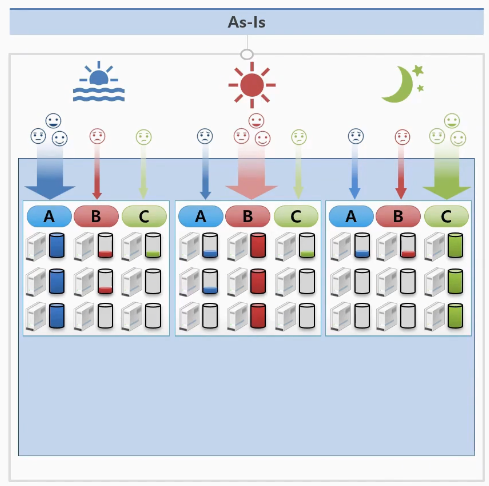

# 쿠버네티스를 사용하는 이유

# 한 회사에서 3개의 서비스를 오픈하는 예시

## 기존

### 서비스 필요 자원

- 한 회사에서 3개의 서비스를 오픈
  - 아침 : A 서비스의 접속량이 높고
  - 정오 : B 서비스만 접속량이 많음
  - 밤 : C 서비스만 접속량이 많음

접속량을 받쳐주기 위해서 각 3대의 서버에 해당하는 자원이 필요

이 시나리오에서는 총 9대의 서버가 필요

### 서비스의 백업

- 서버 장애 상황에 대비해서 한 대의 여분 서버가 필요할 때
- 서버별로 여유 백업서버를 두어 총 3대의 서버가 추가로 필요해 12개의 서버가 필요

### 서비스의 업데이트

- 서비스의 중단이 허용되는 경우 모든 서버를 내렸다가 업데이트 작업 후에 다시 올림
- 무중단 서비스를 해야 되는 경우, 한 서버씩 내렸다가 업데이트 작업 후에 서비스를 올리는 방식

## 쿠버네티스 적용

### 서비스 필요 자원

- 하루 동안 ABC 서비스의 평균 트래픽을 계산해보면 4대 분의 자원이 필요
- 스케일링 기능이 있기 때문에 서비스의 접속이건 점오건 저녁이건 트래픽 양에 따라 알아서 서비스 자원을 변경

### 서비스의 백업

- 쿠버네티스가 적용된 시스템은 장애가 난 서버 위에 있는 서비스들이 다른 서버에 바로 자동으로 옮겨주는 오토힐링 기능 존재 여분의 서버 한 대만 있으면 알아서 서비스를 유지

### 서비스의 업데이트

쿠버네티스 deployment 오브젝트를 통해서 업데이트를 자동적으로 처리되도록 지원
