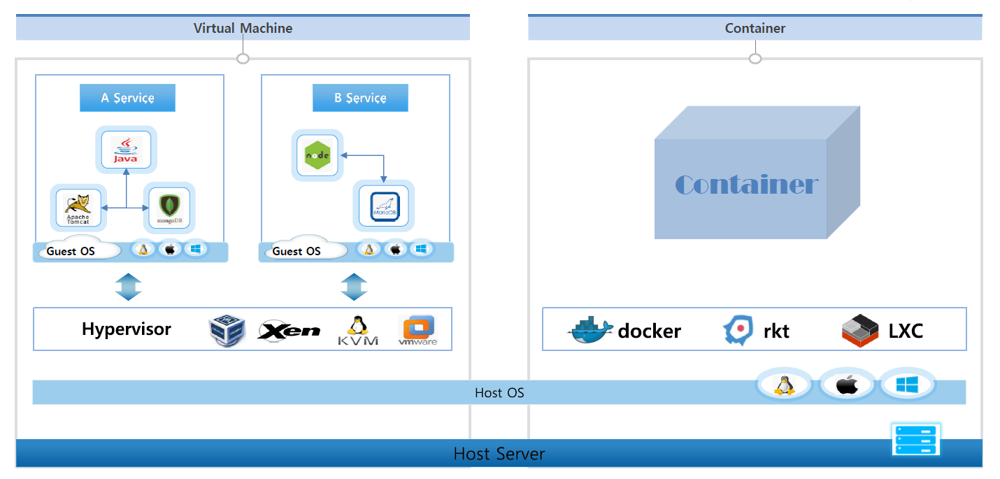

# VM vs Container

## Virtual Muchine

- 기본적으로 어떤 운영체제가 됐던 호스트 OS (필수)
- 호스트 OS 위에 VM을 가상화 시켜주기 위해서 여러 하이퍼바이저 존재
- 하이퍼 바이저를 이용해 원하는 운영체제로 게스트OS를 올려서 여러 VM들을 만들 수 있음
- 게스트OS도 호스트OS와 똑같이 하나의 OS 를 독립적으로 가지고 있는 것처럼 사용가능
- 각각의 OS가 올라가는 구조
- 보안적으로 VM은 게스트 OS 가 뚫려도 다른 게스트OS나 호스트 OS와 완전 분리

### 자원 증량이 필요할 경우

- VM은 A와 B 모듈은 괜찮지만 모듈 C에 부하가 가는 상황이 발생하면, VM을 하나 더 띄워서 사용하게 되는데, 필요없는 A, B도 함꼐 복사하게 되고, 자원량을 더 많이 사용하게 됨

## Container

- 한 OS를 공유하는 구조 (컨테이너 속도 빠름)
- 컨테이너를 리눅스 OS에서 윈도우용 컨테이너를 사용 불가능
- 보안상 한 컨테이너가 뚫려서 OS 영역에 접근을 하게 되면 다른 컨테이너들도 위험해질 수가 있습니다.

## 예시 상황

- 리눅스마다 버전이 존재하고 리눅스 버전에 따라 기본적으로 설치되는 라이브러리들이 달라짐
- 만약 리눅스 6 버전에서 개발을 하다보면 리눅스 6 버전에 설치되어 있는 OpenJDK 라이브러리를 자연스럽게 사용하게 됨
- 개발이 완료되고 이걸 리눅스 7 버전에서 띄우게 된다면 버전 문제 발생 확률이 높아짐

### 컨테이너 이미지

- Docker를 사용하여 한 서비스와 그 서비스가 돌아가는 데 필요한 라이브러리들이 같이 존재한 이미지 생성 가능합니다
- 리눅스 7 버전에 다른 라이브러리들이 있더라도 Docker만 설치되어 있으면
- 컨테이너 이미지를 가져와서 사용했을 때 A 서비스는 자신의 이미지 안에 있는
- **OpenJDK 라이브러리를 사용하기 때문에 안정적으로 시스템을 구동할 수가 있습니다.**
- Docker는 여러 컨테이너에서 호스트의 자원을 분리해서 사용할 수 있게 하면서 리눅스 고유 기술 namespace와 cgroup을 사용해 컨테이너의 격리를 수행함.
  - namespace : 커널에 관련된 영역 분리
  - cgroup : 자원에 대한 영역을 분리

### POD

- 쿠버네티스는 모듈별로 묶어서 각각의 컨테이너에 담는 걸 전제로 만들어 졌다.
- 각 모듈 별 최적화된 개발 언어를 사용하는 것이 좋다.
- 여러 컨테이너를 묶은 배포 단위
- 필요한 파드만, 확장 가능
