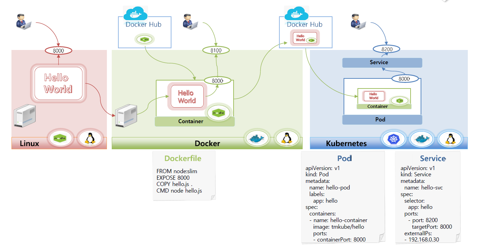

# Getting Started - Kubernates



# 🔶 예상 시나리오

- **최초의 리눅스 서버에서 Hello World라는 Node.js 앱을 하나** 만들어서 띄웁니다.
- 리눅스에는 Node.js를 실행할 수 있는 패키지가 깔려 있어서 이 앱이 구동됩니다.
- 도커가 깔려있는 다른 서버에서 앞서 만든 Hello 앱을 그대로 가지고 온다.
- 파일을 아까와 같이 그대로 실 행을 해보면 이 서버에는 Node.js가 깔려있지 않기 때문에 실행이 안됨
- 도커 허브에서  Node.js를 실행할 수 있는 컨테이너 이미지를 가져와 Hello World 앱을 실행

```docker
FROM node:slim
EXPOSE 8000 # 이 컨테이너를 구동시켜서 앱에서 서비스 할 수 있도록 오픈
COPY hello.js .
ENTRYPOINT ["node", "hello.js"]
```

- 쿠버네티스를 사용해서 앱을 띄운다.
- 먼저 앞에서 만든 컨테이너 이미지를 다시 도커 허브에 올려놓음
- 컨테이너를 만들 때 방금 올린 허브에서 이미지를 가져와서 POD를 구성하기위한 yaml 작성

## 🔹HelloPOD.yaml

```yaml
apiVersion: v1
kind: Pod
metadata:
  name: hello-pod # POD 명 
  labels:
    app: hello
spec:
  containers:
  - name: hello-container
    image: kubetm/hello # Container Image 사용
    ports:
    - containerPort: 8000 # 접근 포트
```

## 🔹Service.yaml

외부에서 접근할 수 있도록 하는 오브젝트

```yaml
apiVersion: v1
kind: Service
metadata:
  name: hello-svc
spec:
  selector:
    app: hello
  ports: # 컨테이너 Port 8000 -> 외부 포트 8200 
    - port: 8200
      targetPort: 8000
  externalIPs:
  - 192.168.56.30
```

## 🔹 신규 파드 생성


## 🔹 Service POD, HelloPOD 생성

- 실행


> [!NOTE]
>
> 본 문서는  인프런의 [초급자를 위한 【대세는 쿠버네티스】](https://www.inflearn.com/course/%EC%BF%A0%EB%B2%84%EB%84%A4%ED%8B%B0%EC%8A%A4-%EA%B8%B0%EC%B4%88/dashboard) 강의를 바탕으로 학습한 내용을 정리한 것입니다.