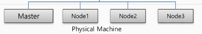

# Kubernates Overview

# 🔶 쿠버네티스 구조

Kubernates 는 서버 한 대를 Master 그외 서버를 노드 라고 함

### 🔹 Master Node

마스터는 Kubernates의 전반적인 기능을 컨트롤 하고 Node들은 자원을 제공하면 된다. 

마스터 노드에 여러 노드가 물려 있는 구조 연결 되면, 하나의 클러스터라고 이야기 할 수 있음

클러스터 전체의 자원을 들리고 있다면, 노드를 추가하면 된다.

### 🔹 네임스페이스 (Namespace)

- 클러스터의  객체가 쿠버네티스 오브젝트 들을 독립된 공간으로 분리 시킨다.
- 서로 다른 네임스페이스를 가지면, Service는 Pod를 연결할 수 없다.

### 🔹 POD :

- Kubernetes 최소 배포 단위인 Pod

### 🔹Service :

- **정적인 네트워크 접근 방법을 제공하고, 외부 트래픽을 Pod들로 분산**
- 외부로부터 연결이 가능하도록 IP를 할당해주는 서비스

### 🔹Container :

- 앱과 구성 요소를 포함하는 어플리케이션 객체

- POD는 여러 개의 Container를 포함할 수 있음
- POD는 데이터 유지를 위해 Volume을 만들어서 데이터를 별도 저장 함

### 🔹 ResourceQuita / LimitRange

NameSpace에 리소스 쿼터와 리미트 레인지를 포함하여, 사용할 자원을 한정 시킬 수 있음

- 파드의 갯수
- CPU 자원
- 메모리

### 🔹 ConfigMap / Secret

파드 생성시 컨테이너 내부의 환경변수 값을 넣어준다.

# 🔶 Kubernates Contoroller

파드를 관리하는 일 수행

### 🔹 Replication :

- 파드 감지해서 살려주거나, 파드의 수를 늘리고 줄이는 기능 (Scale In/Out)

### 🔹Replicaset  :

- 파드 감지해서 살려주거나, 파드의 수를 늘리고 줄이는 기능 (Scale In/Out)

### 🔹Deployment :

- 파드 배포 후 새 버전 업그레이드 수행 및 롤백 처리

### 🔹DaemonSet :

- 한 노드의 파드가 하나씩만 유지되게 해줌 (꼭 이렇게 사용해야 되는 모듈 존재)

### 🔹CronJob :

- 특정 작업만 하고 종료 시켜야 하는 일을 할 때 하드가 그렇게 동작 하도록 함

> [!NOTE]
>
> 본 문서는  인프런의 [초급자를 위한 【대세는 쿠버네티스】](https://www.inflearn.com/course/%EC%BF%A0%EB%B2%84%EB%84%A4%ED%8B%B0%EC%8A%A4-%EA%B8%B0%EC%B4%88/dashboard) 강의를 바탕으로 학습한 내용을 정리한 것입니다.