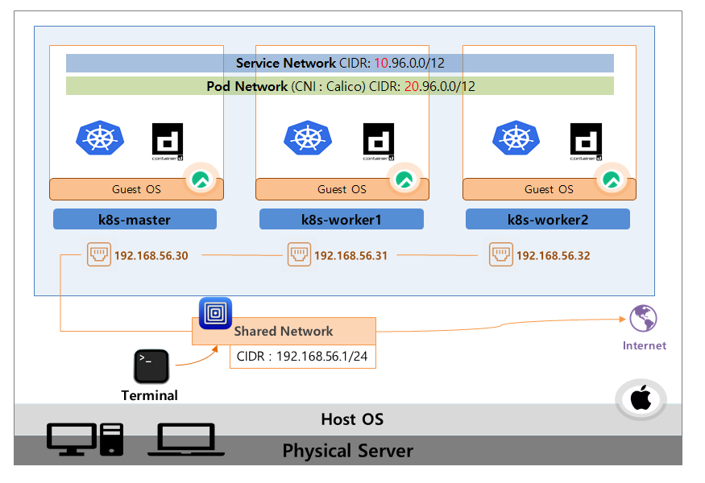

# Kubernates 예시 네트워크

# 🔶 쿠버네티스 네트워크

버추얼박스를 이용해서 내부 네트워크를 생성하라는 부분이 있습니다.

- Host-only Network
    - 각각의 VM에 이 IP들을 할당
        - 192.168.56.30 (Master)
        - 192.168.56.31 (Worker 1)
        - 192.168.56.32 (Worker 2)
    - VM 간의 통신을 하는 역할
    - 쉘 프로그램을 통해 각 IP로 접속할 수 있도록 도움
- NAT
    - 각각의 모든 VM들에 똑같은 10.0.2.15 IP를 할당
    - 외부 인터넷과 연결을 수행
    - 외부 인터넷을 통해 동일한 필요 설치 파일들을 다운로드

- 서비스 네트워크 : IP 10.96.0.0/12
    - 서비스를 만들 경우 해당 서비스의 IP는 10번대로 시작하는 IP가 할당
- 파드 네트워크 : 20.96.0.0/12
    - 파드를 만들면 파드 IP에는 20번대로 시작되는 IP가 할당

> [!NOTE]
>
> 본 문서는  인프런의 [초급자를 위한 【대세는 쿠버네티스】](https://www.inflearn.com/course/%EC%BF%A0%EB%B2%84%EB%84%A4%ED%8B%B0%EC%8A%A4-%EA%B8%B0%EC%B4%88/dashboard) 강의를 바탕으로 학습한 내용을 정리한 것입니다.