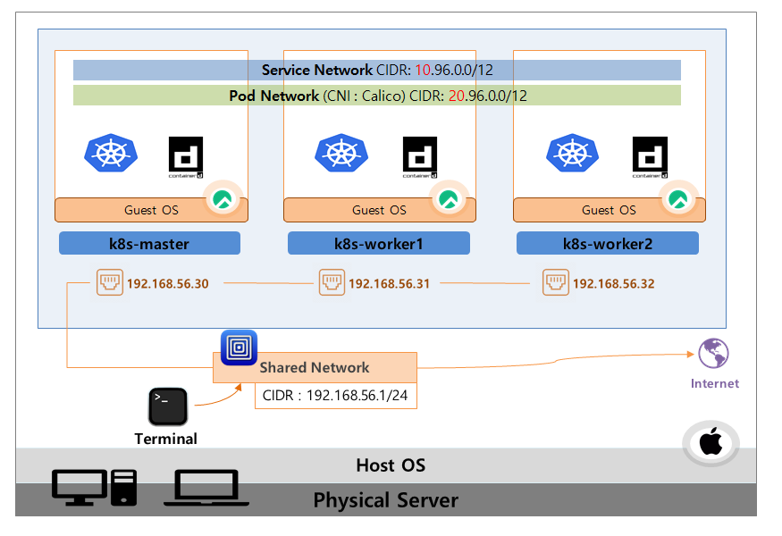

# Kubernates 예시 네트워크

# 🔶 쿠버네티스 네트워크



버추얼박스를 이용해서 내부 네트워크를 생성하라는 부분이 있습니다.


## Vagrant 내용

```txt

NodeCnt = 2

Vagrant.configure("2") do |config|
    
  config.vm.box = "rockylinux/8"
  # Disk 확장설정 추가
  config.disksize.size = "30GB"

  config.vbguest.auto_update = false
  config.vm.synced_folder "./", "/vagrant", disabled: true
  config.vm.network :forwarded_port, guest: 22, host: 2222, id: "ssh", auto_correct: true
  config.vm.provision :shell, privileged: true, inline: $install_default

  config.vm.define "master-node" do |master|
    master.vm.hostname = "k8s-master"
    master.vm.network "private_network", ip: "192.168.56.30"
    master.vm.provider :virtualbox do |vb|
      vb.memory = 4096
      vb.cpus = 4
      vb.customize ["modifyvm", :id, "--firmware", "efi"]
      vb.customize ["modifyvm", :id, "--nested-hw-virt", "on"]
	end
    master.vm.provision :shell, privileged: true, inline: $install_master
  end

  (1..NodeCnt).each do |i|
    config.vm.define "worker-node#{i}" do |node|
      node.vm.hostname = "k8s-worker#{i}"
      node.vm.network "private_network", ip: "192.168.56.#{i + 30}"
      node.vm.provider :virtualbox do |vb|
        vb.memory = 3072
        vb.cpus = 3
        vb.customize ["modifyvm", :id, "--firmware", "efi"]
        vb.customize ["modifyvm", :id, "--nested-hw-virt", "on"]
	  end
    end
  end
end

$install_default = <<-SHELL

echo '======== [4] Rocky Linux 기본 설정 ========'
echo '======== [4-1] 패키지 업데이트 ========'
# 강의와 동일한 실습 환경을 유지하기 위해 Linux Update 주석 처리
# yum -y update

# 초기 root 비밀번호 변경을 원하시면 아래 주석을 풀고 [새로운비밀번호]에 비번을 입력해주세요
# echo "root:새로운비밀번호" | chpasswd

echo '======== [4-2] 타임존 설정 및 동기화========'
timedatectl set-timezone Asia/Seoul
timedatectl set-ntp true
chronyc makestep

echo '======== [4-3] Disk 확장 / Bug: soft lockup 설정 추가========'
# https://cafe.naver.com/kubeops/25
yum install -y cloud-utils-growpart
growpart /dev/sda 4
xfs_growfs /dev/sda4

echo '======== [4-4] [WARNING FileExisting-tc]: tc not found in system path 로그 관련 업데이트 ========'
yum install -y yum-utils iproute-tc

echo '======= [4-4] hosts 설정 =========='
cat << EOF >> /etc/hosts
192.168.56.30 k8s-master
192.168.56.31 k8s-worker1
192.168.56.32 k8s-worker2
EOF

echo '======== [5] kubeadm 설치 전 사전작업 ========'
echo '======== [5] 방화벽 해제 ========'
systemctl stop firewalld && systemctl disable firewalld

echo '======== [5] Swap 비활성화 ========'
swapoff -a && sed -i '/ swap / s/^/#/' /etc/fstab


echo '======== [6] 컨테이너 런타임 설치 ========'
echo '======== [6-1] 컨테이너 런타임 설치 전 사전작업 ========'
echo '======== [6-1] iptable 세팅 ========'
cat <<EOF |tee /etc/modules-load.d/k8s.conf
overlay
br_netfilter
EOF

modprobe overlay
modprobe br_netfilter

cat <<EOF |tee /etc/sysctl.d/k8s.conf
net.bridge.bridge-nf-call-iptables  = 1
net.bridge.bridge-nf-call-ip6tables = 1
net.ipv4.ip_forward                 = 1
EOF

sysctl --system

echo '======== [6-2] 컨테이너 런타임 (containerd 설치) ========'
echo '======== [6-2-1] containerd 패키지 설치 (option2) ========'
echo '======== [6-2-1-1] docker engine 설치 ========'
echo '======== [6-2-1-1] repo 설정 ========'
yum-config-manager --add-repo https://download.docker.com/linux/centos/docker-ce.repo

echo '======== [6-2-1-1] containerd 설치 ========'
yum install -y containerd.io-1.6.21-3.1.el8
systemctl daemon-reload
systemctl enable --now containerd

echo '======== [6-3] 컨테이너 런타임 : cri 활성화 ========'
# defualt cgroupfs에서 systemd로 변경 (kubernetes default는 systemd)
containerd config default > /etc/containerd/config.toml
sed -i 's/ SystemdCgroup = false/ SystemdCgroup = true/' /etc/containerd/config.toml
systemctl restart containerd


echo '======== [7] kubeadm 설치 ========'
echo '======== [7] repo 설정 ========'
cat <<EOF | sudo tee /etc/yum.repos.d/kubernetes.repo
[kubernetes]
name=Kubernetes
baseurl=https://pkgs.k8s.io/core:/stable:/v1.27/rpm/
enabled=1
gpgcheck=1
gpgkey=https://pkgs.k8s.io/core:/stable:/v1.27/rpm/repodata/repomd.xml.key
exclude=kubelet kubeadm kubectl cri-tools kubernetes-cni
EOF


echo '======== [7] SELinux 설정 ========'
setenforce 0
sed -i 's/^SELINUX=enforcing$/SELINUX=permissive/' /etc/selinux/config

echo '======== [7] kubelet, kubeadm, kubectl 패키지 설치 ========'
yum install -y kubelet-1.27.2-150500.1.1.x86_64 kubeadm-1.27.2-150500.1.1.x86_64 kubectl-1.27.2-150500.1.1.x86_64 --disableexcludes=kubernetes
systemctl enable --now kubelet

SHELL


$install_master = <<-SHELL

echo '======== [8] kubeadm으로 클러스터 생성  ========'
echo '======== [8-1] 클러스터 초기화 (Pod Network 세팅) ========'
kubeadm init --pod-network-cidr=20.96.0.0/12 --apiserver-advertise-address 192.168.56.30

echo '======== [8-2] kubectl 사용 설정 ========'
mkdir -p $HOME/.kube
cp -i /etc/kubernetes/admin.conf $HOME/.kube/config
chown $(id -u):$(id -g) $HOME/.kube/config

echo '======== [8-3] Pod Network 설치 (calico) ========'
kubectl create -f https://raw.githubusercontent.com/k8s-1pro/install/main/ground/k8s-1.27/calico-3.26.4/calico.yaml
kubectl create -f https://raw.githubusercontent.com/k8s-1pro/install/main/ground/k8s-1.27/calico-3.26.4/calico-custom.yaml

echo '======== [8-4] Master에 Pod를 생성 할수 있도록 설정 ========'
kubectl taint nodes k8s-master node-role.kubernetes.io/control-plane-

echo '======== [9] 쿠버네티스 편의기능 설치 ========'
echo '======== [9-1] kubectl 자동완성 기능 ========'
echo "source <(kubectl completion bash)" >> ~/.bashrc
echo 'alias k=kubectl' >>~/.bashrc
echo 'complete -o default -F __start_kubectl k' >>~/.bashrc

echo '======== [9-2] Dashboard 설치 ========'
kubectl create -f https://raw.githubusercontent.com/k8s-1pro/install/main/ground/k8s-1.27/dashboard-2.7.0/dashboard.yaml

echo '======== [9-3] Metrics Server 설치 ========'
kubectl create -f https://raw.githubusercontent.com/k8s-1pro/install/main/ground/k8s-1.27/metrics-server-0.6.3/metrics-server.yaml
SHELL

```


- Host-only Network
    - 각각의 VM에 이 IP들을 할당
        - 192.168.56.30 (Master)
        - 192.168.56.31 (Worker 1)
        - 192.168.56.32 (Worker 2)
    - VM 간의 통신을 하는 역할
    - 쉘 프로그램을 통해 각 IP로 접속할 수 있도록 도움
- NAT
    - 각각의 모든 VM들에 똑같은 10.0.2.15 IP를 할당
    - 외부 인터넷과 연결을 수행
    - 외부 인터넷을 통해 동일한 필요 설치 파일들을 다운로드

- 서비스 네트워크 : IP 10.96.0.0/12
    - 서비스를 만들 경우 해당 서비스의 IP는 10번대로 시작하는 IP가 할당
- 파드 네트워크 : 20.96.0.0/12
    - 파드를 만들면 파드 IP에는 20번대로 시작되는 IP가 할당


```txt
k8s-Master 토큰 발급

Kubernetes 클러스터에 새로운 노드를 조인(join)시키기 위한 명령어를 생성해주는 명령어
kubeadm token create --print-join-command

실제 worker/control-plane 노드에서 실행할 완성된 join 커맨드
 -> kubeadm join 192.168.56.30:6443 --token td76kr.krihn7977yfsgn07 --discovery-token-ca-cert-hash sha256:f9416888e7712992e73d71943bc8bf738ea0e9422d596ebdbd556b21009a39fd 


k8s-worker 토큰 적용

master(API server)에 접속
 - kubeadm join 192.168.56.30:6443
 - 기본 포트는 6443

bootstrap token
    --token
    형식: xxxxxx.xxxxxxxxxxxxxxxx
    기본적으로 24시간 유효

--discovery-token-ca-cert-hash
    클러스터의 CA 인증서 해시
    MITM 공격 방지용
    노드가 "이게 진짜 master 맞냐?" 검증하는 역할

[root@k8s-worker1 ~]# kubeadm join 192.168.56.30:6443 --token td76kr.krihn7977yfsgn07 --discovery-token-ca-cert-hash sha256:f9416888e7712992e73d71943bc8bf738ea0e9422d596ebdbd556b21009a39fd

[preflight] Running pre-flight checks
[preflight] Reading configuration from the cluster...
[preflight] FYI: You can look at this config file with 'kubectl -n kube-system get cm kubeadm-config -o yaml'
[kubelet-start] Writing kubelet configuration to file "/var/lib/kubelet/config.yaml"
[kubelet-start] Writing kubelet environment file with flags to file "/var/lib/kubelet/kubeadm-flags.env"
[kubelet-start] Starting the kubelet
[kubelet-start] Waiting for the kubelet to perform the TLS Bootstrap...

This node has joined the cluster:
* Certificate signing request was sent to apiserver and a response was received.
* The Kubelet was informed of the new secure connection details.

Run 'kubectl get nodes' on the control-plane to see this node join the cluster.

```


> [!NOTE]
>
> 본 문서는  인프런의 [초급자를 위한 【대세는 쿠버네티스】](https://www.inflearn.com/course/%EC%BF%A0%EB%B2%84%EB%84%A4%ED%8B%B0%EC%8A%A4-%EA%B8%B0%EC%B4%88/dashboard) 강의를 바탕으로 학습한 내용을 정리한 것입니다.