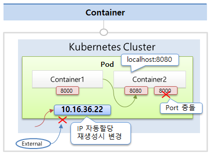

# 파드 POD



# 🔶 **Pod**

- 쿠버네티스에서 **배포 가능한 가장 작은 단위**.
- **최소 하나 이상의 컨테이너**로 구성되며, 보통 하나의 서비스 단위로 동작.
- 같은 Pod 안에 있는 컨테이너들은 **같은 네트워크 공간과 저장소(Volume)를 공유**.

## 🔹 **Pod 내부 네트워크와 포트**

- Pod 내부의 **각 컨테이너는 여러 개의 포트를 가질 수 있음**.
- **단, Pod 내에서는 같은 포트를 여러 컨테이너가 공유할 수 없음** (충돌 방지).
- Pod 안의 컨테이너들끼리는 **localhost(127.0.0.1)** 를 통해 통신 가능.
    - 예: 컨테이너 A에서 컨테이너 B의 8080 포트로 `localhost:8080`으로 접근 가능.

## 🔹 **Pod의 IP 주소**

- Pod가 생성될 때, 쿠버네티스 클러스터 내에서만 유효한 **고유한 IP**가 부여됨.
- 이 IP는 **외부에서 직접 접근할 수 없음**.
- 이 IP는 **휘발성(volatile)** 이며, Pod가 재시작되면 **변경될 수 있음**.

## 🔹 **Pod의 수명과 재생성**

- Pod에 문제가 생기면 쿠버네티스는 이를 감지하여 **해당 Pod를 삭제하고 새로운 Pod를 생성**함.
- 이로 인해 **IP 주소도 변경**됨.
- 따라서, **고정 IP를 기대해서는 안 되며**, 보통은 **Service**를 통해 Pod에 접근함.

```yaml
apiVersion: v1
kind: Pod
metadata:
 name: pod-1
spec:
 containers:
 - name: container1 # 컨테이터 명
   image: tmkube/p8000 # 이미지 명
   ports:
   - containerPort: 8000 # 컨테이너 포트 
 - name: container2 # 컨테이터 명
   image: tmkube/p8080 # 이미지 
   ports:
   - containerPort: 8080 # 컨테이너 포트 
```

# 🔶 라벨 (Label)

## 🔹 라벨이란?

- **Kubernetes 오브젝트에 부여할 수 있는 key-value 형식의 메타데이터**
- **파드(Pod)** 뿐만 아니라 **노드(Node)**, **서비스(Service)** 등 모든 오브젝트에 부착 가능
- 가장 많이 사용되는 대상은 **Pod**

## 🔹 라벨의 목적

- **오브젝트 분류와 분류된 오브젝트 사이 연결을 용이하게 하기 위해 사용**
- 라벨이 붙은 오브젝트들끼리 **그룹화**할 수 있음
- 서비스, 셀렉터, 배포 정책 등에서 **조건 기반 매칭**에 사용됨
- 검색 용도로 원하는 파드를 선택을 해서 사용 가능

## 🔹 3. 라벨의 구성

- **형식:** `key: value`
    
    예: `env: dev`, `type: web`
    
- 한 오브젝트에 **여러 개의 라벨** 부착 가능

## 🔹 4. YAML 예시

```yaml
apiVersion: v1
kind: Pod 
metadata:
  name: pod-2 # 파드 명
  labels:
    type: web # 라벨
    lo: dev   # 라벨
spec:
  containers:
  - name: container
    image: tmkube/init

```

## 🔹5. 라벨 활용 예시

```yaml
apiVersion: v1
kind: Service
metadata:
  name: svc-1
spec:
  selector:
    type: web # Selector 해당 내용과 매칭되는
							# 라벨이 붙어 있는 파드에 연결
  ports:
    - port: 8080

```

# 🔶 **Node Schedule**


## 🔹 노드 스케줄링이란?

- 쿠버네티스 클러스터에는 여러 개의 노드(Node)가 존재
- **Pod는 반드시 이 중 하나의 노드에 배치되어야 함**
- 이 과정을 **스케줄링(Scheduling)**이라고 함

## 🔹 노드 선택 방식: 수동 vs 자동

### ▫️ 수동 노드 선택

- 사용자가 **직접 노드를 선택**해서 파드를 배치할 수 있음
- 방법: **노드에 라벨(Label)**을 부여하고, 파드에서 **nodeSelector**를 사용하여 해당 라벨을 참조

```yaml
apiVersion: v1
kind: Pod
metadata:
 name: pod-3
spec:
 nodeSelector:
  hostname: node1
 containers:
 - name: container
   image: tmkube/init

```

### ▫️자동 스케줄링

- **쿠버네티스 스케줄러가 자동으로 노드를 선택**
- 기준은 각 노드의 **남은 자원량(CPU, Memory 등)**
    
    예시:
    
    - Node A: 남은 메모리 7GB
    - Node B: 남은 메모리 3.7GB
    - 예시 : Pod가 2GB 메모리를 요구하면
        - 두 노드 모두 가능하지만, 상황에 따라 쿠버네티스가 최적의 노드로 할당

## 🔹 3. 리소스 설정 (`requests`, `limits`)

- 파드는 생성 시 자원 사용량을 명시할 수 있음

```yaml
apiVersion: v1
kind: Pod
metadata:
  name: pod-4
spec:
  containers:
  - name: container
    image: tmkube/init
    resources:
      requests: # 최소 보장 자원
        memory: 2Gi
      limits: # 최대 허용 자원 
        memory: 3Gi
```

## 🔹 4. 리소스 제한이 중요한 이유

- 설정하지 않으면, 파드가 **무제한으로 자원을 사용할 수 있음**
- 이는 같은 노드의 **다른 파드들을 죽이는 결과**를 초래할 수 있음
- 특히 **메모리는 초과하면 즉시 파드가 종료됨 (OOMKilled)**
- **CPU는 초과하더라도 단지 느려질 뿐**, 파드를 죽이진 않음

## 🔹 5. 메모리와 CPU의 차이

| 자원 | 초과 시 반응 | 예시 |
| --- | --- | --- |
| 메모리 | 즉시 파드 종료 | 잘못된 메모리 참조 → 프로세스 충돌 |
| CPU | 느려지지만 종료되지 않음 | 여러 복사 작업이 동시에 진행되어도 성능 저하만 발생 |

# 🔶 실습

## 🔹 Deploying file has failed

- Kubernetes Dashboard에서 **Namespace를 `[모든 네임스페이스]`로 두고 리소스를 생성하려고 하면 오류 발생**
- 모든 네임스페이스(All namespaces)인 경우 실제로 어떤 네임스페이스에 리소스를 생성할지 명확하지 않기 때문에, API 요청을 거부
- 모든 네임스페이스(All namespaces)는  조회 전용 뷰 입니다.
- 새로운 리소스를 생성할 때는 정확히 어느 네임스페이스에 생성할지를 알아야 합니다.

## 🔹 POD 실습

- 쿠버네티스 마스터에서 POD의 IP로 명령을 내리는것 자체가, 클러스터 내에서의 동작입니다.


- Dash Board에서 EXEC 를 눌러 해당 파드의 쉘로 접속하여 명령을 처리할 수 도 있습니다.


- 동일 포트 사용 오류 확인

```yaml
apiVersion: v1
kind: Pod
metadata:
  name: pod-2
spec:
  containers:
  - name: container1
    image: kubetm/p8000
    ports:
    - containerPort: 8000 # 8000 포트 중복
  - name: container2
    image: kubetm/p8000
    ports:
    - containerPort: 8000 # 8000 포트 중복
```

- 오류로 인해 파드가 계속 재시작 되는것을 확인


- 로그 확인 버튼


- 로그 확인


### ▫️파드 재생성 테스트

- Deployment 추가

```yaml
apiVersion: apps/v1
kind: Deployment
metadata:
  name: deployment-1
spec:
  replicas: 1 # 최소 파드 갯수 
  selector:
    matchLabels:
      app: deploy
  template:
    metadata:
      name: pod-1 
      labels:
        app: deploy
    spec:
      containers:
      - name: container
        image: kubetm/init
```

### ▫️파드 삭제


### ▫️파드 재생성


- IP 할당 변경을 확인할 수 있음


## 🔹 Label 실습

- pod

```yaml
apiVersion: v1
kind: Pod
metadata:
  name: pod-1
  labels:
    type: web
    lo: dev
spec:
  containers:
  - name: container
    image: kubetm/init
---
apiVersion: v1
kind: Pod
metadata:
  name: pod-2
  labels:
    type: db
    lo: dev
spec:
  containers:
  - name: container
    image: kubetm/init
---
apiVersion: v1
kind: Pod
metadata:
  name: pod-3
  labels:
    type: server
    lo: dev
spec:
  containers:
  - name: container
    image: kubetm/init
---
apiVersion: v1
kind: Pod
metadata:
  name: pod-4
  labels:
    type: web
    lo: production
spec:
  containers:
  - name: container
    image: kubetm/init
---
apiVersion: v1
kind: Pod
metadata:
  name: pod-5
  labels:
    type: db
    lo: production
spec:
  containers:
  - name: container
    image: kubetm/init
---
apiVersion: v1
kind: Pod
metadata:
  name: pod-6
  labels:
    type: server
    lo: production
spec:
  containers:
  - name: container
    image: kubetm/init
```

- service

```yaml
apiVersion: v1
kind: Service
metadata:
  name: svc-for-web
spec:
  selector:
    type: web
  ports:
  - port: 8080
---
apiVersion: v1
kind: Service
metadata:
  name: svc-for-production
spec:
  selector:
    lo: production 
  ports:
  - port: 8080
```

### ▫️Seletor  type : web


### ▫️Seletor   lo : production


## 🔹 NodeSelector 실습

### ▫️수동 생성

- worker node1 자동 생성

```yaml
apiVersion: v1
kind: Pod
metadata:
  name: pod-3
spec:
  nodeSelector:
    kubernetes.io/hostname: k8s-worker1 # Worker Node 1에 수동 생성
  containers:
  - name: container
    image: kubetm/init
```

### ▫️자동 생성 (여유 공간이 많은 worker node2에 생성)

```yaml
apiVersion: v1
kind: Pod
metadata:
  name: pod-4
spec:
  containers:
  - name: container
    image: kubetm/init
    resources:
      requests:
        memory: 2Gi
      limits:
        memory: 3Gi
```


### ▫️자동 생성 (두 노드를 분석해 더 높은 점수를 가진 Worker Node할당) [ 점수 : 자원 ]

```yaml
apiVersion: v1
kind: Pod
metadata:
  name: pod-5
spec:
  containers:
  - name: container
    image: kubetm/init
    resources:
      requests:
        memory: 0.5Gi
      limits:
        memory: 0.5Gi
```


> [!NOTE]
>
> 본 문서는  인프런의 [초급자를 위한 【대세는 쿠버네티스】](https://www.inflearn.com/course/%EC%BF%A0%EB%B2%84%EB%84%A4%ED%8B%B0%EC%8A%A4-%EA%B8%B0%EC%B4%88/dashboard) 강의를 바탕으로 학습한 내용을 정리한 것입니다.