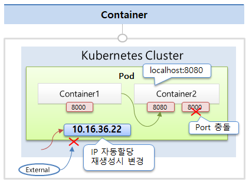
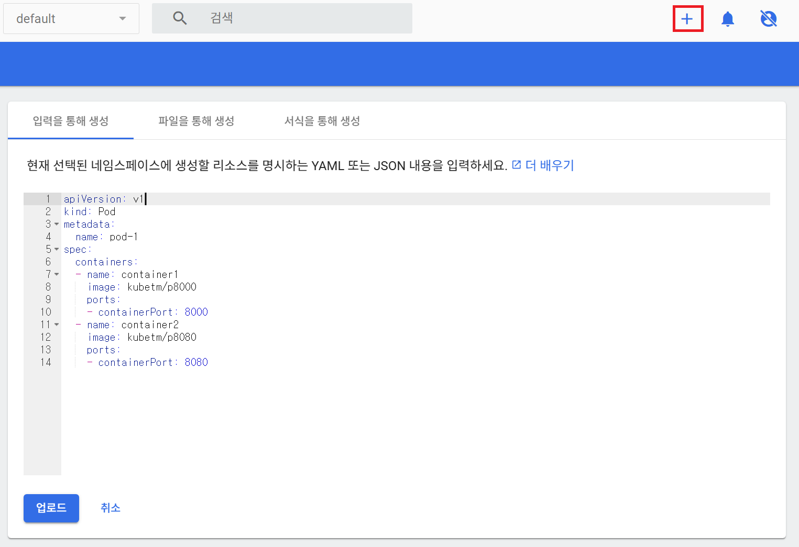

# 파드 POD



# 🔶 **Pod**

- 쿠버네티스에서 **배포 가능한 가장 작은 단위**.
- **최소 하나 이상의 컨테이너**로 구성되며, 보통 하나의 서비스 단위로 동작.
- 같은 Pod 안에 있는 컨테이너들은 **같은 네트워크 공간과 저장소(Volume)를 공유**.

## 🔹 **Pod 내부 네트워크와 포트**

- Pod 내부의 **각 컨테이너는 여러 개의 포트를 가질 수 있음**.
- **단, Pod 내에서는 같은 포트를 여러 컨테이너가 공유할 수 없음** (충돌 방지).
- Pod 안의 컨테이너들끼리는 **localhost(127.0.0.1)** 를 통해 통신 가능.
    - 예: 컨테이너 A에서 컨테이너 B의 8080 포트로 `localhost:8080`으로 접근 가능.

## 🔹 **Pod의 IP 주소**

- Pod가 생성될 때, 쿠버네티스 클러스터 내에서만 유효한 **고유한 IP**가 부여됨.
- 이 IP는 **외부에서 직접 접근할 수 없음**.
- 이 IP는 **휘발성(volatile)** 이며, Pod가 재시작되면 **변경될 수 있음**.

## 🔹 **Pod의 수명과 재생성**

- Pod에 문제가 생기면 쿠버네티스는 이를 감지하여 **해당 Pod를 삭제하고 새로운 Pod를 생성**함.
- 이로 인해 **IP 주소도 변경**됨.
- 따라서, **고정 IP를 기대해서는 안 되며**, 보통은 **Service**를 통해 Pod에 접근함.

```yaml
apiVersion: v1
kind: Pod
metadata:
 name: pod-1
spec:
 containers:
 - name: container1 # 컨테이터 명
   image: tmkube/p8000 # 이미지 명
   ports:
   - containerPort: 8000 # 컨테이너 포트 
 - name: container2 # 컨테이터 명
   image: tmkube/p8080 # 이미지 
   ports:
   - containerPort: 8080 # 컨테이너 포트 
```

# 🔶 라벨 (Label)

## 🔹 라벨이란?

- **Kubernetes 오브젝트에 부여할 수 있는 key-value 형식의 메타데이터**
- **파드(Pod)** 뿐만 아니라 **노드(Node)**, **서비스(Service)** 등 모든 오브젝트에 부착 가능
- 가장 많이 사용되는 대상은 **Pod**

## 🔹 라벨의 목적

- **오브젝트 분류와 분류된 오브젝트 사이 연결을 용이하게 하기 위해 사용**
- 라벨이 붙은 오브젝트들끼리 **그룹화**할 수 있음
- 서비스, 셀렉터, 배포 정책 등에서 **조건 기반 매칭**에 사용됨
- 검색 용도로 원하는 파드를 선택을 해서 사용 가능

## 🔹 3. 라벨의 구성

- **형식:** `key: value`
    
    예: `env: dev`, `type: web`
    
- 한 오브젝트에 **여러 개의 라벨** 부착 가능

## 🔹 4. YAML 예시

```yaml
apiVersion: v1
kind: Pod 
metadata:
  name: pod-2 # 파드 명
  labels:
    type: web # 라벨
    lo: dev   # 라벨
spec:
  containers:
  - name: container
    image: tmkube/init

```

## 🔹5. 라벨 활용 예시

```yaml
apiVersion: v1
kind: Service
metadata:
  name: svc-1
spec:
  selector:
    type: web # Selector 해당 내용과 매칭되는
							# 라벨이 붙어 있는 파드에 연결
  ports:
    - port: 8080

```

# 🔶 **Node Schedule**


## 🔹 노드 스케줄링이란?

- 쿠버네티스 클러스터에는 여러 개의 노드(Node)가 존재
- **Pod는 반드시 이 중 하나의 노드에 배치되어야 함**
- 이 과정을 **스케줄링(Scheduling)**이라고 함

## 🔹 노드 선택 방식: 수동 vs 자동

### ▫️ 수동 노드 선택

- 사용자가 **직접 노드를 선택**해서 파드를 배치할 수 있음
- 방법: **노드에 라벨(Label)**을 부여하고, 파드에서 **nodeSelector**를 사용하여 해당 라벨을 참조

```yaml
apiVersion: v1
kind: Pod
metadata:
 name: pod-3
spec:
 nodeSelector:
  hostname: node1
 containers:
 - name: container
   image: tmkube/init

```

### ▫️자동 스케줄링

- **쿠버네티스 스케줄러가 자동으로 노드를 선택**
- 기준은 각 노드의 **남은 자원량(CPU, Memory 등)**
    
    예시:
    
    - Node A: 남은 메모리 7GB
    - Node B: 남은 메모리 3.7GB
    - 예시 : Pod가 2GB 메모리를 요구하면
        - 두 노드 모두 가능하지만, 상황에 따라 쿠버네티스가 최적의 노드로 할당

## 🔹 3. 리소스 설정 (`requests`, `limits`)

- 파드는 생성 시 자원 사용량을 명시할 수 있음

```yaml
apiVersion: v1
kind: Pod
metadata:
  name: pod-4
spec:
  containers:
  - name: container
    image: tmkube/init
    resources:
      requests: # 최소 보장 자원
        cpu : 1
        memory: 2Gi
      limits: # 최대 허용 자원 
        cpu : 2
        memory: 3Gi
```

## 🔹 4. 리소스 제한이 중요한 이유

- 설정하지 않으면, 파드가 **무제한으로 자원을 사용할 수 있음**
- 이는 같은 노드의 **다른 파드들을 죽이는 결과**를 초래할 수 있음
- 특히 **메모리는 초과하면 즉시 파드가 종료됨 (OOMKilled)**
- **CPU는 초과하더라도 단지 느려질 뿐**, 파드를 죽이진 않음

## 🔹 5. 메모리와 CPU의 차이

| 자원 | 초과 시 반응 | 예시 |
| --- | --- | --- |
| 메모리 | 즉시 파드 종료 | 잘못된 메모리 참조 → 프로세스 충돌 |
| CPU | 느려지지만 종료되지 않음 | 여러 복사 작업이 동시에 진행되어도 성능 저하만 발생 |

<br/>

# 🔶 실습

## 🔹 Deploying file has failed

- Kubernetes Dashboard에서 **Namespace를 `[모든 네임스페이스]`로 두고 리소스를 생성하려고 하면 오류 발생**
- 모든 네임스페이스(All namespaces)인 경우 실제로 어떤 네임스페이스에 리소스를 생성할지 명확하지 않기 때문에, API 요청을 거부
- 모든 네임스페이스(All namespaces)는  조회 전용 뷰 입니다.
- 새로운 리소스를 생성할 때는 정확히 어느 네임스페이스에 생성할지를 알아야 합니다.
- namespace : default 확인



## 🔹 POD 실습

- 쿠버네티스 마스터에서 POD의 IP로 명령을 내리는것 자체가, 클러스터 내에서의 동작입니다.


- Dash Board에서 EXEC 를 눌러 해당 파드의 쉘로 접속하여 명령을 처리할 수 도 있습니다.


- 동일 포트 사용 오류 확인

```yaml
apiVersion: v1
kind: Pod
metadata:
  name: pod-2
spec:
  containers:
  - name: container1
    image: kubetm/p8000
    ports:
    - containerPort: 8000 # 8000 포트 중복
  - name: container2
    image: kubetm/p8000
    ports:
    - containerPort: 8000 # 8000 포트 중복
```

- 오류로 인해 파드가 계속 재시작 되는것을 확인


- 로그 확인 버튼


- 로그 확인


### ▫️파드 재생성 테스트

- Deployment 추가

```yaml
apiVersion: apps/v1
kind: Deployment
metadata:
  name: deployment-1
spec:
  replicas: 1 # 최소 파드 갯수 
  selector:
    matchLabels:
      app: deploy
  template:
    metadata:
      name: pod-1 
      labels:
        app: deploy
    spec:
      containers:
      - name: container
        image: kubetm/init
```

### ▫️파드 삭제


### ▫️파드 재생성


- IP 할당 변경을 확인할 수 있음


## 🔹 Label 실습

- pod

```yaml
apiVersion: v1
kind: Pod
metadata:
  name: pod-1
  labels:
    type: web
    lo: dev
spec:
  containers:
  - name: container
    image: kubetm/init
---
apiVersion: v1
kind: Pod
metadata:
  name: pod-2
  labels:
    type: db
    lo: dev
spec:
  containers:
  - name: container
    image: kubetm/init
---
apiVersion: v1
kind: Pod
metadata:
  name: pod-3
  labels:
    type: server
    lo: dev
spec:
  containers:
  - name: container
    image: kubetm/init
---
apiVersion: v1
kind: Pod
metadata:
  name: pod-4
  labels:
    type: web
    lo: production
spec:
  containers:
  - name: container
    image: kubetm/init
---
apiVersion: v1
kind: Pod
metadata:
  name: pod-5
  labels:
    type: db
    lo: production
spec:
  containers:
  - name: container
    image: kubetm/init
---
apiVersion: v1
kind: Pod
metadata:
  name: pod-6
  labels:
    type: server
    lo: production
spec:
  containers:
  - name: container
    image: kubetm/init
```

- service

```yaml
apiVersion: v1
kind: Service
metadata:
  name: svc-for-web
spec:
  selector:
    type: web
  ports:
  - port: 8080
---
apiVersion: v1
kind: Service
metadata:
  name: svc-for-production
spec:
  selector:
    lo: production 
  ports:
  - port: 8080
```

### ▫️Seletor  type : web


### ▫️Seletor   lo : production


## 🔹 NodeSelector 실습

### ▫️수동 생성

- worker node1 자동 생성

```yaml
apiVersion: v1
kind: Pod
metadata:
  name: pod-3
spec:
  nodeSelector:
    kubernetes.io/hostname: k8s-worker1 # Worker Node 1에 수동 생성
  containers:
  - name: container
    image: kubetm/init
```

### ▫️자동 생성 (여유 공간이 많은 worker node2에 생성)

```yaml
apiVersion: v1
kind: Pod
metadata:
  name: pod-4
spec:
  containers:
  - name: container
    image: kubetm/init
    resources:
      requests:
        memory: 2Gi
      limits:
        memory: 3Gi
```


### ▫️자동 생성 (두 노드를 분석해 더 높은 점수를 가진 Worker Node할당) [ 점수 : 자원 ]

```yaml
apiVersion: v1
kind: Pod
metadata:
  name: pod-5
spec:
  containers:
  - name: container
    image: kubetm/init
    resources:
      requests:
        memory: 0.5Gi
      limits:
        memory: 0.5Gi
```


> [!NOTE]
>
> 본 문서는  인프런의 [초급자를 위한 【대세는 쿠버네티스】](https://www.inflearn.com/course/%EC%BF%A0%EB%B2%84%EB%84%A4%ED%8B%B0%EC%8A%A4-%EA%B8%B0%EC%B4%88/dashboard) 강의를 바탕으로 학습한 내용을 정리한 것입니다.

<details>

<summary>8. Pod - Container, Label, NodeSchedule 접기/펼치기</summary>
쿠버네티스의 파드에 대해서 강의를 시작하겠습니다

첫 번째 파드의 특징을 보면 파드 안에는 하나의 독립적인 서비스를 구동할 수 있는 컨테이너들이 있고요

그 컨테이너들은 서비스가 연결될 수 있도록 포트를 가지고 있는데 한 컨테이너가 포트를 하나 이상 가질 수는 있지만 한 파드 내에서 컨테이너들끼리 포트가 중복될 수는 없어요

이 두 컨테이너는 한 호스트로 묶여 있다고 보시면 되는데 그래서 이 컨테이너에서 이 컨테이너로 접근을 할 때 로컬호스트 8080으로 접근할 수가 있죠

그리고 Pod가 생성될 때 고유의 IP 주소가 할당이 되는데 쿠버네티스 클러스터 내에서만 이 IP를 통해서 이 파드에 접근을 할 수가 있고요 외부에서는 이 IP로 접근을 할 수가 없어요 그리고 만약 파드에 문제가 생기면 시스템이 이걸 감지를 해서 파드를 삭제를 시키고 다시 재생성을 하게 되는데 이때 IP 주소는 변경이 돼요

그러니까 휘발성이 있는 특징을 가진 IP인 거죠

밑에 이런 파드를 만들기 위한 야물 파일 내용을 보시면 먼저 파드를 만들 건데 이 pod의 name은 pod-1이고요.

containers에 container1과 container2를 만들 거예요.

그리고 container1은 이미지가 p8000이라는 이름이고요.

그리고 port는 8000번으로 노출이 되어 있어요.

그리고 container2는 p8080이라는 이미지 이름이고요.

그리고 container port로는 8080번이 오픈되어 있습니다.

이렇게 한 파드에 여러 컨테이너를 담을 수가 있고요 실습 때 확인을 해보겠습니다

두 번째로 라벨의 속성에 대해서 설명을 드릴 건데 라벨은 파드 뿐만 아니라 모든 오브젝트에 달 수가 있는데 파드에서 가장 많이 사용이 돼요

이 라벨을 사용하는 이유는 목적에 따라 오브젝트들을 분류를 하고 그 분류된 오브젝트들만 따로 골라서 연결을 하기 위해서예요

라벨의 구성은 키와 값가 한 쌍이고요 한 파드에는 여러개의 라벨을 달 수가 있어요

이렇게 사용 목적에 따라 라벨을 잘 달아 놓으면 우리가 해시태그를 붙여서 검색 용도로 사용하듯이 원하는 파드를 선택을 해서 사용할 수가 있어요

아래 YAML 파일 내용을 보면 파드를 만들 때 레이블 수에 키와 밸류 형식으로 내용을 넣을 수가 있구요 추후 서비스를 만들 때 여기 셀렉터에 키와 밸류를 넣으면 해당 내용과 매칭되는 라벨이 붙어 있는 파드에 연결이 돼요 다음으로는 노드 스케줄이라는 특성인데 파드는 결국

여러 노드들 중에 한 노드에 올라가 줘야 돼요

그 방법에 대해서 제가 직접 노드를 선택하는 방법과 쿠버네티스가 자동으로 지정해 주는 방법이 있어요 먼저 첫 번째인 직접 선택하는 방법을 보시면 아까 파드에 라벨을 단 것처럼

이번엔 노드에 라벨을 달고 파드를 만들 때 노드를 지정을 할 수가 있어요.

밑에 YAML 내용을 보시면 파드를 만들 때 노드 셀렉터라는 항목에 노드에 라벨과 매치되는 키 밸류를 넣으면 돼요.

그리고 두 번째로 쿠버네티스의 스케줄러가 판단을 해서 지정을 해주는 경우인데 노드에는 전체 사용 가능한 자원량이 있죠.

메모리와 CPU가 대표적인데 일단 메모리를 예를 들면 현재 이 노드에는 몇몇 파드들이 들어가 있어서 남은 메모리가 1GB고요.

그리고 이 노드는 3.7GB의 메모리가 남은 상황이에요.

그리고 파드를 생성을 할 때 이 파드에서 요구될 리소스의 사용량을 명시를 할 수가 있는데

이 파드는 2GB의 메모리를 요구한다고 했을 때 Kubernetes가 알아서 이쪽으로 파드를 스케줄링 해줘요.

그리고 이 사용량을 넣는 큰 한 가지 이유가 만약 이거를 설정하지 않으면 파드 안에 있는 앱에서 부하가 생길 때 무한정 노드에 있는 자원을 사용을 하려고 할 거고 그러면 그 노드에 있는 다른 파드들은 자원이 없어서 결국 다 같이 죽게 돼요.

밑에 파드를 만들 때 야물 내용을 보시면 파드에서 사용될 리소스는 리퀘스트가 메모리 2기가를 요구한다는 뜻이고요.

그리고 리미트는 최대 허용 메모리가 3기가다 라는 내용이에요.

리미치에 대해서 좀 더 설명을 드리면 일단 메모리의 경우 리미치를 넘어 버리면 바로 파드를 종료를 시켜버려요

반면 CPU의 경우에는 직접 파드를 종료시키지는 않아요

이렇게 메모리와 CPU가 다르게 동작하는 이유는 각 자원에 대한 특성 때문인데요 예를 들어 우리가 파일을 복사를 할 때 하나를 복사하고 있는데 또 다른 하나를 복사를 시키면 첫 번째 파일이 좀 느려지면서 두 번째 파일이 복사가 되죠

프로세스들이 CPU 자원을 쓰는 데 있어서 서로 문제를 일으키진 않아요

좀 느려질 뿐이지

근데 파일을 복사를 하는데 두 번째 파일이 첫 번째 파일을 쓰는 메모리를 침범을 했을 때

근데 파일을 복사를 하는데 두 번째 파일이 첫 번째 파일을 쓰는 메모리를 침범을 했을 때

우리가 가끔 보면 잘못된 메모리를 참조했다면서 프로세스가 종료되는 경우가 있잖아요

메모리는 잘못되면 이렇게 프로세스 간에 치명적인 문제를 일으키죠

그래서 이렇게 자원의 성격에 따라 쿠버네티스에서도 다르게 판단을 해요.

하드에 대해서는 설명할 내용이 정말 많은데 기초편 강의이기 때문에 이 정도로만 하고요.

한번 설명한 대로 잘 작동을 하는지 실습을 통해서 확인을 해보겠습니다.
</details>

<details>

<summary>9. Pod - 실습 접기/펼치기</summary>

이제 실습을 진행하겠습니다

먼저 한 파드에 여러 컨테이너들을 생성하는 실습이고요 내용을 보시면 이렇게 두 개의

컨테이너가 있어요

하나는 이미지가 p8000이라고 해서 8000번 포트로 접속이 되고요 다른 하나는

p8080이라는 이미지를 가지고 와서 8080 포트를 오픈시켜놨어요

일단 만들어 볼게요

이렇게 붙여놓고 업데이트를 누르면 이렇게 지금 파드가 만들어지고 있고요 그래서 내용을

보면은 파드가 만들어졌고 그리고 상태는 러닝 상태고요 그리고 여기를 보시면 ip가 보이시죠

서비스 없이 이 파드에 접근할 수 있는 ip이고 쿠버네티스 클러스터 내에서만 접근을 할

수가 있어요 일단 여기에 접속을 해서 아까 생성했던 포트로 호출을 해 볼게요

현재 여기가 Kubernetes 마스터인데 여기서 콘솔 명령을 날리는 것 자체가

Kubernetes 클러스터 내에서 동작하는 거라고 보시면 되고요

그렇기 때문에 여기서 curl로 아까 만들었던 파드의 IP와 포트를 날려보면 이렇게

8000번 포트가 찍히는 걸 볼 수가 있고요 그리고 이렇게 8080 포트도 연결되는 걸 볼

수가 있습니다.

그럼 이번에는 8000번 포트가 열려있는 컨테이너로 들어가서 8080 포트로 접속을 한번

해볼게요. 이 화면에서 여기 EXEC 여기로 들어가시면 바로 컨테이너에 있는 쉘로 들어갈

수가 있는데 현재 여기가 컨테이너 1 안에 있는 쉘이에요.

그래서 여기서 마찬가지로 CURL를 localhos
그러면 이렇게 연결이 잘 됐죠

한번 이번 컨테이너에서도 만들어 볼까요

이번 컨테이너로 들어왔고요

이렇게 호스트 이름이 똑같은 걸 볼 수가 있어요

curl로 localhost:8080 로컬 호스트로 접속을 하면 다른 컨테이너에 연결이 잘되는 걸 볼 수가 있어요

이번에 파드를 만들 때 컨테이너 포트를 한번 중복을 시켜볼게요

다시 이 내용을 복사를 해서 생성을 하고 포트가 8000번인

이미지를 2개를 만드는 거예요

이렇게 해서 업데이트를 하면 이렇게 생성 중이라고 나오고요

다시 보면 파드의 상태를 보면 뭔가 문제가 생겼는지 지금 재생성을 계속 시도를 하고 있어요

한번 로그를 볼게요

여기에 로그가 있고요

컨테이너 1에는 특별한 로그가 찍히지 않았죠

그럼 컨테이너 2를 볼게요

여기 뭔가 내용이 찍혔죠 쭉 보시면은 에러가 났는데 현재 8000번 포트가 이미 사용 중이다 라는 내용이죠

컨테이너 1을 만들고 2를 만들면서 1에서 이미 8000번 포트를 사용을 했기 때문에

2에서는 사용할 수 없다 라고 찍힌 거예요

이렇게 한 파드 내에 있는 컨테이너들끼리는 서로 포트가 중복이 될 수 없다는 것을 보셨고요

다음으로 한가지 더 보여드릴 것은 Pod가 시스템에 의해서 관리가 됐을 때 Pod의 IP가

Pod가 재생성이 되면 변경된다는 얘기를 했었죠?

그걸 한번 확인을 해볼 거예요 그러기 위해서 여기 컨트롤러라는 걸 한번 만들어 볼 건데요

나중에 실습할 내용이지만 간단하게 말씀을 드리면 이 컨트롤러가 Pod를 만들어주고 Pod가 죽었을 때 다시 생성시켜주는 그런 관리적인 역할을 해줘요

이 정도로만 알고 한번 만들어 볼게요

만들어 보면은 이렇게 컨트롤러라는 얘가 Pod를 만들고 있어요

안에 내용을 보면 IP가 생성이 됐죠

10.16.36.75 인데 이 패드가 뭔가 문제가 생겨서 때가 됐다 라고 해서 이 패드를 삭제를 해보면 패드를 삭제를 하면 바로 지워지지가 않아요.

아직 러닝 중이고 하지만 컨트롤러는 삭제 신호를 받았기 때문에 바로 이렇게 새 파드를 생성하려고 하고 있어요.

얘는 곧 지워질 거고요.

이 패드로 들어가 보면 이렇게 IP가 바뀌어서 재생성된 걸 볼 수가 있어요.

그럼 다음으로 라벨의 기능을 사용해 보겠습니다.

일단 6개의 패드를 만들 건데 여기 내용을 복사를 해서 이론 설명때 드렸던 것처럼 이

파드는 개발환경에서 실행될 웹서버구요 만들고

그리고 2번 파드는 개발환경에서 만들 DB 서버에요

그리고 3번 파드는 서버구요

그리고 4번 Pod는 웹인데 이번엔 프로덕션이죠

그리고 DB가 있구요 마지막으로 서버입니다

이렇게 6개의 파드가 만들어졌구요

이제 서비스를 달아서 원하는 파드들을 선택을 해볼건데 이렇게 해서 만들어 보면 서비스가 만들어졌죠

이 서비스 안을 보면 여러가지 내용이 있는데 이 내용들은 다음 장에서의 서비스 파트에서 더 알아볼 거고요.

여기 밑에 보면 이렇게 파드가 2개가 연결된 걸 볼 수가 있어요.

이 두 파드는 레이블이 type=Web인 파드고요.

들어가 보면 TypeWeb이 있는 걸 볼 수가 있죠.

그리고 이번에는 Production 환경에 있는 파드들만 서비스에 연결을 해 볼게요.

셀렉터에 env로 프로덕션을 입력을 하고요.

이렇게 해서 만들어 보겠습니다.

여기 밑에 보면 이렇게 프로덕션에만 실행되고 있는 파드들이 연결이 되어 있죠.

이렇게 파드에 라벨을 달아 놓으면 해당 목적에 따라 파드를 연결할 수 있다는 걸 확인할 수 있습니다 그럼 이제 노드 스케줄에 대해서 실습을 해 볼 건데요

여기 파드를 만들 거고요

여기 스펙에 보시면 노드 셀렉터라고 있어요

그리고 밑에 키와 밸류가 있는데 Kubernetes 호스트가 노드 1번을 가리키고 있죠

실제 노드의 내용을 보면 노드가 1번과 2번이 있어요

그래서 1번을 보면 기본적인 레이블들이 만들어져 있죠

그 중에 이 레이블을 제가 선택을 한 거예요

그래서 실제 이 파드가 노드에 생성이 되는지 확인을 해볼게요

복사해서 만들어 보면 이렇게 바로 파드가 만들어졌고요 현재 이 파드는 노드1에 생성됐다고 이렇게 바로 나와요

그럼 이번엔 쿠버네티스 스케줄러가 알아서 적절한 노드를 할당해주는 걸 확인해볼게요

먼저 노드의 자원 상황을 보면 현재 노드1에는 총 3.7GB가 있는데 사용된 요청량은 2.7GB예요 그렇기 때문에 약 1GB의 메모리가 남은 상황이고요

이 노드에는 3.7GB가 있고 사용된 게 없기 때문에 그대로 3.7GB가 남아있겠죠

그럼 여기서 제가 파드를 만들어 볼 건데요

이 파드에 리소스를 주고 리퀘스트에 메모리를 2GB를 할당해달라고 요청을 할 거예요

그럼 당연히 파드 1에는 이만큼의 용량이 없기 때문에 파드 2에 당연히 만들어지겠죠

이렇게 보시면 POD4가 노드2에 만들어진 걸 볼 수가 있어요

그리고 다시 한번 노드에 남아있는 메모리를 한번 보면 노드1은 72%를 사용했고 노드2는 50% 가량을 사용을 했어요

제가 여기서 0.5기가의 메모리를 요청하는 POD를 생성을 해 볼게요

그러면 이 파드는 노드 1과 2 중에서 어느 노드로 스케줄링이 될까요?

아마도 노드 2에 만들어지려고 할 거예요

현재 노드 2에 자원이 더 많이 남아있기 때문에 이렇게 노드 2에 만들어진 걸 확인할 수 있죠 쿠버네티스가 스케줄링을 할 때 노드마다 점수를 매겨서 가장 높은 점수가 있는 노드에 파드를 할당을 해줘요

거기서 그 점수에 영향을 끼치는 부분 중에 하나가 이렇게 노드 스케줄에 대해서 알아봤고 이것으로 이번 실습을 마치도록 하겠습니다

</details>


