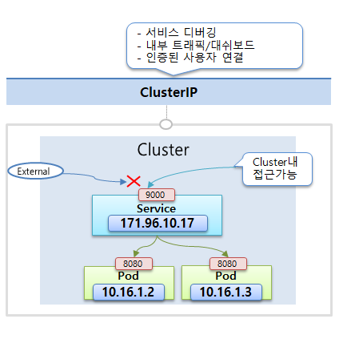

# Service

# 🔶 Service

Kubernetes에서 **Service**는 Pod의 IP 주소가 휘발성이고 변경되기 쉬우므로, **안정적인 접근 경로를 제공**하기 위해 사용됩니다.

## 🔹 Pod IP의 한계와 Service의 필요성

- Pod는 **장애나 업데이트 시 자동 재생성**되며, 이때 IP 주소가 변경됨
- 사용자는 Pod가 언제 삭제될지 알 수 없고, 따라서 **직접 IP를 사용하는 것은 신뢰성이 낮음**
- **Service는 직접 삭제하거나 재생성하지 않는 이상 IP가 고정**되어, 항상 연결되어 있는 Pod에 접근 가능
- Service는 **라벨 셀렉터**를 통해 여러 Pod를 묶고, 그들 사이에 **트래픽을 분산**함

---

## 🔹 ClusterIP (기본값)

- **쿠버네티스 클러스터 내부 전용 IP를 통해서** Pod에 접근 가능한 IP
- 해당 IP에 클러스터 내의 다른 오브젝트 들이 접근할 수 있습니다.
- 외부에서는 접근 불가
- **기본 서비스 타입**이며, 별도로 지정하지 않으면 자동으로 사용됨
- 여러 개의 파드를 연결할 수 있고, 서비스는 트래픽을 분산 처리해서 파드에 전달 합니다.
- 사용 예:
    - 내부 마이크로서비스 간 통신
    - 대시보드나 CLI를 통한 관리자 접근
    - 디버깅, 상태 확인 목적



### ▫️서비스 연결

Selector와 Label을 사용 

- POD

```yaml
apiVersion: v1
kind: Pod
metadata:
  name: pod-1
  labels:
     app: pod
spec:
  nodeSelector:
    kubernetes.io/hostname: k8s-worker1
  containers:
  - name: container
    image: kubetm/app
    ports:
    - containerPort: 8080
```

- Service

```yaml
apiVersion: v1
kind: Service
metadata:
  name: svc-1
spec:
  selector:
    app: pod
  ports:
  - port: 9000 # 9000번 포트로 서비스 입력이 들어오면
    targetPort: 8080 # 파드의 8080포트로 연결을 수행한다.
```

---

## 🔹 NodePort

- 기본적으로 ClusterIP 성격을 포함
- 클러스터에 연결된 **모든 노드한테 동일한 고정 포트를 제공**
    - **모든 노드에 동일 포트가 열림**
- **어느 노드라도 상관 없이 해당하는 IP로 외부에서 접근하면 서비스와 연결 가능**
    - 외부에서 노드 IP + 지정된 포트를 통해 접근 가능
- Service는 이 포트로 들어온 요청을 **알맞은 Pod로 전달**
- 포트 범위: `30000 ~ 32767` (자동 할당 지원 )
- **ExternalTrafficPolicy** 옵션:
    - `Cluster`: 모든 노드에 요청 분산
    - `Local`: 요청이 도착한 노드에 있는 Pod에만 전달
- 사용 예:
    - 내부망 외부 노드 접근 허용
    - 간단한 데모나 임시 테스트용 공개 포트


```yaml
apiVersion: v1
kind: Service
metadata:
 name: svc-2
spec:
 selector:
    app: pod
 ports:
   - port: 9000
     targetPort: 8080
     nodePort: 30000 # (30000~32767)
 type: NodePort
```

---

## 🔹 LoadBalancer

- **NodePort 기능 포함 + 외부 로드밸런서를 통해 외부 IP 노출**
- LoadBalancer로 접근할 수 있는 IP는 플러그인
- Bare-metal 환경에서는 LoadBalancer 로 접근할 수 있는 IP 할당을 위해  **MetalLB, OpenELB 등의 LoadBalancer 플러그인**이 설치되어야 사용 가능
    - Bare-metal 환경 : 클라우드 서비스(AWS, GCP, Azure 등)를 사용하지 않고, **직접 물리 서버를 구축하고 관리하는 환경**
- 클라우드 환경(GCP, AWS 등)에선 로드밸런서가 자동 생성됨
- 사용 예:
    - 실서비스 운영 시 외부에서 접속 가능한 엔드포인트 제공
    - 프론트엔드, 외부 API 서버 공개


```yaml
apiVersion: v1
kind: Service
metadata:
  name: svc-4
spec:
  selector:
    app: pod
  ports:
  - port: 9000
    targetPort: 8080
  type: LoadBalancer
```

---

# 🔶 Kubernetes Service 실습

## 🔹 기본 개념: **Service가 필요한 이유**

- Pod는 시스템 장애 시 자동 재생성됨 → IP가 계속 바뀜
- 반면 Service는 고정 IP를 가지며, 파드가 재생성되어도 연결됨
- 따라서 **신뢰할 수 있는 접근 포인트로 Service가 필요**

## 🔹 ClientIP 실습

- POD

```yaml
apiVersion: v1
kind: Pod
metadata:
  name: pod-1
  labels:
     app: pod
spec:
  nodeSelector:
    kubernetes.io/hostname: k8s-worker1
  containers:
  - name: container
    image: kubetm/app
    ports:
    - containerPort: 8080
```

- Service

```yaml
apiVersion: v1
kind: Service
metadata:
  name: svc-1
spec:
  selector:
    app: pod
  ports:
  - port: 9000 # 9000번 포트로 서비스 입력이 들어오면
    targetPort: 8080 # 파드의 8080포트로 연결을 수행한다.
```

### ▫️ 서비스 생성


- svc-1:9000 : ClusterIp
    - POD를 지우고 새로 지정해도 자동으로 연결됩니다.

## 🔹 NodePort 실습

```yaml
apiVersion: v1
kind: Service
metadata:
 name: svc-2
spec:
 selector:
    app: pod
 ports:
   - port: 9000
     targetPort: 8080
     nodePort: 30000 # (30000~32767)
 type: NodePort
```


svc-2:9000 : ClusterIp

svc-2:30000 : Nodeport 

### ▫️ IP

- worker node1 : 192.168.56.31


- worker noder 2 : 192.168.56.32


- 30000번은 Dash board가 사용중

- 파드 추가

```yaml
apiVersion: v1
kind: Pod
metadata:
  name: pod-2
  labels:
     app: pod
spec:
  nodeSelector:
    kubernetes.io/hostname: k8s-worker2
  containers:
  - name: container
    image: kubetm/app
    ports:
    - containerPort: 8080
```

- 입력이 Node Port에 의해 분산 처리됨을 확인 가능


- externalTrafficPolicy: Local 테스트 (입력이 들어온 worker에서만 처리)

```yaml
apiVersion: v1
kind: Service
metadata:
  name: svc-2
spec:
  selector:
    app: pod
  ports:
  - port: 9000
    targetPort: 8080
    nodePort: 30002
  type: NodePort
  externalTrafficPolicy: Local
```

- 입력받은 Work node 처리됨을 확인 가능


### ▫️주의사항

- externalTrafficPolicy: Local 상태인데, worker node에서 처리할 수 있는 pod가 없다면 처리되지 않고 무한 루프에 빠집니다.

## 🔹 LoadBalancer

```yaml
apiVersion: v1
kind: Service
metadata:
  name: svc-4
spec:
  selector:
    app: pod
  ports:
  - port: 9000
    targetPort: 8080
  type: LoadBalancer
```

- 현재 외부 IP를 설정할 수 있는 Plugin이 없어서, Pending상태 유지


> [!NOTE]
>
> 본 문서는  인프런의 [초급자를 위한 【대세는 쿠버네티스】](https://www.inflearn.com/course/%EC%BF%A0%EB%B2%84%EB%84%A4%ED%8B%B0%EC%8A%A4-%EA%B8%B0%EC%B4%88/dashboard) 강의를 바탕으로 학습한 내용을 정리한 것입니다.