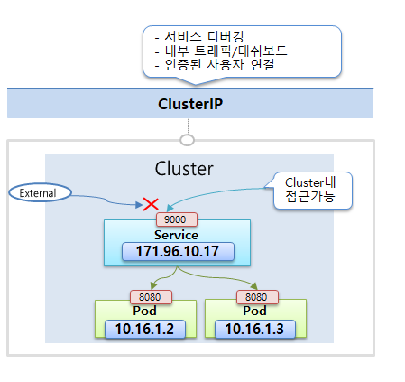

# Service

# 🔶 Service

Kubernetes에서 **Service**는 Pod의 IP 주소가 휘발성이고 변경되기 쉬우므로, **안정적인 접근 경로를 제공**하기 위해 사용됩니다.

## 🔹 Pod IP의 한계와 Service의 필요성

- Pod는 **장애나 업데이트 시 자동 재생성**되며, 이때 IP 주소가 변경됨
- 사용자는 Pod가 언제 삭제될지 알 수 없고, 따라서 **직접 IP를 사용하는 것은 신뢰성이 낮음**
- **Service는 직접 삭제하거나 재생성하지 않는 이상 IP가 고정**되어, 항상 연결되어 있는 Pod에 접근 가능
- Service는 **라벨 셀렉터**를 통해 여러 Pod를 묶고, 그들 사이에 **트래픽을 분산**함

---

## 🔹 ClusterIP (기본값)

- **쿠버네티스 클러스터 내부 전용 IP를 통해서** Pod에 접근 가능한 IP
- 해당 IP에 클러스터 내의 다른 오브젝트 들이 접근할 수 있습니다.
- 외부에서는 접근 불가
- **기본 서비스 타입**이며, 별도로 지정하지 않으면 자동으로 사용됨
- 여러 개의 파드를 연결할 수 있고, 서비스는 트래픽을 분산 처리해서 파드에 전달 합니다.
- 사용 예:
    - 내부 마이크로서비스 간 통신
    - 대시보드나 CLI를 통한 관리자 접근
    - 디버깅, 상태 확인 목적



### ▫️서비스 연결

Selector와 Label을 사용 

- POD

```yaml
apiVersion: v1
kind: Pod
metadata:
  name: pod-1
  labels:
     app: pod
spec:
  nodeSelector:
    kubernetes.io/hostname: k8s-worker1
  containers:
  - name: container
    image: kubetm/app
    ports:
    - containerPort: 8080
```

- Service

```yaml
apiVersion: v1
kind: Service
metadata:
  name: svc-1
spec:
  selector:
    app: pod
  ports:
  - port: 9000 # 9000번 포트로 서비스 입력이 들어오면
    targetPort: 8080 # 파드의 8080포트로 연결을 수행한다.
```

---

## 🔹 NodePort

- 기본적으로 ClusterIP 성격을 포함
- 클러스터에 연결된 **모든 노드한테 동일한 고정 포트를 제공**
    - **모든 노드에 동일 포트가 열림**
- **어느 노드라도 상관 없이 해당하는 IP로 외부에서 접근하면 서비스와 연결 가능**
    - 외부에서 노드 IP + 지정된 포트를 통해 접근 가능
- Service는 이 포트로 들어온 요청을 **알맞은 Pod로 전달**
- 포트 범위: `30000 ~ 32767` (자동 할당 지원 )
- **ExternalTrafficPolicy** 옵션:
    - `Cluster`: 모든 노드에 요청 분산
    - `Local`: 요청이 도착한 노드에 있는 Pod에만 전달
- 사용 예:
    - 내부망 외부 노드 접근 허용
    - 간단한 데모나 임시 테스트용 공개 포트


```yaml
apiVersion: v1
kind: Service
metadata:
 name: svc-2
spec:
 selector:
    app: pod
 ports:
   - port: 9000
     targetPort: 8080
     nodePort: 30000 # (30000~32767)
 type: NodePort
```

---

## 🔹 LoadBalancer

- **NodePort 기능 포함 + 외부 로드밸런서를 통해 외부 IP 노출**
- LoadBalancer로 접근할 수 있는 IP는 플러그인
- Bare-metal 환경에서는 LoadBalancer 로 접근할 수 있는 IP 할당을 위해  **MetalLB, OpenELB 등의 LoadBalancer 플러그인**이 설치되어야 사용 가능
    - Bare-metal 환경 : 클라우드 서비스(AWS, GCP, Azure 등)를 사용하지 않고, **직접 물리 서버를 구축하고 관리하는 환경**
- 클라우드 환경(GCP, AWS 등)에선 로드밸런서가 자동 생성됨
- 사용 예:
    - 실서비스 운영 시 외부에서 접속 가능한 엔드포인트 제공
    - 프론트엔드, 외부 API 서버 공개


```yaml
apiVersion: v1
kind: Service
metadata:
  name: svc-4
spec:
  selector:
    app: pod
  ports:
  - port: 9000
    targetPort: 8080
  type: LoadBalancer
```

---

# 🔶 Kubernetes Service 실습

## 🔹 기본 개념: **Service가 필요한 이유**

- Pod는 시스템 장애 시 자동 재생성됨 → IP가 계속 바뀜
- 반면 Service는 고정 IP를 가지며, 파드가 재생성되어도 연결됨
- 따라서 **신뢰할 수 있는 접근 포인트로 Service가 필요**

## 🔹 ClientIP 실습

- POD

```yaml
apiVersion: v1
kind: Pod
metadata:
  name: pod-1
  labels:
     app: pod
spec:
  nodeSelector:
    kubernetes.io/hostname: k8s-worker1
  containers:
  - name: container
    image: kubetm/app
    ports:
    - containerPort: 8080
```

- Service

```yaml
apiVersion: v1
kind: Service
metadata:
  name: svc-1
spec:
  selector:
    app: pod
  ports:
  - port: 9000 # 9000번 포트로 서비스 입력이 들어오면
    targetPort: 8080 # 파드의 8080포트로 연결을 수행한다.
```

### ▫️ 서비스 생성


- svc-1:9000 : ClusterIp
    - POD를 지우고 새로 지정해도 자동으로 연결됩니다.

## 🔹 NodePort 실습

```yaml
apiVersion: v1
kind: Service
metadata:
 name: svc-2
spec:
 selector:
    app: pod
 ports:
   - port: 9000
     targetPort: 8080
     nodePort: 30000 # (30000~32767)
 type: NodePort
```


svc-2:9000 : ClusterIp

svc-2:30000 : Nodeport 

### ▫️ IP

- worker node1 : 192.168.56.31


- worker noder 2 : 192.168.56.32


- 30000번은 Dash board가 사용중

- 파드 추가

```yaml
apiVersion: v1
kind: Pod
metadata:
  name: pod-2
  labels:
     app: pod
spec:
  nodeSelector:
    kubernetes.io/hostname: k8s-worker2
  containers:
  - name: container
    image: kubetm/app
    ports:
    - containerPort: 8080
```

- 입력이 Node Port에 의해 분산 처리됨을 확인 가능


- externalTrafficPolicy: Local 테스트 (입력이 들어온 worker에서만 처리)

```yaml
apiVersion: v1
kind: Service
metadata:
  name: svc-2
spec:
  selector:
    app: pod
  ports:
  - port: 9000
    targetPort: 8080
    nodePort: 30002
  type: NodePort
  externalTrafficPolicy: Local
```

- 입력받은 Work node 처리됨을 확인 가능


### ▫️주의사항

- externalTrafficPolicy: Local 상태인데, worker node에서 처리할 수 있는 pod가 없다면 처리되지 않고 무한 루프에 빠집니다.

## 🔹 LoadBalancer

```yaml
apiVersion: v1
kind: Service
metadata:
  name: svc-4
spec:
  selector:
    app: pod
  ports:
  - port: 9000
    targetPort: 8080
  type: LoadBalancer
```

- 현재 외부 IP를 설정할 수 있는 Plugin이 없어서, Pending상태 유지


> [!NOTE]
>
> 본 문서는  인프런의 [초급자를 위한 【대세는 쿠버네티스】](https://www.inflearn.com/course/%EC%BF%A0%EB%B2%84%EB%84%A4%ED%8B%B0%EC%8A%A4-%EA%B8%B0%EC%B4%88/dashboard) 강의를 바탕으로 학습한 내용을 정리한 것입니다.

<details>

<summary>10. Service - ClusterIP, NodePort, LoadBalancer 접기/펼치기</summary>
이번 장에서는 서비스에 대한 강의를 시작하겠습니다.

서비스는 기본적으로 여기 그림에서처럼 자신의 클러스터 IP를 가지고 있어요.

그리고 이 서비스를 파드에 연결을 시켜 놓으면 서비스의 IP를 통해서도 파드에 접근을 할 수가 있게 돼요.

그런데 우리는 전 강의 때 파드에도 똑같이 클러스터 내에서 접근할 수 있는 IP가 있는데 왜 굳이 서비스를 달아서 이걸 통해서 접근을 하자고 생각할 수가 있는데 그 이유는

PAD라는 존재는 쿠버네티스에서 시스템 장애건 성능 장애건 언제든지 죽을 수가 있고 그러면 다시 재생성되도록 설계가 되어 있는 오브젝트예요.

그런 파드의 IP는 재생성이 되면 변한다고 했었잖아요.

그렇기 때문에 이 파드의 IP는 신뢰성이 떨어져요.

근데 서비스는 사용자가 직접 지우지 않는 한 삭제되거나 재생성되고 그러지 않아요.

그래서 이 서비스의 IP로 접근을 하면 항상 연결되어 있는 파드에 접근할 수가 있게 돼요.

그렇기 때문에 서비스를 쓰는 거고 서비스의 종류는 여러 가지가 있고 그 종류에 따라서 파드의 접근을 도와주는 방식이 틀린데 그 중 가장 기본적인 방식인 클러스터 IP라는 방식이 있고요 이 IP는 쿠버네티스 클러스터 내에서만 접근 가능한 IP예요

파드에 있는 IP와 특징이 똑같아요

그래서 이 IP도 클러스터 내에 다른 모든 오브젝트들이 접근을 할 수가 있지만 이렇게 외부에서는 접근을 할 수가 없어요

그리고 파드를 하나만 연결할 수 있는 건 아니고 이렇게 두개 내지 여러개의 파드를 연결시킬 수가 있는데 이렇게 여러개의 파드를 연결시켰을 때 서비스가 트래픽을 분산을 해서 파드에 전달을 해줘요. 밑에 양쪽 내용을 보시면 서비스와 파드가 연결되기 위한 셀렉터와 라벨은 앞에서도 봤구요

여기 밑에 서비스의 타입을 보시면 클러스터 IP라고 적혀 있어요

근데 이 타입은 옵션널 값이라 생략할 수 있는데 생략을 하면 기본값이 클러스터 IP이기 때문에 클러스터 IP를 사용할 때는 이 타입을 안 넣어도 돼요

그리고 위에 포트를 보시면 90번 포트로 이 서비스에 들어오면 타겟이 되는 파드에 8080 포트로 연결이 된다는 내용이 그리고 다음으로 노드 포트 타입의 서비스가 있는데요

일단 노드 포트 타입으로 만들어도 서비스에는 기본적으로 클러스터 IP가 할당이 돼서 클러스터 IP 타입과 같은 기능이 포함되어 있구요 노드 타입만의 큰 특징은 이렇게 쿠버네티스 클러스터에 연결되어 있는 모든 노드한테 똑같은 포트가 할당이 돼서 웹으로부터

어느 노드건 간에 그 IP의 포트로 접속을 하면 이 서비스에 연결이 돼요

그럼 또 서비스는 기본 역할인 자신한테 연결되어 있는 카드에 트래픽을 전달해주고요 주의할 점은 이 파드가 있는 노드에만 포트가 할당되는 게 아니라 모든 노드에 포트가 만들어진다는 것이 큰 특징이에요.

내용 내용을 보시면 밑에 노드 포트 타입의 서비스고요.

위에 포트를 보시면 이렇게 노드 포트를 지정을 할 수가 있어요.

3만번대에서 32767번대 사이에서만 할당을 할 수가 있고요 이 값도 옵션널이기 때문에 안 넣으면 자동으로 이 범위 내에서 할당이 돼요

그리고 한 가지 더 추가적인 속성에 대해서 설명을 드릴 건데요

만약 이렇게 각 노드에 패드가 하나씩 올라가져 있어요

이 상태에서 제가 1번 노드의 ip로 접근을 하더라도 이 서비스는 이 노드에 있는 패드한테 트래픽을 전달을 할 수가 있어요

서비스 입장에서는 어떤 노드한테 온 트래픽인지 상관없이 그냥 자신한테 달려있는 패드들한테 트래픽을 전달해 주기 때문인데요 근데 만약에 이 야물 내용에 External Traffic Policy라고 해서 값을 Local이라고 주면 특정 노드 포트의 IP로 접근을 하는 이 트래픽은 서비스가 해당 노드 위에 올려져 있는 파드한테만 트래픽을 전달을 해줘요

이런 설정이 있구요 마지막으로 Load Balancer 타입의 서비스가 있는데요

Load Balancer 타입으로 서비스를 만들면 일단 기본적으로 앞에서 배운 노드포트의 성격을 또 그대로 가지고 있어요

그리고 추가적으로 이 로드밸런서라는게 생겨서 각각의 노드에 트래픽을 분산시켜주는 역할을 해요 근데 한가지 문제가 이 로드밸런서에 접근을 하기 위한 외부 접속 IP 주소는 현재 저처럼 개별적으로 쿠버네티스를 설치를 했을 때 기본적으로 생기지가 않아요.

별도로 외부 접속 IP를 할당을 해주는 플러그인이 설치가 되어야 이 IP가 생기고요.

만약에 구글 클라우드 플랫폼이나 아마존에서 제공하는 Kubernetes 플랫폼을 사용할 때는 이것이 자체적으로 플러그인이 설치가 되어 있어서 로드 밸런서 타입으로 서비스를 만들면 알아서 외부에서 접속할 수 있는 IP를 여기에 만들어 주고요.

그럼 그 IP를 통해서 외부에서 접근이 가능해져요.

야물 내용을 보시면 별다른 건 없고 타입의 로드 밸런서를 지정하면 돼요

일단 3가지 서비스 타입에 대해서 설명을 드렸는데 서비스는 이외에도 여러가지 용도로 쓰여요

나머지는 더 고급 과정에서 강의를 드릴 예정이고요 이제 서비스에 대해서 사용법은 알았는데 이 각각의 서비스 타입들을 어떤 상황에서 써야 되는지 정리를 해볼게요

첫째로 클러스터 IP는 외부에서 접근할 수가 없고 클러스터 내에서만 사용하는 IP예요

그렇기 때문에 이 IP에 접근할 수 있는 대상은 클러스터 내부에 접근을 할 수 있는 운영자와 같은 인가된 사람일 수밖에 없고요 주된 작업은 쿠버네티스 대시보드를 관리를 하거나 각 파드의 서비스 상태를 디버깅하는 작업을 할 때 사용이 돼요.

두 번째로, 노드포트는 특징이 물리적인 호스트의 IP를 통해서 파드에 접근을 할 수가 있다는 건데 대부분 호스트 IP는 보안적으로 내부망에만 접근을 할 수 있게 네트워크를 구성하기 때문에 이 노드포트는 클러스터 밖에는 있지만 그래도 내부망 안에서 접근을 해야 될 때 쓰여요 그리고 일시적인 외부 연동용으로도 사용이 되는데 우리가 내부 환경에서 시스템 개발을 하다가 외부에 간단한 데모를 보여줘야 된다고 할 때 종종 네트워크 중계기에 포트 포워딩을 해서 외부에서 내부 시스템에 연결을 하잖아요

이럴 때 노드포트를 잠깐 뚫어놓고 쓸 수가 있어요

마지막으로 로드 밸런스인데 실제적으로 외부의 서비스를 노출시키려면 로드 밸런서를 이용을 해야 돼요. 그래야 내부 IP가 노출되지 않고 외부 IP를 통해서 안정적으로 서비스를 노출시킬 수가 있어요.

그렇기 때문에 이 로드 밸런서는 외부의 시스템을 노출하는 용도로 쓰입니다.

이렇게 이번 강의에서는 3가지 타입의 서비스를 알아봤고요.

이제 실습을 해보도록 하겠습니다.
</details>

<details>
<summary>11. service - 실습 접기/펼치기</summary>


이번 강의에서는 서비스에 대한 실습을 진행하도록 하겠습니다.

먼저 파드에 서비스를 달면 파드가 죽어서 재생성되더라도 서비스의 IP를 통해서 접근하는 예제를 보여드릴 건데요.

먼저 여기 보시면 파드에 라벨을 붙여놨고요.

그래서 먼저 파드를 만들면 이렇게 해서 파드가 하나 생성 중에 있고요.

다음으로 서비스를 만들건데 방금 만든 파드를 지정하는 셀렉터가 있구요 그리고 타입으로

클러스터 IP가 있는데 이 클러스터 IP는 한번 넣지 않아 볼게요

그러면 자동으로 타입이 클러스터 IP가 지정이 될 거예요

그리고 이 서비스에 9000번으로 접근을 했을 때 이 서비스가 타겟이 되는 컨테이너에

8080 포트로 연결을 해 줄 거예요

그래서 만들어 보면 이렇게 서비스가 바로 생성이 됐고요 들어가보면

먼저 이렇게 타입으로 클러스터 IP라고 기본 타입이 할당이 됐고요

그리고 클러스터 IP가 이렇게 할당이 됐는데 이 IP로 접근을 해볼게요

여기서 CURL로 고천법 비트에 포스트 네임을 찍는 패스를 호출을 해보면 이렇게

PAD1에 접근해서 PAD1의 호스트 네임을 찍는 걸 볼 수가 있구요.

이건 제가 PAD에 이 호스트 네임이라고 패스가 들어가면 이 PAD의 호스트 네임을 찍도록 만든 이미지로 POD를 생성을 했기 때문에 이렇게 메시지가 찍히는 거고요.

만약에 제가 이 PC에서 접근을 하는 거는 내부망이긴 하지만 클러스터 밖에서 접근을 하는 거기 때문에 이렇게 아까 IP로 접근을 하면은 클러스터 IP에 접근이 안 돼요 그럼 이제 파드를 한번 삭제를 해 보고 다시 만들어 볼게요

이렇게 다시 만들고 서비스를 가보면 라벨과 셀렉터가 알아서 연결을 맺어 주기 때문에 이렇게 파드를 새로 만들더라도 알아서 이렇게 연결이 되어 있어요

그래서 이 파드는 지워졌다 다시 만들어졌기 때문에 ip가 변했겠지만 여전히 이 서비스의 ip는 그대로구요

아까와 마찬가지로 접근을 해보면 이렇게 잘 되는 걸 볼 수가 있어요

이렇게 클러스터 ip에 대한 실습을 해봤구요

다음으로는 노드 포트를 만들어 보겠습니다

이건 노드포트를 만드는 서비스 야물내용입니다.

여기 보시면 타입에 노드포트라고 있어요.

그리고 노드포트는 30000번으로 지정을 했고요.

그래서 만들어 보면 기존에 만들었던 서비스는 지우고요.

노드포트를 만들어 보면 이렇게 바로 서비스가 생성이 됐고요.

들어가 보면 이렇게 타입은 노드포트고요.

그리고 여기 클러스터 IP가 자동으로 생겼습니다

그리고 여기 보시면 포트가 2개가 있는데요 하나는 클러스터 IP로 접근을 했을 때 연결할 수 있는 9000번 포트구요 그리고 이 밑에 있는 포트가 노드로 접근을 했을 때 쓸 수 있는 노드 포트예요 한번 확인을 해보면 먼저 노드를 보면 여기에 2개의 노드가 있죠

그 IP가 어떻게 되냐면 노드 1번은 31번이고요 그리고 노드 2번은 32번이에요

그래서 이 IP들은 다 내부망이 있기 때문에 IP를 복사를 해서 제 PC에서 CURL로

접속을 해 보면요 이렇게

접근이 되는 걸 볼 수가 있구요 그리고 31번 노드도 접근을 해 보면 이렇게 마찬가지로 각각의 노드 포트를 통해서 파드에 접속이 되는 걸 볼 수가 있습니다

그러면 이번에는 파드를 하나 더 만들어 볼 거고요

이름은 파드2고 이번엔 노드2번에 만들어 볼게요

이렇게 만들고 있구요 해당

서비스를 들어가 보면 이렇게 파드2도 같이 연결이 되어 있어요

이 상태에서 아까와 같이 접근을 해 보면요 서비스가 각각의 연결되어 있는 파드들한테 트래픽을 분산해서 전달을 해주기 때문에 이렇게 각각의 파드에 트래픽이 분산이 돼서 가는 걸 볼 수가 있구요.

노드2로 접근을 해도 마찬가지로 이렇게 각각의 파드에 트래픽이 분산돼서 가고 있습니다.

마지막으로 이 익스터널 트래픽 플래시를 확인해 볼 건데요.

기존에 있는 서비스를 지우고 이 플래시를 달아서 다시 만들어 보면

연결이 되어 있구요.

노드1에는 파드1이 있고 노드2에는 파드2가 있기 때문에 제가 만약에 노드1에 접근을 하면 이렇게 계속 pod1만 접근이 되는 걸 볼 수가 있구요 이 플래시가 서비스한테 그 노드 위에 올려져 있는 PAD한테만 트래픽이 가도록 해주는 거고요

이번엔 노드2를 호출을 하면 이렇게 pod2에만 연결이 되는 걸 볼 수가 있습니다

그럼 만약에 노드1에는 PAD가 없는데 노드1의 IP를 계속 호출하면 어떻게 될까요?

한번 해볼게요 먼저 pod1을 삭제를 하고요.

이렇게 삭제가 됐고요.

다시 가서 node1에 접근을 해보면 접근이 안 돼요.

이렇게 계속 기다리고 있죠.

그렇기 때문에 이 옵션을 사용할 때는 이런 부분을 주의를 해야 됩니다.

그럼 여기까지 노드포트에 대한 설명을 마쳤구요 다음으로는 로드 밸런서에 대해서 실습을 해 볼 건데요 여기 보면 타입이 로드 밸런서구요 바로 서비스를 만들어 보면

서비스가 잘 만들어졌으면 이렇게 초록색이 떠야 되는데 이 서비스는 현재 펜딩 상태라고 나오죠 뭐가 잘 안되고 있는 거예요

일단 내용을 보면 이렇게 클러스터 IP도 생겼고요.

그리고 여기 3만 대의 노드포트가 자동으로 생긴거구요

근데 이론때 말씀드렸다시피 외부에서 접근할 수 있도록 External IP를 자동으로 할당해주는 플러그인이 제공되어야 한다고 말씀을 드렸는데 기본적으로 쿠버네티스를 설치를 할 때는 그게 없기 때문에 여기 내용 중에는 External IP가 보이지가 않아요

콘솔 명령을 통해서 확인을 해보면 더 확실하게 볼 수가 있는데요

여기 마스터에서 이렇게 콘솔 명령으로 서비스를 확인을 해보면 여기에 external ip 부분에 pending 이라고 돼 있죠

이렇게 외부 ip를 할당해주는 플러그인이 현재 없기 때문에 이 ip가 할당이 되지 않아서 계속 pending 상태에 있는 거예요

그렇기 때문에 여기까지만 확인을 해보고 로드 밸런서 타입에 대한 서비스 내용을 마칠게요

그럼 이것으로 서비스에 대한 실습을 끝내도록 하겠습니다
</details>