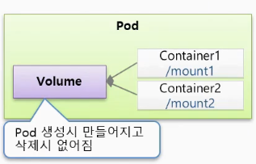

# Volume

# 🔶 Volume

## 🔹 emptyDir (Docker 익명 볼륨과 유사)

- **파드(Pod)** 내의 컨테이너들끼리 **데이터를 공유하기 위한 임시 저장소**
    - 파드(Pod) 내부에 Volume 공간이 잡혀 생성되고 사용된다.
- 파드가 생성될 때 자동으로 생성되며, 파드가 **삭제되면 볼륨도 함께 삭제됨**
    - Pod가 삭제되도 상관이 없는 데이터를 담아야 함
- **임시 캐시, 로그 공유, 세션 정보** 등에 사용
- **컨테이너 간 마운트 경로는 다를 수 있지만**, 동일한 `emptyDir` 이름을 사용하면 **동일한 볼륨을 공유**



```yaml
apiVersion: v1
kind: Pod
metadata:
  name: pod-volume-1
spec:
  containers:
  - name: container1
    image: kubetm/init
    volumeMounts: 
    - name: empty-dir # # 동일한 볼륨 마운트 
      mountPath: /mount1 # 마운트 경로 : 볼륨 생성 경로
  - name: container2
    image: kubetm/init
    volumeMounts:
    - name: empty-dir # 동일한 볼륨 마운트 
      mountPath: /mount2 # 마운트 경로 : 볼륨 생성 경로 
  volumes:
  - name : empty-dir # Mount Path가 다르더라도 volumeMounts가 동일하다면
    emptyDir: {}     # 동일한 볼륨을 지명하고 있기 때문에 
								     # 자신이 원하는 경로를 사용하고 있어도, 하나의 볼륨을 Mount해서 사용
```

## 🔹 hostPath

- **파드가 올라간 노드의 로컬 디렉토리**를 볼륨으로 사용
- 파드가 죽어도 노드가 살아 있다면 **데이터는 유지됨**
- **단점**:
    - 파드가 **다른 노드에서 재생성되면 데이터에 접근 불가**
    - 동일한 경로를 모든 노드에 만들어주는 **운영자의 추가 작업 필요**
    - 자동화 및 확장성이 떨어져 실무에서는 **잘 사용하지 않음**
    - Node에 장애가 생겨서 Node를 옮겨야 될 경우  데이터 손실


- 노드 생성시마다 mount를 추가로 설정할 수 도 있다. (운영자 수동 설정)
    - 추천 X


- 사전에 볼륨을 만들어 두어야 파드를 만들때 오류가 발생하지 않습니다.

```yaml
apiVersion: v1
kind: Pod
metadata:
 name: pod-volume-2
spec:
 containers:
 - name: container
   image: tmkube/init
   volumeMounts:
   - name: host-path
     mountPath: /mount1
 volumes:
 - name : host-path
   hostPath:
     path: /node-v
     type: Directory
```

## 🔹 PersistentVolume (PV) & PersistentVolumeClaim (PVC)

### ▫️개념

- POD에 영속성있는 볼륨을  제공하기 위한 개념
    - 영속성(Persistence) : 데이터나 상태가 일시적이지 않고, 시스템이 꺼지거나 재시작되어도 유지되는 특성
- PV: **관리자가 미리 정의해둔 저장소 리소스**
- PVC: **사용자가 원하는 크기, 액세스 모드 등을 정의한 요청**
- 쿠버네티스가 PVC의 요청 스펙 (`capacity`, `accessModes`)을 보고 **적절한 PV를 자동으로 연결**해줌

### ▫️ 형태

- 로컬 볼륨
- AWS, Git과 같은 외부에서 원격으로 사용되는 볼륨
- NFS 다른 서버와의 연결
- 스토리지 OS 볼륨을 직접 만들고 관리하는 솔루션


### ▫️ 사용 흐름

1. **관리자(Admin)** → `PV` 정의
    - PV는 저장할 볼륨에 따라 설정 값이 다르기 때문에 전문적인 관리자가 관리
    - 클러스터 관리자가 **미리 만들어 둔 저장소** 리소스
    - 디스크의 실제 위치 (`/mnt/data`, `NFS`, `AWS EBS`)에 해당
    - 독립적인 리소스이며, **Pod와 직접 연결되지 않음**
2. **사용자(User)** → `PVC` 정의
    - 사용자가 “**이 정도 저장공간이 필요해요**”라고 요청하는 객체
    - 쿠버네티스가 PVC의 요청 스펙을 보고, PV 중에 적합한 것을 자동 연결
3. **Kubernetes** → PVC에 맞는 PV를 자동 매칭
4. **Pod** → PVC를 참조하여 볼륨 사용


- PersistentVolume (PV) 예시

```yaml
apiVersion: v1
kind: Pod
metadata:
 name: pod-volume-3
spec:
 containers:
 - name: container
   image: tmkube/init
   volumeMounts:
   - name: pvc-pv
     mountPath: /volume
 volumes:
 - name : pvc-pv
   persistentVolumeClaim:
     claimName: pvc-01

```

- PersistentVolumeClaim (PVC)

```yaml
apiVersion: v1
kind: PersistentVolumeClaim
metadata:
 name: pvc-01
spec:
 accessModes:
   - ReadWriteOnce
 resources:
   requests:
     storage: 1G
 storageClassName: ""
```

- PersistentVolume (PV) 로컬 볼륨 예시
    - 다음 속성을 보고 쿠버네티스는 PVC가 사용할 PV를 연결시켜준다.
        - capacity
        - accessModes

```yaml
apiVersion: v1
kind: PersistentVolume
metadata:
  name: pv-01
spec:
  capacity: # PVC - Capacity
    storage: 1G 
  accessModes: # PVC - accessModes 
    - ReadWriteOnce 
  local:
    path: /node-v
  nodeAffinity:
    required:
      nodeSelectorTerms:
      - matchExpressions:
        - {key: node, operator: In, values: [node1]} # 해당 볼륨을 사용하는 파드는 모두
                                                     # node1에 만들어진다는 의미
```

> [!NOTE]
>
> 본 문서는  인프런의 [초급자를 위한 【대세는 쿠버네티스】](https://www.inflearn.com/course/%EC%BF%A0%EB%B2%84%EB%84%A4%ED%8B%B0%EC%8A%A4-%EA%B8%B0%EC%B4%88/dashboard) 강의를 바탕으로 학습한 내용을 정리한 것입니다.