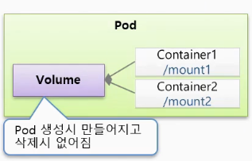
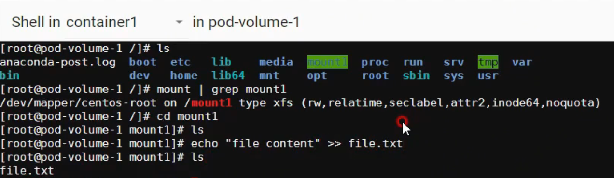
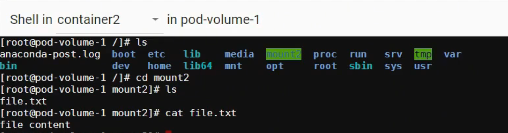

# Volume

# 🔶 Volume

## 🔹 emptyDir (Docker 익명 볼륨과 유사)

- **파드(Pod)** 내의 컨테이너들끼리 **데이터를 공유하기 위한 임시 저장소**
    - 파드(Pod) 내부에 Volume 공간이 잡혀 생성되고 사용된다.
- 파드가 생성될 때 자동으로 생성되며, 파드가 **삭제되면 볼륨도 함께 삭제됨**
    - Pod가 삭제되도 상관이 없는 데이터를 담아야 함
- **임시 캐시, 로그 공유, 세션 정보** 등에 사용
- **컨테이너 간 마운트 경로는 다를 수 있지만**, 동일한 `emptyDir` 이름을 사용하면 **동일한 볼륨을 공유**



```yaml
apiVersion: v1
kind: Pod
metadata:
  name: pod-volume-1
spec:
  containers:
  - name: container1
    image: kubetm/init
    volumeMounts: 
    - name: empty-dir # # 동일한 볼륨 마운트 
      mountPath: /mount1 # 마운트 경로 : 볼륨 생성 경로
  - name: container2
    image: kubetm/init
    volumeMounts:
    - name: empty-dir # 동일한 볼륨 마운트 
      mountPath: /mount2 # 마운트 경로 : 볼륨 생성 경로 
  volumes:
  - name : empty-dir # Mount Path가 다르더라도 volumeMounts가 동일하다면
    emptyDir: {}     # 동일한 볼륨을 지명하고 있기 때문에 
								     # 자신이 원하는 경로를 사용하고 있어도, 하나의 볼륨을 Mount해서 사용
```

## 🔹 hostPath

- **파드가 올라간 노드의 로컬 디렉토리**를 볼륨으로 사용
- 파드가 죽어도 노드가 살아 있다면 **데이터는 유지됨**
- **단점**:
    - 파드가 **다른 노드에서 재생성되면 데이터에 접근 불가**
    - 동일한 경로를 모든 노드에 만들어주는 **운영자의 추가 작업 필요**
    - 자동화 및 확장성이 떨어져 실무에서는 **잘 사용하지 않음**
    - Node에 장애가 생겨서 Node를 옮겨야 될 경우  데이터 손실


- 노드 생성시마다 mount를 추가로 설정할 수 도 있다. (운영자 수동 설정)
    - 추천 X


- 사전에 볼륨을 만들어 두어야 파드를 만들때 오류가 발생하지 않습니다.

```yaml
apiVersion: v1
kind: Pod
metadata:
 name: pod-volume-2
spec:
 containers:
 - name: container
   image: tmkube/init
   volumeMounts:
   - name: host-path
     mountPath: /mount1
 volumes:
 - name : host-path
   hostPath:
     path: /node-v
     type: Directory
```

## 🔹 PersistentVolume (PV) & PersistentVolumeClaim (PVC)

### ▫️개념

- POD에 영속성있는 볼륨을  제공하기 위한 개념
    - 영속성(Persistence) : 데이터나 상태가 일시적이지 않고, 시스템이 꺼지거나 재시작되어도 유지되는 특성
- PV: **관리자가 미리 정의해둔 저장소 리소스**
- PVC: **사용자가 원하는 크기, 액세스 모드 등을 정의한 요청**
- 쿠버네티스가 PVC의 요청 스펙 (`capacity`, `accessModes`)을 보고 **적절한 PV를 자동으로 연결**해줌

### ▫️ 형태

- 로컬 볼륨
- AWS, Git과 같은 외부에서 원격으로 사용되는 볼륨
- NFS 다른 서버와의 연결
- 스토리지 OS 볼륨을 직접 만들고 관리하는 솔루션


### ▫️ 사용 흐름

1. **관리자(Admin)** → `PV` 정의
    - PV는 저장할 볼륨에 따라 설정 값이 다르기 때문에 전문적인 관리자가 관리
    - 클러스터 관리자가 **미리 만들어 둔 저장소** 리소스
    - 디스크의 실제 위치 (`/mnt/data`, `NFS`, `AWS EBS`)에 해당
    - 독립적인 리소스이며, **Pod와 직접 연결되지 않음**
2. **사용자(User)** → `PVC` 정의
    - 사용자가 “**이 정도 저장공간이 필요해요**”라고 요청하는 객체
    - 쿠버네티스가 PVC의 요청 스펙을 보고, PV 중에 적합한 것을 자동 연결
3. **Kubernetes** → PVC에 맞는 PV를 자동 매칭
4. **Pod** → PVC를 참조하여 볼륨 사용


- PersistentVolume (PV) 예시

```yaml
apiVersion: v1
kind: Pod
metadata:
 name: pod-volume-3
spec:
 containers:
 - name: container
   image: tmkube/init
   volumeMounts:
   - name: pvc-pv
     mountPath: /volume
 volumes:
 - name : pvc-pv
   persistentVolumeClaim:
     claimName: pvc-01

```

- PersistentVolumeClaim (PVC)

```yaml
apiVersion: v1
kind: PersistentVolumeClaim
metadata:
 name: pvc-01
spec:
 accessModes:
   - ReadWriteOnce
 resources:
   requests:
     storage: 1G
 storageClassName: ""
```

- PersistentVolume (PV) 로컬 볼륨 예시
    - 다음 속성을 보고 쿠버네티스는 PVC가 사용할 PV를 연결시켜준다.
        - capacity
        - accessModes

```yaml
apiVersion: v1
kind: PersistentVolume
metadata:
  name: pv-01
spec:
  capacity: # PVC - Capacity
    storage: 1G 
  accessModes: # PVC - accessModes 
    - ReadWriteOnce 
  local:
    path: /node-v
  nodeAffinity:
    required:
      nodeSelectorTerms:
      - matchExpressions:
        - {key: node, operator: In, values: [node1]} # 해당 볼륨을 사용하는 파드는 모두
                                                     # node1에 만들어진다는 의미
```

# 🔶 Kubernetes Volume 실습

## mount 상태 확인하기

```yaml
  apiVersion: v1
  kind: Pod
  metadata:
    name: pod-volume-1
  spec:
    containers:
    - name: container1
      image: kubetm/init
      volumeMounts:
      - name: empty-dir
        mountPath: /mount1
    - name: container2
      image: kubetm/init
      volumeMounts:
      - name: empty-dir
        mountPath: /mount2
    volumes:
    - name : empty-dir
      emptyDir: {}
```

### EmptyDir Volume 공유 확인하기

```yaml
apiVersion: v1
kind: Pod
metadata:
  name: pod-volume-1
spec:
  containers:
  - name: container1
    image: kubetm/init
    volumeMounts:
    - name: empty-dir
      mountPath: /mount1
  - name: container2
    image: kubetm/init
    volumeMounts:
    - name: empty-dir
      mountPath: /mount2
  volumes:
  - name : empty-dir
    emptyDir: {}
```

####  Container 1


#### Container 2


 - Pod에서 접근한 Mount Path가 달라도 볼륨 명이 같다면 파일을 공유하는 것을 확인할 수 있음.

### Host Path

```yaml
apiVersion: v1
kind: Pod
metadata:
  name: pod-volume-2
spec:
  nodeSelector:
    kubernetes.io/hostname: k8s-worker1
  containers:
  - name: container
    image: kubetm/init
    volumeMounts:
    - name: host-path
      mountPath: /mount1
  volumes:
  - name : host-path
    hostPath:
      path: /node-v
      type: DirectoryOrCreate # DirectoryOrCreate 해당 경로가 없으면 자동 생성
---
apiVersion: v1
kind: Pod
metadata:
  name: pod-volume-3
spec:
  nodeSelector:
    kubernetes.io/hostname: k8s-worker1
  containers:
  - name: container
    image: kubetm/init
    volumeMounts:
    - name: host-path
      mountPath: /mount1
  volumes:
  - name : host-path
    hostPath:
      path: /node-v
      type: DirectoryOrCreate # DirectoryOrCreate 해당 경로가 없으면 자동 생성
```

#### 🔹 hostPath 실습 구조
```
  Node1
  └── /node-v

  Pod1 → /mount1
  Pod2 → /mount1
```
모두 같은 디렉토리 공유.

- Pod 삭제 후 재생성하더라도 파일 유지
- 실제 Node 디스크 /node-v에 저장되기 때문
- Pod가 다른 Node에 스케줄링되면 Node1의 파일이 Node2에서는 안 보임

> [!NOTE]
>
> 본 문서는  인프런의 [초급자를 위한 【대세는 쿠버네티스】](https://www.inflearn.com/course/%EC%BF%A0%EB%B2%84%EB%84%A4%ED%8B%B0%EC%8A%A4-%EA%B8%B0%EC%B4%88/dashboard) 강의를 바탕으로 학습한 내용을 정리한 것입니다.

<details>
<summary>12. Volume - emptyDir, hostPath, PV/PVC 접기/펼치기</summary>

이번 볼륨 단원에서는 emptyDir과 호스트 패스 그리고 PVC와 PV라고 해서 퍼시스턴트 볼륨 클라임과 퍼시스턴트 볼륨에 대해서 배워보도록 하겠습니다.

먼저 emptyDir은 컨테이너들끼리 데이터를 공유하기 위해서 볼륨을 사용하는 거고 최초 이 볼륨이 생성될 때는 항상 이 볼륨 안에 내용이 비어 있기 때문에 MTDIR이라고 명칭이 된 거예요 그리고 이 볼륨은 그림에서처럼 이 파드 안에 생성이 되는 것이기 때문에 그렇다는 건 파드에 문제가 발생을 해서 재생성이 되면 데이터가 싹 없어진다는 걸 의미를 해요

그래서 이 볼륨에 쓰이는 데이터는 꼭 일시적인 사용 목적에 의한 데이터만 넣는 게 좋아요

그래서 야물내용을 한번 보시면 컨테이너에 두 컨테이너가 있구요.

둘다 볼륨을 마운트하고 있어요.

근데 마운트할 패스를 보시면 컨테이너1은 mount1이라는 패스를 사용했고요.

그리고 컨테이너2는 mount2라는 패스를 사용했어요.

이 mount 패스의 의미는 이 컨테이너가 이 패스로 볼륨을 연결을 하겠다는 의미구요.

하지만 이 컨테이너2에서 패스의 이름이 틀리더라도 결국 각각의 패스가 지정되는 볼륨의 이름은 MTDIR로 똑같은 이 볼륨을 지정하고 있기 때문에 컨테이너마다 자신의 원하는 경로를 사용을 하고 있지만 결국 한 볼륨을 마운트를 하고 있는 거예요

그리고 이 볼륨의 속성으로 여기 MTDIR라고 명시되어 있는 걸 볼 수가 있습니다

다음으로 호스트Path에 대해서 설명을 드릴게요

이름 그대로 한 호스트 그러니까 이 파드들이 올라가져 있는 노드에 패스를 볼륨으로써 사용하는 건데요 아까 이 MTDIR과 다른 점은 이 패스를 각각의 파드들이 마운트에서 공유하기 때문에 이 파드들이 죽어도 이 노드에 있는 데이터는 사라지지가 않아요

그런 점에서 다소 좋아 보일 수 있지만 파드 입장에서는 한 가지 큰 문제가 있어요

만약 이 파드2가 죽어서 재생성이 될 때 꼭 해당 노드에 재생성이 되리라는 보장은 없거든요

만약 그 재생되는 순간에 스케줄러가 자원 상황을 보고 이 노드2에 파드를 만들어 줄 수도 있고요 또 노드1에 장애가 생겨서 다른 노드에 파드가 옮겨질 수도 있는 거거든요

그래서 이 파드가 이 노드로 옮겨졌을 때 이 패드는 이 노드원에 있는 볼륨을 마운트를 할 수가 없게 돼요

호스트Path이기 때문에 자신의 패드가 올라가져 있는 이 노드의 볼륨을 사용할 수가 있거든요

하지만 굳이 방법을 찾는다면 만약 이 노드2가 추가될 때마다 똑같은 이름의 경로를 만들어서 직접 노드에 있는 패스끼리 마운트를 시켜주면 문제는 없어지겠죠

하지만 이거는 쿠버네티스가 해주는 역할은 아니고요 운영자가 직접 노드가 추가될 때마다 리눅스 시스템 별도의 마운트 기술을 사용해서 연결을 해줘야 돼요 물론 이런 구성을 하는 게 별로 어렵지는 않지만 뭔가를 자동화를 시키는데 있어서 사람의 개입이 들어간다는 것 자체가 실수를 발생할 여지를 주기 때문에 딱히 이런 방법은 추천드리지 않구요

그럼 이 호스트 패스를 만들기 위한 야물 내용을 한번 보십시오.

파드를 만들 때 컨테이너에서 볼륨을 mount로 할 건데 그 패스는 mount1이고요

그리고 이 패스에 대한 호스트 패스라는 이름의 볼륨이 여기에 있어요

그리고 이 호스트패스 라는 볼륨은 이렇게 호스트패스라는 속성이 들어가구요

패스는 nodev 이구요

그리고 타입은 디렉토리 타입이에요

그리고 한가지 주의해야 될 점은 이 호스트에 있는 경로는 이 파드가 만들어지기 전에 사전에 만들어져 있어야 파드가 생성될 때 에러가 나지 않아요

여기까지 호스트 패스에 대한 설명이구요 다음으로 이 퍼시스턴트 볼륨 클레임과 퍼시스턴트 볼륨에 대해서 설명을 드리겠습니다

이 PVC PV가 파드에 영속성 있는 볼륨을 제공하기 위한 개념인데요 실제 볼륨들의 형태는 다양해요 로컬 볼륨도 있지만 이렇게 외부에 원격으로 사용되는 형태의 볼륨들도 있어요.

그림처럼 아마존이나 Git에 연결을 할 수도 있구요.

NFS를 써서 다른 서버와 연결을 할 수도 있어요.

그리고 스토리지 OS같이 볼륨을 직접 만들고 관리할 수 있는 솔루션들도 있죠.

이런 것들을 각각 퍼시스턴트 볼륨을 정의하고 연결을 해요.

근데 PAD는 PV에 바로 연결을 하지 않고 퍼시스턴트 볼륨 클레임을 통해서 PV와 연결이 돼요 바로 PAD에서 PV로 연결을 하는게 더 깔끔해 보일 수가 있는데 중간에 PVC를 두지라고 생각할 수도 있는데 쿠버네티스는 볼륨 사용에 있어서 유저 영역과 어드민 영역으로 나눠요

이 어드민은 Kubernetes를 담당하는 쿠버네티스 운영자일 거고요 그리고 이 유저는 PAD의 서비스를 만들고 배포를 관리하는 서비스 담당자일 거예요

아까도 말씀드렸지만 이 볼륨들의 종류는 많고 이 각각의 볼륨들을 연결하기 위한 설정들도 각각 달려요 밑에 야물내용을 보시면 이 퍼센트 볼륨을 정의하는데 각각의 볼륨에 따라 이걸 연결하기 위한 속성들이 이렇게 다르게 들어가요

그래서 전문적으로 이런걸 관리하는 어드민이 PV를 만들어 놓으면 유저는 이걸 사용하기 위해서 PVC를 만들어야 되는데 이 퍼시스턴트 볼륨 클레임을 만들기 위한 야물 내용을 보시면

나는 읽기 쓰기 모드가 되고 용량이 1GB인 볼륨을 할당해달라고 요청하는 내용입니다

밑에 보시면 이 스토리지 클래스 네임이라고 있는데 이렇게만 넣으면 현재 만들어져 있는 pv들 중에서 선택이 된다고만 알고 넘어갈게요

이걸 더블 커테이션으로 안 넣고 생략을 하면 또 다른 동작으로 사용될 수가 있기 때문에 스토리지 클래스는 다음 과정에서 더 배울 거고요 그리고 마지막으로 파드를 만들 때 클레임 네임에 앞서 만들어 놓은 PVC 이름을 연결을 하고요.

그렇게 볼륨을 만들어 놓으면 이 볼륨을 컨테이너에서 사용을 하면 돼요.

좀 복잡할 수가 있는데 다시 한번 정리해서 말씀을 드리면 최초로 어드민이 PV를 만들어 놓고요. 사용자가 PVC를 만들면 쿠버네티스가 이 PVC 내용에 맞는 적합한 볼륨에 연결을 해줘요. 그리고 나서 파드를 만들 때 이 PVC를 사용을 하면 돼요.

PV와 PVC에 대한 설명은 여기까지입니다. 실습 때 사용할 로컬 볼륨에 대해서 잠깐 설명을 드리면 일단 아까 호스트 패스처럼 호스트에 있는 로컬 패스를 사용하는 거구요.

밑에 달린 내용들이 많은데 지금 다 알 필요는 없구요.

결론적으로 이 PV에 연결되는 파드들은 여기에 Node1이라고 라벨링이 되어 있는 노드 위에만 무조건 만들어진다는 뜻이에요

근데 뭔가 살짝 찝찝하죠?

어떤 노드 위에 파드가 올라가건 이 노드에 지정되어 있는 패스를 사용하는 거면 좋았을 텐데 그렇지는 않고 파드를 생성할 때 무조건 이 노드 위에 파드가 만들어진다는 것입니다.

어쨌든 파드가 재생성될 때마다 이 노드 위에 만들어지기 때문에 데이터 영속적인 입장에서 문제는 없겠죠

하지만 이 로컬 타입의 PV는 실제로 잘 사용하지 않아요

그냥 PV와 PVC 개념을 확인해 보려고 사용하는 거니까 너무 깊게 생각하지 말고요

중요한 건 이 스펙의 Capacity와 액세스 모드인데 이렇게 지정을 해 놓으면 아까 PVC가 PV를 연결을 할 때 쿠버네티스가 알아서 자동으로 연결을 해준다고 했잖아요

자동으로 연결을 해주려면 뭔가 근거가 있어야 되는데 바로 이 내용을 보고 쿠버네티스가 연결을 해줘요 이 스펙의 Capacity와 Access 모드가 지정이 되면 PVC에서 요청하는 내용에 맞게 연결이 되는 거죠

이 부분에 대해서는 실습 때 좀 더 보여드리도록 하고요

일단 볼륨에 대한 이론 강의는 여기까지 하고 다음 강의에서 실습을 진행해 보도록 하겠습니다
</details>

<details>
<summary>13. Volume 실습 접기 / 펼치기</summary>

이번 강의에서는 볼륨에 대한 실습을 진행해 볼 텐데요 먼저 MTDIR에 대해서 해보겠습니다 여기 내용을 보시면 여기 두 컨테이너가 자신이 정한 패스를 통해서 이 한 볼륨에 접근하는 걸 확인해 볼 건데요 먼저 복사를 해서 바로 만들어 보면 이렇게 파드가 생성이 됐고요 들어가서 먼저 컨테이너1에 들어가 볼게요

ls 명령을 쳐보면 이렇게 mount1이라고 만든 폴더를 확인해 볼 수가 있고 여기에

mount 명령어로 이게 mount가 된 폴더인지 확인을 해보면요 이렇게 이 폴더는

mount가 되어 있는 걸 확인해 볼 수가 있구요 그래서 이 폴더에 들어가 보면 이렇게 폴더가 생성이 됐고 그 안은 비어 있습니다

그럼 여기에 파일을 하나 만들어 볼게요

이렇게 파일을 만들었고요

파일이 잘 생성됐네요

그럼 이 파일이 컨테이너 2에서도 잘 보이는지 확인을 해보면 컨테이너 2로 들어가서요

마찬가지로 ls를 쳐보면 이렇게 컨테이너 2에서는 mount2라고 폴더를 만들었죠

이렇게 존재를 하고 그래서 들어가보면 이렇게 컨테이너1에서 만들었던 파일이 그대로 보여요

이렇게 내용도 들어가 있고요.

이렇게 MTDIR이 잘 돌아가는 걸 확인해 볼 수가 있구요.

한 가지 더 확인을 해 볼게.

카드가 삭제가 되고 다시 만들면 내용이 지워진다고 했잖아요.

한번 해 볼게요.

카드를 삭제를 하고요.

다시 복사를 해서 만들어 보면 이렇게

확인을 해보면 폴더가 비어있죠

이 볼륨은 파드 내에 존재하기 때문에 파드가 삭제가 되고 다시 생성이 되면 이 내용도 지워지는게 너무 당연한 얘기지만 그래도 한번 해봤구요

그렇기 때문에 이 MTDIR은 두 컨테이너가 파일을 공유해서 쓰되 언제 삭제돼도 상관이 없는 그런 내용을 담아야 됩니다

여기까지가 MTDIR에 대한 실습이었구요

다음으로 호스트 패스에 대해서 실습을 해보겠습니다

야물 내용을 보시면 이 파드는 노드1에다가 만들 거고요

이 컨테이너에서 접근할 mount 경로는 mount1이고 마운트할 볼륨의 이름은 호스트패스예요

그래서 그 호스트패스가 정의되어 있는 볼륨을 보면 이렇게 호스트패스라고 정의가 되어 있고요

그리고 이 호스트패스의 경로는 노드1라고 했었어요

그리고 밑에 타입을 보시면 directory-or-create라고 했는데요 이론적으로 디렉토리로 설명을 드렸었는데요

이 directory-or-create는 만약 이 패스가 해당 노드에 없으면 패스를 내가 직접 생성을 하겠다는 내용이고요 그렇기 때문에 이 경우에는 사전에 노드에 경로를 만들어 둘 필요가 없겠죠

이외에 이 타입은 파일이라든지 소켓이라든지 몇 가지가 더 있긴 하고요

여튼 이렇게 만들어 볼게요

그리고 파드를 하나 더 만들건데 이름만 바꿔서 그대로 만들어 보면요

이렇게 방금 만든 두 파드가 잘 만들어졌고요 미리 예상 해보면 두 파드가 같은 노드1 위에 만들어질 거고요

그 두 파드는 노드1에 노드v라는 디렉토리를 공유하게 될 거예요

한번 먼저 만든 파드를 들어가 보면요 ls 를 쳐보면 이렇게 mount1이라고 패스가 있구요 한번 들어가보면 현재는 아무 파일이 없죠

그래서 아까처럼 다시 만들어 보면 이렇게 파일을 만들었구요

그럼 이제 두번째 만든 파드로 들어가서 방금 만든 파일이 잘 있는지 확인을 해볼게요

이렇게 두번째 만든 파드에서도 첫번째 만든 파드에서 만든 같은 볼륨을 공유하고 있기 때문에 첫번째 만든 파드에서 만든 파일이 잘 보이죠

그럼 또 하나 확인을 해봐야 될게 이게 노드패스 볼륨이잖아요

그러면 실제 노드에 그 패스가 잘 있는지도 확인을 해봐야죠

현재 여기가 노드1의 서버구요

이렇게 ls를 쳐보면 여기 노드1라고 만들어져 있죠

그래서 확인을 해보면 이렇게 파일이 있어요

실제 노드에 폴더와 파일이 존재하고 있죠

그렇기 때문에 제가 파드를 삭제를 하고 다시 만들더라도 노드1에 호스트패스는 그대로 있기 때문에 데이터가 유지가 돼요 다시 파드를 복사를 해서 만들어 보면 이렇게 데이터가 유지되고 있는 걸 확인할 수가 있구요

하지만 이론 때 설명드렸다시피 문제가 있죠

제가 이 파드를 노드를 지정하지 않고 만들어 볼게요

node를 지정하는 부분을 삭제를 하고 만들게 되면 스케줄러가 자원 상황상 node2에 이 파드를 만들어 줄 거예요

한번 해보면 여기 보시면 파드가 생성이 되고 있구요

현재 node2에 이 파드가 만들어지고 있죠

한번 컨테이너로 들어가 보면요 이렇게 노드2에도 디렉토리는 새로 만들어져 있지만 다른 노드이기 때문에 아까 노드1에서 만든 파일이 보이지 않아요

여기까지가 호스트패스에 대한 실습이었구요 그럼 다음으로 퍼센트 볼륨 클라임과 퍼센트 볼륨에 대해서 해보겠습니다

먼저 PV를 만들어 볼 건데요

이름은 PV1이고 Capacity에 스토리지 용량은 1GB고요 그리고 액세스 모드는 읽기 쓰기 원스라는 모드에요

그리고 이 PV의 실제는 호스트 패스와 같은 성격의 로컬 볼륨인데 상세 내용은 지금 신경 쓰지 않을 거구요 중요한 건 이 PV에 연결되는 파드들은 노드1에 만들어진다는 내용만 알고 계시면 돼요

그리고 또 한 가지 더 신경 안 쓸 부분이 여기 Capacity와 Access Mode를 설정한다고 해서 여기 밑에 있는 Local Volume이 이 내용대로 설정되거나 그러진 않아요 이런 관계에 대해서는 좀 더 깊이 볼륨에 대해서 공부를 할 때 설명을 드릴 거고요

현재 중요한 것은 특정 물리적인 볼륨을 지정하는 PV를 만들었고요

그리고 그 안에 Capacity와 Access Mode라는 값이 있다는 거예요

그래서 한번 만들어 보면요 이렇게 잘 만들어졌고요 몇 개를 더 만들어 볼 건데 이번 거는 이름을 바꿔서 액세스 모드를 read-only-many로 변경을 해 볼게요 이렇게

만들어졌고 그리고 하나 더 만들 건데 3으로 해서 용량을 2GB로 늘릴 거고요 그리고 모드는 다시 돌려 놓을게요

첫 번째 만든 것과 용량만 다른 거죠

이렇게 3개의 볼륨을 만들었고 이 처음에 만든 볼륨에 비해서 하나는 액세스 모드만 틀리고 또 하나는 용량이 틀리게 만들었어요

그리고 다음에는 PVC를 만들 건데요 내용을 보면 여기에 액세스 모드와 요구되는 스토리지가 있는데 제가 read-write-once와 1GB라고 설정을 해줬기 때문에 이 PV와 연결이 될 거구요 한번

만들어 보면요 이렇게 퍼센트 볼륨이 만들어졌고요 바로 이 PV1과 연결된 걸 확인할 수가 있죠

PV도 확인을 해보면 이렇게 클레임이 바인딩이 됐구요

그리고 이렇게 한번 바인딩이 되면은 이 pv는 다른 클레임에서 사용할 수가 없어요

다음엔 이번 클레임을 만들 거고요

이거의 액세스 모드는 read-only-many 이에요

그럼 당연히 아까 만든 pv2에 연결이 되겠죠

이렇게 볼륨을 확인을 해보면 이렇게 pv2에 연결이 됐구요 그럼 이제 용량이 2GB짜리가 남았는데 제가 한번 pv3를 만들 때 용량을 2GB가 아닌 3GB로 만들어 볼게요

그럼 어떻게 될까요?

만들어보면 현재 이 pvc는 제가 요구된 용량과 적합한 볼륨이 없기 때문에 쿠버네티스가 연결을 못해주고 있는 상황이구요 그렇다면 반대로 제가 현재 볼륨 2기가가 남았지만 볼륨 1기가로 요청을 해 볼게요

만들어보면 이렇게 볼륨 3에 연결이 되어 있죠

스토리지 같은 경우 요청이 1기가지만 자신보다 높은 스토리지가 있는 볼륨에는 할당을 해줘요

그럼 마지막으로 파드를 만들어 볼게요

여기 볼륨을 만들 때 퍼센트 볼륨 클라임을 사용할 거고요

그 이름은 PVC1 이에요

그래서 이 볼륨이 컨테이너에서 접근을 할 때 mount3 이라는 패스로 연결을 하겠다는 내용이구요 한번 복사를 해서 카드 안에 들어가 보면 여기 mount3 이 있구요

아까 호스트 패스 실습 때 만들어 놓은 그 패스를 그대로 들어가져 있구요 이 로컬로 만든 pv는 아까 노드 패스에 디렉토리 오랄 클레이트 명령처럼 해당 노드에 디렉토리가 없으면 새로 만드는 옵션이 없기 때문에 만약 해당 노드에 이 디렉토리가 없었으면 pv 생성할 때는 문제가 안되고 파드를 생성될 때 해당 노드에 디렉토리가 없다고 하면서 에러가 날 거예요

그럼 이번에도 파드를 삭제를 해보고 다시 만들어 볼게요

이렇게

다시 만들어 보면

이렇게 볼륨의 내용이 잘 있죠

이렇게 패드가 데이터를 영속적으로 사용하기 위한 쿠버네티스 오브젝트인 PV와 PVC를 만들어 봤고요.

이것으로 볼륨에 대한 모든 실습은 마치도록 하겠습니다
</details>
