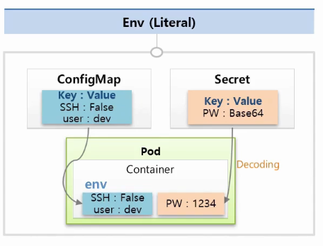

# ConfigMap/ Secret

# 🔶 ****ConfigMap/ Secret **사용 목적 및 개요**

## 🔹 환경 전환 시 문제점

- 개발환경에서 상용환경으로 이동할 때 접근 유저 및 키를 변경해야 함
- 해당 값이 컨테이너 이미지 내부에 존재하면 환경별로 **다른 이미지**를 관리해야 함
- 단지 몇 개 값 차이로 이미지 중복 생성은 비효율적임 → **외부에서 주입하는 구조로 변경** 필요

## 🔹 해결 방안

- 환경에 따라 변하는 값을 외부에서 주입
- Kubernetes의 `ConfigMap`, `Secret` 오브젝트를 활용
    - **ConfigMap** : 일반적인 설정 값 저장
    - **Secret** : 보안이 필요한 값 저장 (ex. 패스워드, 인증키 등)

## 🔹 작동 방식

- 파드가 생성될 때, 지정된 ConfigMap과 Secret의 값이 **컨테이너의 환경 변수로 주입**됨
- 서비스는 환경 변수의 값을 읽어 동작 로직을 결정
- 동일한 이미지로도 **개발/운영 환경 모두 대응 가능**

# 🔶 **ConfigMap / Secret 생성 및 사용 방식**

## 🔹 환경변수 방식

### ▫️Env - Literal 방식



- 입력 형태
    - key : value
- 주의사항
    - Secret의 Value 기입할때는 Base 64 인코딩 필수

- ConfigMap

```yaml
apiVersion: v1
kind: ConfigMap
metadata:
 name: cm-dev
data:
 SSH: False
 User: dev
```

- Secret

```yaml
apiVersion: v1
kind: Secret
metadata:
 name: sec-dev
data:
 Key: MTIzNA== #base64로 인코딩된 값 
```

- Pod

```yaml
apiVersion: v1
kind: Pod
metadata:
  name: file
spec:
  containers:
    - name: container
      image: tmkube/init
      envFrom:
      - configMapKeyRef:
        name: cm-dev
      - secretRef :
        name : sec-dev
					
```

## 🔹 **파일 주입 방식**

### ▫️파일을 ConfigMap, Secret으로 만들기

- 대시보드 지원 X
    - Kubectl 명령어를 수행하여 ConfigMap 및 Secret을 생성
- ▫️ConfigMap 만들기 (파일)

```yaml
# 예시: configmap (cm-file) 생성
kubectl create configmap cm-file --from-file=./file.txt
```

- Secret 만들기 (파일)

```yaml
kubectl create secret generic sec-file --from-file=./file.txt
```

### ▫️주의사항

- 파일 내용은 자동으로 base64 인코딩됨
- 이미 인코딩된 데이터를 넣으면 **2중 인코딩** 주의 필요
- Pod

```yaml
apiVersion: v1
kind: Pod
metadata:
  name: file
spec:
  containers:
    - name: container
      image: tmkube/init
      env:
        - name: file
          valueFrom:
            configMapKeyRef:
              name: cm-file        # ConfigMap 이름
              key: file.txt        # ConfigMap 내 키 (파일명 기준)
            secretKeyRef:
              name: sec-file       # Secret 이름
              key: file.txt        # Secret 내 키 (파일명 기준)            
```

## 🔹 볼륨 **마운트 (Volume Mount)**

- Pod Volume Mount

```yaml
apiVersion: v1
kind: Pod
metadata:
  name: mount
spec:
  containers:
    - name: container
      image: tmkube/init
      volumeMounts:
      - name: file-volume
        mountPath: /mount
  volumes:
  - name: file-volume
    configMap:
      name: cm-file

```

## 🔹보안 및 성능 고려사항

- ConfigMap, Secret
    - Kubernetes API 서버에 저장되지만, 실제 컨테이너에는 **메모리(tmpfs)** 로 주입됨
    - 파일로 저장하는 것보다 보안 우수
    - **크기 제한: 1MB** → 너무 많은 두 시스템 상사용 시 시스템 자원에 영향 있음

## 🔹파일 주입 시 주의사항

| 방식 | 설명 | 변경 시 반영 여부 |
| --- | --- | --- |
| `envFrom` | 파드 시작 시 환경 변수로 주입 | 변경 시 **Pod 재시작 필요** |
| `volumeMount` | 컨테이너 내에 파일로 마운트 | 변경 시 **자동 반영됨** |

# 🔶 ConfigMap과 Secret 실습

## 🔹**ConfigMap 생성**

- 키-값 쌍의 문자열 데이터를 정의하여 생성
- 모든 값은 **string 타입**이어야 함
- 예: boolean 값을 사용하려면 `"true"`처럼 **따옴표 처리 필요**

```yaml
apiVersion: v1
kind: ConfigMap
metadata:
  name: cm-dev
data:
  SSH: 'false' # Bollean 값이라도 String으로 'false' 기입
  User: dev
```

## 🔹**Secret 생성**

- 데이터는 **base64로 인코딩**된 문자열이어야 함
- 인코딩하지 않으면 생성 오류 발생

### ▫️**ConfigMap과 Secret 확인**

- `kubectl describe` 명령어로 생성된 내용 확인 가능
- 값이 잘 들어갔는지 출력으로 검증

※ BASE64 Decode and Encode [https://www.base64decode.org/](https://www.base64decode.org/)

### ▫️Secret 생성 오류 - base 64 X

```yaml
apiVersion: v1
kind: Secret
metadata:
  name: sec-dev
data:
  Key: 1234 
```


```yaml
apiVersion: v1
kind: Secret
metadata:
  name: sec-dev
data:
  Key: MTIzNA==
```

## 🔹**Pod에 적용 (환경 변수)**

- 파드 yaml 내 환경변수 설정에 `valueFrom`으로 ConfigMap과 Secret 참조
- `kubectl exec`로 컨테이너에 들어가 `env` 명령어로 적용 여부 확인 가능
- Secret 값도 디코딩되어 반영됨


## 🔹**파일 기반 ConfigMap/Secret 생성**

- `kubectl create configmap/secret cm-file --from-file=파일명` 명령으로 생성
- `kubectl create secret generic sec-file --from-file=./file-s`  명령으로 생성
- 이때 키는 파일 이름, 값은 파일의 내용이 됨
- secret의 generic은 secret은 여러 타입으로 사용되기 때문에 타입 지정을 위해 기입한다.

### ▫️Master Node 파일 생성


## 🔹 **환경 변수와 파일 마운트 비교**

- ConfigMap/Secret을 환경 변수로 주입: **Pod 재시작 필요** 시에만 변경 반영
    - 환경 변수를, file 혹은 파일 데이터를 변경해도 해당 파드 이미지에서는 변경 X


- 파일 마운트로 주입: **자동 실시간 반영**, Pod 재시작 필요 없음

## 🔹**볼륨 마운트**

- Pod spec의 `volumes`에 ConfigMap/Secret을 지정하고,
`volumeMounts`로 컨테이너 내부 경로에 연결
- `kubectl exec`로 컨테이너 내부 파일 경로를 통해 실제 파일 내용 확인 가능
- env로는 확인할 수 없다.

### ▫️ENV에는 값이 없습니다.


### ▫️Mount 파일 확인


> [!NOTE]
>
> 본 문서는  인프런의 [초급자를 위한 【대세는 쿠버네티스】](https://www.inflearn.com/course/%EC%BF%A0%EB%B2%84%EB%84%A4%ED%8B%B0%EC%8A%A4-%EA%B8%B0%EC%B4%88/dashboard) 강의를 바탕으로 학습한 내용을 정리한 것입니다.