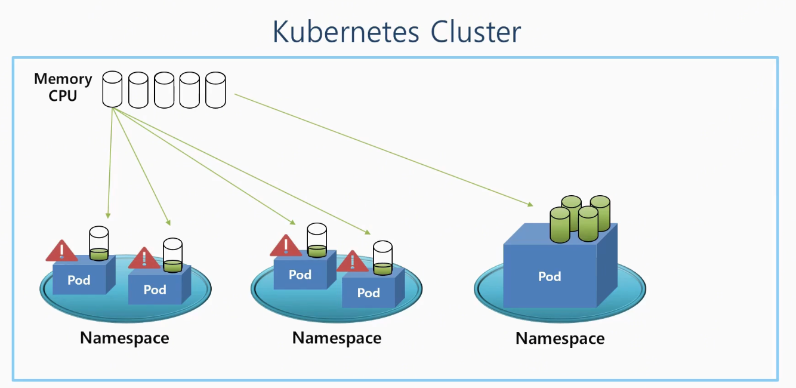

# Namespace, ResuorceQuota, LimitRange

## 🔹왜 이 오브젝트들이 필요한가?

- Kubernetes 클러스터는 메모리, CPU 같은 **전체 자원**을 가짐
- 여러 **Namespace**에서 자원을 공유해서 사용함
- 한 Namespace의 파드가 자원을 과도하게 쓰면 → **다른 파드가 피해**를 봄



- **ResourceQuota**: Namespace 단위로 최대 자원 한계 설정
- **LimitRange**: 파드 하나당 자원 설정을 제한


- **LimitRange와 ResourceQuota는 Cluster 자체에도 할당이 가능하다.**

## 🔹 Namespace (네임스페이스)

### ▫️ 역할

- Kubernetes 리소스를 **논리적으로 구분**하는 단위
- 하나의 **Namespace** 안에서는 **같은 이름의 리소스를 중복 생성 불가**
    - 오브젝트 별로 별도의 UUID가 존재하지만, 같은 종류의 오브젝트라면, 유일한 Key 역활 가능
- 내부 리소스들은 **서로만 접근 가능** (예: 파드 ↔ 서비스 연결)

### ▫️ 특징

- 각 오브젝트는 **Namespace** 안에서 격리됨
- 다른 네임 스페이스와 자원이 격리
- **같은 Namespace 내에서만 Service의 Selector → Pod의 Label** 연결이 **유효**
- **Namespace를 삭제하면 그 안 리소스도 전부 삭제됨**
- 단, 일부 리소스(예: Node, PV)는 클러스터 전역에서 공유됨

### ⚠️ IP 접근

- 파드 IP를 직접 입력하면 **Namespace** 구분 없이 기본적으로는 접근 가능
- 이를 제한하려면 Network Policy ****오브젝트 설정이 필요

- Namespace 선언

```yaml
apiVersion: v1
kind: Namespace
metadata:
  name: nm-1
```

- POD

```yaml
apiVersion: v1
kind: Pod
metadata:
  name: pod-1
  namespace: nm-1 # Namespace 명시
  labels:
    app: pod
spec:
  containers:
  - name: container
    image: kubetm/app
    ports:
    - containerPort: 8080
```

- Service

```yaml
apiVersion: v1
kind: Service
metadata:
  name: svc-1
  namespace: nm-1 # Namespace 명시
spec:
  selector:
    app: pod
  ports:
  - port: 9000
    targetPort: 8080
```

## 🔹ResourceQuota (리소스 쿼터)

### ▫️ 역활

- **Namespace별로 사용 가능한 총 자원량 제한**
- Pod들이 사용할 수 있는 Request**/Limit 총량을 강제로 제한**

```yaml
requests.memory: 3Gi # 최소 메모리 요구치
limits.memory: 6Gi # 최대 메모리 사용 제한
```

### ▫️ 동작 방식

- ResourceQuota가 적용된  NameSpace
    - 파드를 만들 때 **resources.request, limit** 명시 필수
    - 명시 안 하면 → 파드 생성 실패
- 예: 총 3Gi 중 2Gi 사용 중일 때 2Gi 파드 추가 요청 → 거부됨

### ▫️ 제한 가능한 항목

- 메모리, CPU, 스토리지
- 오브젝트 개수 제한도 가능 (ex: Pod 10개, PVC 5개 등)
- Kubernetes 버전에 따라 제한 가능한 오브젝트 항목이 점점 늘어나는 중

## 🔹LimitRange (리미트 레인지)

### ▫️ 목적

- **개별 파드 또는 컨테이너 수준에서** 자원 사용량 제한 설정
- 너무 큰 파드가 들어오지 못하게 막는 기능

### ▫️ 설정 항목

| 항목 | 의미 |
| --- | --- |
| `min` | 최소 자원 요구치. 이보다 작으면 파드 거부 |
| `max` | 최대 허용 자원. 초과 시 파드 거부 |
| `maxLimitRequestRatio` | limit:request 비율 제한 (예: 3 이상 금지) |
| `default` | 자원 설정 안 한 경우 자동 할당되는 기본 limit 값 |
| `defaultRequest` | 자원 설정 안 한 경우 자동 할당되는 기본 request 값 |

### ▫️ 동작 예시

- `max: 4Gi` → 5Gi 설정된 파드는 거부됨
- `maxLimitRequestRatio: 3` → request 1Gi, limit 4Gi → 4배 → 거부

# 실습

```yaml
apiVersion: v1
kind: Pod
metadata:
  name: pod1
  labels:
    type: web
spec:
  containers:
  - name: container
    image: kubetm/app:v1
  terminationGracePeriodSeconds: 0 # 파드가 종료될때 
																   # 원래 30초의 대기시간을 갖지만, 바로 삭제 시킨다.
```

> [!NOTE]
>
> 본 문서는  인프런의 [초급자를 위한 【대세는 쿠버네티스】](https://www.inflearn.com/course/%EC%BF%A0%EB%B2%84%EB%84%A4%ED%8B%B0%EC%8A%A4-%EA%B8%B0%EC%B4%88/dashboard) 강의를 바탕으로 학습한 내용을 정리한 것입니다.