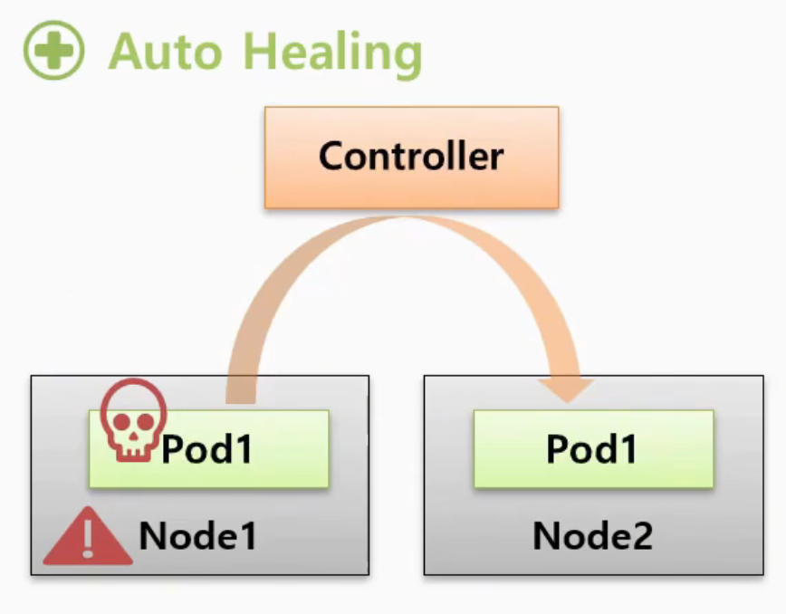
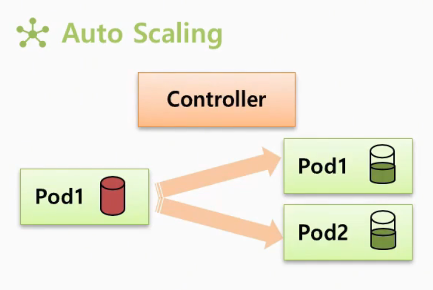
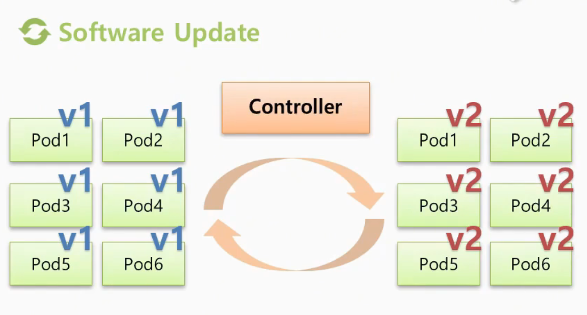
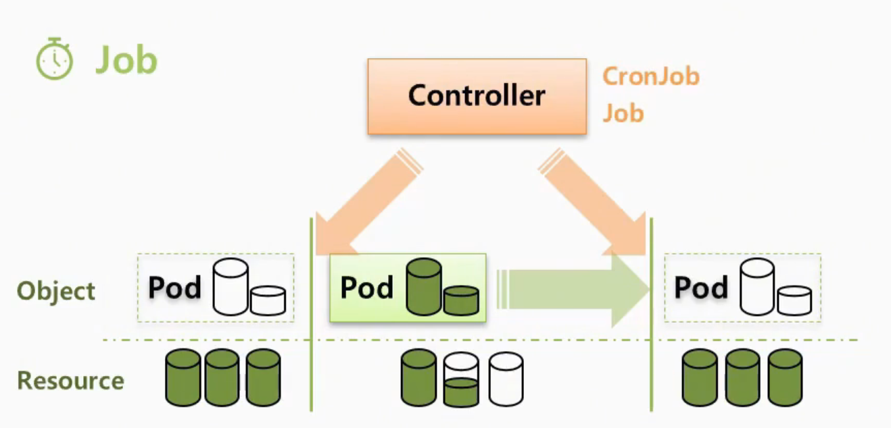
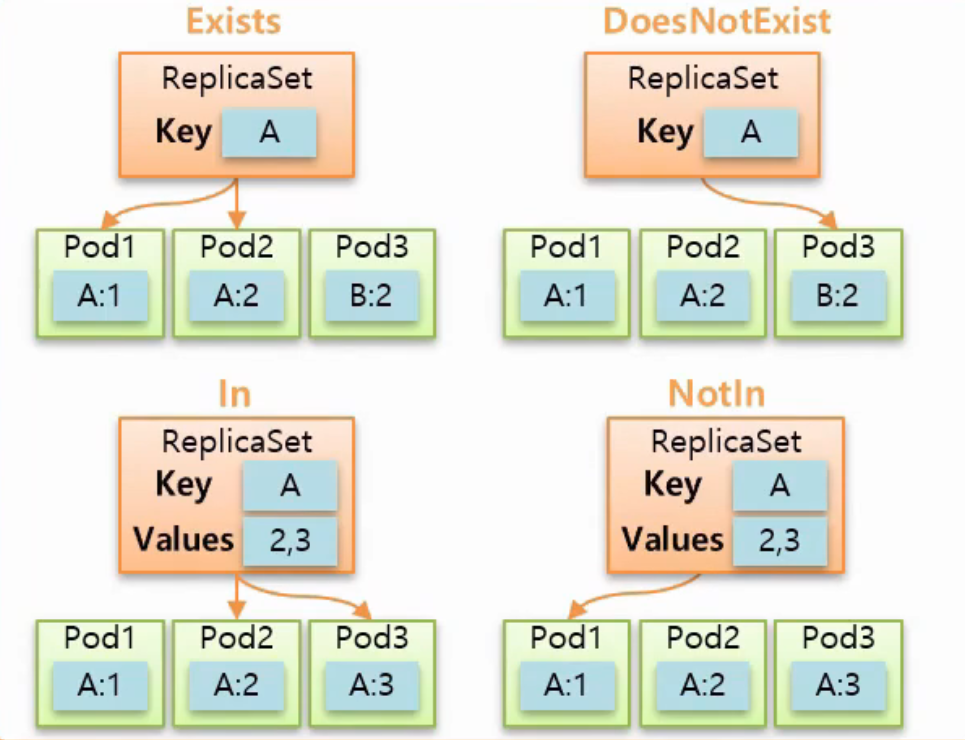

# Controller, Replication Controller, ReplicaSet

## 🔹 Controller란?

쿠버네티스에는 다양한 **Controller(컨트롤러)** 가 존재한다.  
컨트롤러는 단순히 파드를 생성하는 역할만 하는 것이 아니라,  
클러스터의 상태를 지속적으로 감시하면서 원하는 상태를 유지하도록 관리한다.

즉, 서비스 운영 과정에서 발생하는 장애나 부하 상황을 자동으로 처리해주는 핵심 기능이다.

---

## 🔹 Controller가 제공하는 주요 기능

### 1. Auto Healing (자동 복구)

파드가 실행 중 갑자기 종료되거나,  
해당 파드가 올라가 있던 노드 자체가 다운될 수 있다.

이 경우 기존 서비스는 장애 상태가 된다.

하지만 컨트롤러는 현재 상태를 감시 중에 있기 때문에

- 파드 장애 감지
- 노드 장애 감지

```
다른 정상 노드에 새로운 파드 재생성을 자동으로 수행한다.
   
-> 장애가 발생해도 서비스를 가능한 빠르게 복구한다.
```


  
---

### 2. Auto Scaling (자동 확장)

파드의 CPU / Memory 사용량이 증가하여 리소스 한계(Limit)에 가까워질 수 있다.

이 상황을 컨트롤러가 감지하면

```
- 동일한 파드를 추가 생성한다.

  -> 1. 트래픽 분산
  -> 2. 부하 감소
```


- 특정 파드 과부하 방지
- 서비스 다운 방지
- 안정적인 성능 유지




---

### 3. Version Upgrade & Rollback

서비스 운영 중에는 버전 업그레이드가 자주 발생한다.

컨트롤러를 사용하면:

- 여러 파드를 한 번에 업그레이드 가능
- 배포 자동화 가능
- 문제 발생 시 Rollback 가능

즉, 운영 안정성을 높이면서 배포 작업을 단순화할 수 있다.



---

### 4. 일시적인 작업(Job성 작업)

컨트롤러는 특정 순간에만 필요한 작업도 수행할 수 있다.

예를 들어:

- 배치 작업
- 로그 정리
- 데이터 처리
- 일회성 스크립트 실행

같은 작업이 필요할 때:

1. 필요한 순간에만 파드 생성
2. 작업 수행
3. 완료 후 자동 삭제

```
- 사용 중일 때만 리소스 사용
- 작업 종료 후 자원 반환
```

이 가능하기 때문에 효율적인 자원 관리가 가능하다.



---


## Replication Controller & ReplicaSet

### 🔹 Replication Controller란?

`Replication Controller` 는 현재는 사실상 deprecated(구식) 상태의 오브젝트다.

현재는 대부분 `ReplicaSet` 으로 대체되어 사용된다.

하지만 ReplicaSet을 이해하려면  
Replication Controller의 개념을 먼저 이해하는 것이 중요하다.

---

## 🔹 Controller와 Pod의 연결 방식

`Controller` 와 `Pod` 는  
`Service` 와 `Pod` 관계같이 `Label`, `Selector` 를 통해 연결된다.


- Pod에 특정 Label 존재
- Controller의 Selector가 해당 Label과 매칭
- Controller가 해당 Pod를 관리

---

## 🔹 Template

컨트롤러에는 매우 중요한 기능인 `Template` 이 존재한다.

컨트롤러 생성 시 내부에:

- Pod 정보
- Container 정보
- Image 정보

등을 Template 형태로 저장한다.

---

### ▫️Template 동작 방식

컨트롤러는 항상 현재 상태를 감시한다.

만약 관리 중인 Pod가 죽으면:

1. 현재 Pod 삭제 감지
2. 내부 Template 확인
3. 동일한 Pod 재생성

```
Template은 "파드를 복구하기 위한 원본 설계도" 역할을 한다.
```

---

### ▫️ Template를 활용한 수동 업그레이드

이 Template 특성을 이용하면 버전 업그레이드도 가능하다.

예를 들어:

기존 Pod를 V1-> V2 로 변경하는 경우

  1. v1 작동 중
  2. Controller의 Template 수정
      - v2 이미지로 변경
  3. 기존 Pod를 삭제
      - Controller가 Pod 삭제 감지
      - 새 Template 기반으로 재생성
      - 결과적으로 v2 Pod 생성

```
수동 버전 업데이트 완료
```

---

# 🔹 Template 작성 시 주의점

Template 내부에도 반드시 Label이 존재해야 한다.

왜냐하면:

- 새로 생성된 Pod도
- Controller Selector와 연결되어야 하기 때문

```yaml
# Pod
  template:
    metadata:
      name: pod1
      labels:
        type: web
```

---

## ReplicaSet

> "Pod 개수를 유지하는 Controller"

### 🔹 replicas

ReplicaSet은 `replicas` 값을 기준으로 Pod 개수를 유지한다.


예를 들어 replicas를 2라고 설정하면
 - 항상 Pod 2개 유지를 목표 상태로 삼는다.

```yaml
replicas: 2
```
- 만약 Pod 하나가 삭제되거나 죽으면
    - ReplicaSet이 상태 변화 감지
    - 부족한 Pod 1개 재생성
```text
현재 상태: 1개
목표 상태: 2개
  
→ 부족하므로 1개 생성되는 구조다.
```

---

#### ▫️ Scale Out

> 부족한 수만큼 Pod를 추가 생성

replicas 값을 증가시키면 Replicaset은 부족한 수만큼 Pod를 추가 생성

```yaml
replicas: 3
```

- 서비스 처리량 증가
- 트래픽 분산
- 부하 감소

효과를 얻을 수 있다.

---

#### ▫️ Scale In

> 초과된 Pod를 제거

replicas 값을 감소시키면 Replicaset은 초과된 수만큼 Pod를 제거하여 필요 자원을 줄이는 과정

```yaml
replicas: 1
```

---

### 🔹 Template + Replicas 기능 결합

- Pod를 따로 생성하지 않고 Controller만 생성한다.

왜냐하면 ReplicaSet 내부 Template를 통해 필요한 Pod를 자동 생성할 수 있기 때문이다.

```yaml
replicas: 2
```


```
ReplicaSet은:

- Template 확인
- 동일한 Pod 2개 생성
운영자는 Pod를 직접 만들 필요가 없다.
```

---

### 🔹 Replication Controller Selector

기존 Replication Controller는 `Key`, `Value`가 모두 정확히 일치해야 연결된다.

```
- key 다르면 연결 실패
- value 다르면 연결 실패
```

### 🔹 ReplicaSet Selector 확장 기능

ReplicaSet의 Selector는 두 가지 방식이 존재한다.

- `matchLabels`
- `matchExpressions`

#### ▫️ matchLabels

 > `matchLabels` 는 기존 Replication Controller와 동일한 방식이다.

- Key 일치
- Value 일치

---

#### ▫️ matchExpressions

> 더 세밀한 조건 설정이 가능한 Selector 방식이다.

예시:

- key가 `ver` 인 Pod 모두 선택

```yaml
matchExpressions:
- key: ver
  operator: Exists
```

ReplicaSet은 다음 4가지 Operator를 제공한다.

- Exists
- DoesNotExist
- In
- NotIn




---

- Exists
    - `ver` 라는 key가 존재하는 모든 Pod 선택

```yaml
key: ver
operator: Exists
```

- DoesNotExist
    - key가 'a' 인 Label이 없는 Pod 선택

```yaml
key: a
operator: DoesNotExist
```

- In
    - key가 'a'
    - value가 '2' 또는 '3'

```yaml
key: a
operator: In
values:
- 2
- 3
```

- NotIn
    - key가 'a' 이면서 value가 '2', '3' 이 아닌 Pod 선택

```yaml
key: a
operator: NotIn
values:
- 2
- 3
```

---

### 🔹 ReplicaSet Selector의 장점

ReplicaSet은 다양한 Selector 옵션을 통해:

- 세밀한 Pod 선택
- 유연한 그룹 관리
- 버전 관리
- 운영 자동화

를 훨씬 효율적으로 수행할 수 있다.

---


Controller를 삭제하면, Controller에 포함된 Pod들이 함께 삭제되니 주의할 것!

> [!NOTE]
>
> 본 문서는  인프런의 [초급자를 위한 【대세는 쿠버네티스】](https://www.inflearn.com/course/%EC%BF%A0%EB%B2%84%EB%84%A4%ED%8B%B0%EC%8A%A4-%EA%B8%B0%EC%B4%88/dashboard) 강의를 바탕으로 학습한 내용을 정리한 것입니다.