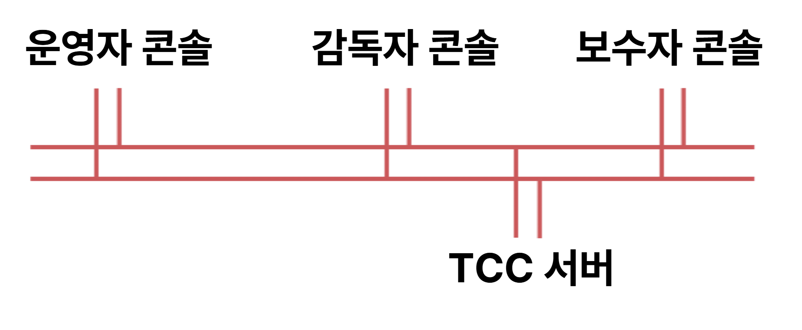
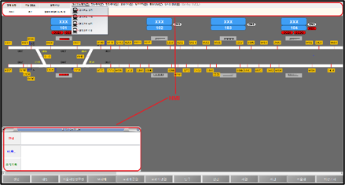
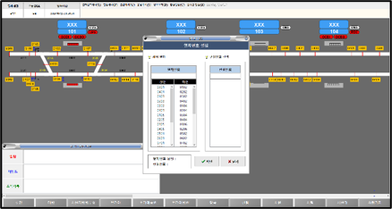
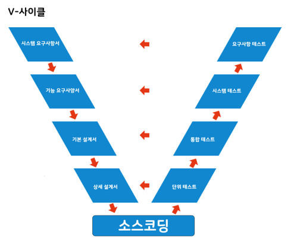
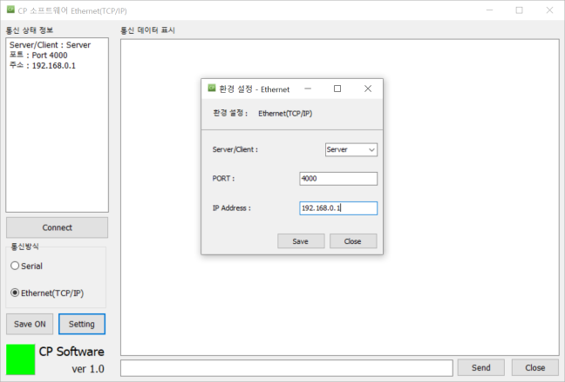
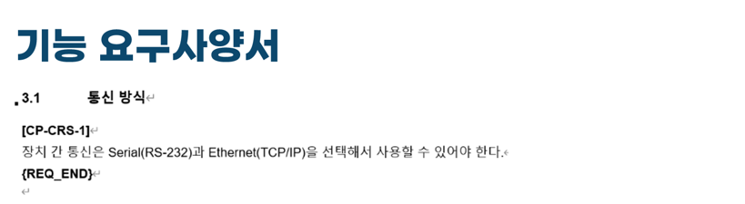
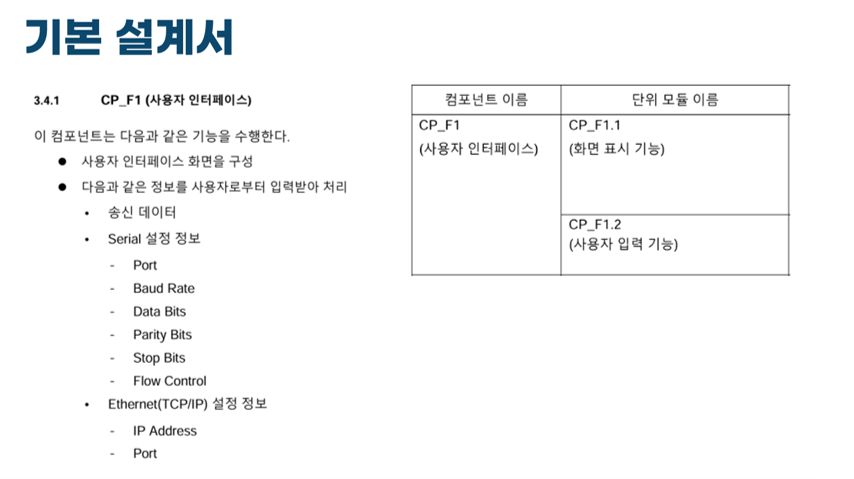
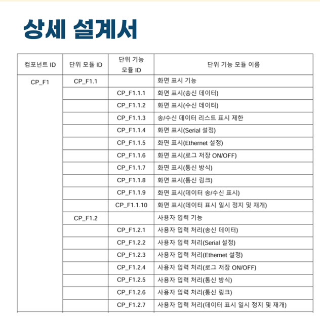
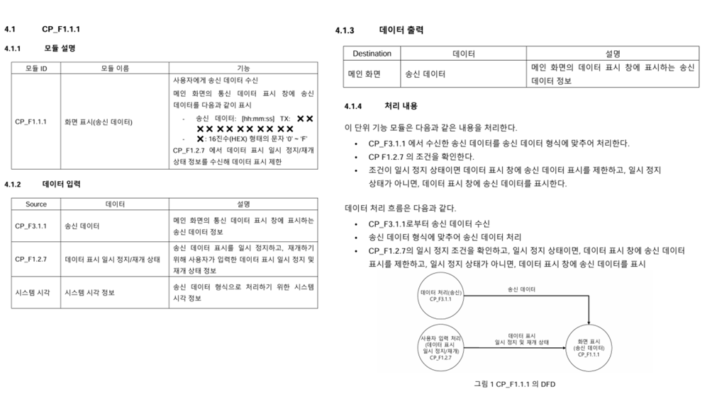

# 테크빌 (Techvile)

## 🔹 테크빌 (Techvile)

### 소속

 - 소프트웨어 개발팀

### 직위

 - 팀원

### 기간 

 - 2018.01 ~ 2020.01

### 담당 역활
```
 - 철도 관제 시스템 HMI 개발 (TCP/IP, UDP) 기반
 - Linux 철도 관제 서버 프로세스 개발 (DSP)
 - 요구사항 분석 및 설계 문서 작성 (V-Cycle)
 - 시스템 테스트 및 장애 분석
```
### 프로젝트 소개

철도 신호 관제 시스템(HMI) 개발

철도 신호 관제 시스템(ATS)은 열차의 안전한 운행을 위해 열차 위치 추적, 운행 계획 관리, 신호 제어, 장애 감시 및 경보 관리를 수행하는 철도 운영의 핵심 시스템입니다.

프로젝트에서는 ATS의 핵심 제어 장치인 TCC(Traffic Control Computer) 와 연동되는 운영자 콘솔(HMI) 개발에 참여하였습니다.

운영자 콘솔은 실시간으로 TCC에서 전달되는 데이터를 수신하여 열차 운행 상태와 신호 설비 정보를 화면에 표시하고, 사용자의 제어 명령을 다시 TCC로 전달하는 역할을 수행합니다.

저는 운영자 콘솔의 HMI 프로그램 개발과 통신 로직 구현, TCC 서버 프로세스(DSP) 개발을 담당하였습니다.

운영자, 감독자, 보수자 콘솔은 로그인 권한에 따라 기능 구성이 달라집니다.

  

 - ATS : Automatic Train Supervision
 - TCC : Traffic Control Computer
 - HMI : Human Muchine Interface
 - DSP : DiSPlay

### 주요 프로젝트

 - 부산 다대선 유지보수
 - 서울 도시철도 7호선 연장
 - 서울 신림 경전철

####  요구사항 분석 및 설계
```
 - 고객 요구사항 분석
 - 기능 정의 및 요구사항 정리 V-Cycle
 - 기본 설계서 작성 및 문서 검증
 - PM과 협의하여 요구사항 변경 및 개선사항 제안
```

#### HMI 개발 (Windows)

  - 사용 기술 (Delphi 2007, MFC , C#)
  ```
  - 주요 업무
    - 기능별 데이터 흐름 정의
    - 철도 관제 화면(UI/UX) 설계 및 개발
    - 실시간 데이터 표시
    - 관제 메뉴 및 기능 구현
  ```
  

  


#### TCC 서버 개발 
  - 사용 기술 : C, C++, Linux (Centos 8)
  ```
  - 주요 업무 
    - DSP 모듈 설계
    - 데이터 수신 및 처리
    - 프로세스 제어 로직 구현
    - 로그 출력 및 분석
    - 장애 원인 분석
    - 서버 프로세스 유지보수
  ```

### V-Cycle 예시

- 간단한 Serial과 Ethernet 통신을 수행할 수 있는 프로그램을 예시로 직접 작성하고 개발한 문서 입니다.

  - V-Cycle 그림
  

  - 예시 프로그램
  

#### 기능 요구 사양서



#### 기본 설계서 



#### 상세 설계서




