# 포트폴리오


## 🔶 마리오 아울렛 (Mario Outlet)

### 🔹 소속

 - 소프트웨어 개발팀

### 🔹 직위

 - 사원

### 🔹 기간 

 - 2024.10 ~ 2025.11

##  마리오몰 및 마리오아울렛 온라인 쇼핑몰 운영 업무

### 🔹 프로젝트 개요 
```
 - 온라인 쇼핑몰 유지보수 (ASP.NET, MSSQL)
 - ERP 상품 정보 동기화 (ASP.NET, MSSQL)
 - 상품 연동 오류 분석 및 수정 
 - IIS 로그 분석 (Windows Server 2014)
 - Bot Traffic 분석 및 대응 (Windows Server 2014 로그 분석 및 Robot.txt)
 - SSL 인증서(Gabia) 발급 및 적용
 - 서비스 장애 분석 및 대응
```

   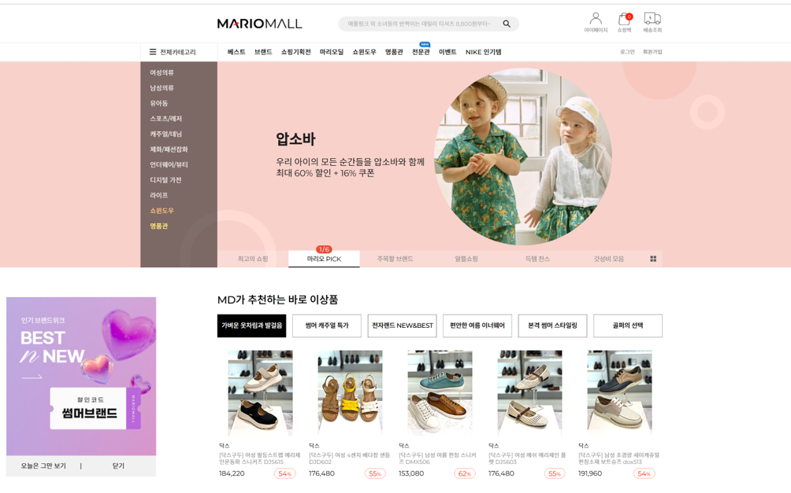

### 🔹 기술 스택

```
  프론트엔드 : ASP.NET (C#)
  백엔드	: ASP.NET (C#)
  데이터베이스	: MSSQL
  인프라 환경	: Windows Server 2014 (IIS 서버) - Cafe24(외부 온프레미스 서버 관리)
```


## 마리오 PHP 기반 레거시 허브빌리지 재구축


### 🔹 프로젝트 개요 

기존 서비스는 PHP 5.6 기반의 레거시 애플리케이션으로, 노후화된 서버 환경에 의존하고 있어 신규 환경 구축과 유지보수가 어려웠습니다.


서비스의 이식성과 재현성을 높이기 위해 Docker 기반 컨테이너 환경으로 재구축하였으며, 웹 애플리케이션과 데이터베이스를 분리하여 운영 환경을 표준화하였습니다.


기존 수동 설치 과정을 Shell Script로 자동화하여 동일한 개발 및 운영 환경을 손쉽게 구축할 수 있도록 개선하였습니다.


### 🔹 컨테이너 구성

   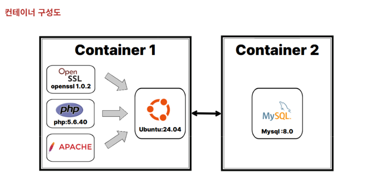


```
•	Container 1: 웹 애플리케이션 서버
    o	베이스 이미지: Ubuntu Server
    o	OpenSSL 1.0.2: 보안 통신을 위한 암호화 모듈
    o	PHP 5.6.40: 웹 애플리케이션 실행을 위한 서버 사이드 스크립트 언어
    o	Apache: HTTP 웹 서버
 
•	Container 2 : 데이터 베이스 서버
    o	DBMS: MySQL 8.0

```

 - Shell Script 자동화

```

기존 수동 설치 과정을 Shell Script로 자동화하여 
운영 환경을 일관되게 구축할 수 있도록 개선하였습니다.
 
 1. 시스템 패키지 설치
 2. MySQL 초기 설정
 3. PHP 빌드
 4. OpenSSL 설치
 5. Apache 설정
 6. 서비스 배포
 
 RUN    bash ./01_update_system.sh && \
        bash ./02_mysql.sh && \
        bash ./03_openssl.sh && \
        bash ./04_php.sh && \
        bash ./05_apache.sh && \
        bash ./06_herbvillage.sh
```

## 이미지 서버 개발 

 - 이미지 저장 : AWS S3
 - 이미지 변환 : imgproxy
 - 백엔드 : NestJS

### 🔹 프로젝트 개요

기존 이미지 서비스는 온프레미스 서버에 파일을 저장하고 CDN으로 올려 사용하고 있었습니다.

기존 이미지 서비스를 사용하기 위해서는 지속적으로 연간 700 만원의 사용료를 지급하고 있었기 때문에, 해당 서비스를 구성하여, 비용을 절약할 수 있게 하였습니다.

기존 서버의 용량 부담을 줄이기 위해 AWS S3를 이미지 저장소로 사용하고, 이미지 제공 및 가공을 처리하는 기존 서버의 기능을 동일하게 구현하기 위해 imgproxy를 활용하여 동적 이미지 변환하도록 하였습니다.


### 🔹 이미지 업로드 구현

사용자가 업로드한 이미지는 서버에서 유효성 검사를 수행한 후 AWS S3에 저장됩니다. 파일 크기에 따라 일반 업로드(PutObject) 또는 Multipart Upload를 선택하여 처리하도록 구현하였습니다.


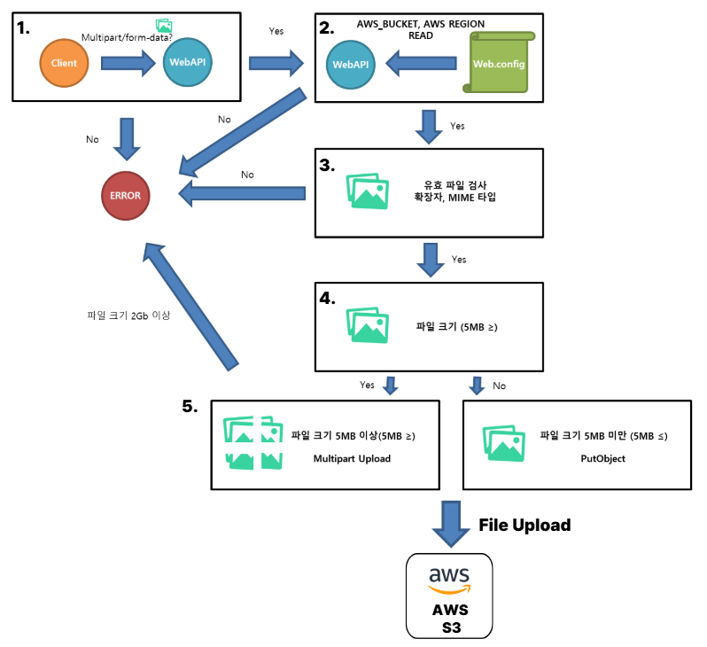

```
1. 이미지 업로드 요청
    - multipart/form-data 형식으로 이미지를 Web API에 업로드합니다.
 
2. AWS 환경 설정 확인
    - Web API는 Web.config에 저장된 AWS 설정 정보를 읽어 S3 접속 정보를 초기화합니다.
    - AWS Bucket, AWS Region, AWS Access
 
3. 업로드 파일 검증
    - 파일 존재 여부
    - 파일 확장자
    - MIME Type
    - 허용되지 않는 파일 여부
 
4. 파일 크기 확인
    - 파일 크기에 따라 업로드 방식을 결정합니다.
        - 5MB 이하 → 일반 업로드(PutObject)
        - 5MB 초과 → Multipart Upload
    - 2GB 이상의 파일은 업로드를 제한하도록 구현하였습니다.
```


### 🔹 이미지 요청 

이미지 요청 API는 클라이언트가 원하는 크기와 옵션에 맞는 이미지를 동적으로 생성하여 반환하는 기능을 제공합니다.

원본 이미지는 AWS S3에 저장되어 있으며, 실제 이미지 변환은 imgproxy가 수행합니다.

Backend는 변환 옵션을 생성하고 imgproxy에 요청을 전달하는 역할을 담당합니다.


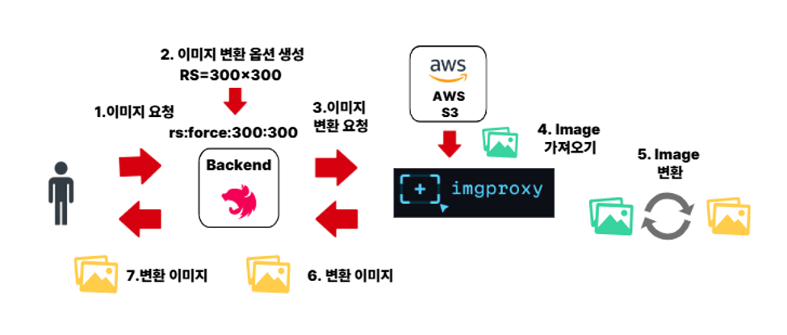
```
1. 이미지 요청
    - 클라이언트는 이미지와 함께 원하는 변환 옵션을 Backend API로 요청합니다.

2. 이미지 변환 옵션 생성
    - 기존 이미지 서버에서 사용하던 옵션을 imgproxy에서 사용하는 URL 형식으로 변환합니다.

3. imgproxy 요청
    - 생성된 imgproxy URL을 이용하여 이미지 변환 요청을 전달합니다.

4. AWS S3 원본 이미지 조회
    - imgproxy는 Backend에서 전달받은 정보를 이용하여 AWS S3에서 원본 이미지를 가져옵니다.

5. 이미지 변환
    - imgproxy가 메모리 상에서 이미지를 변환합니다.
    - 원본 이미지는 변경되지 않습니다.

6. Backend 반환
    - 변환된 이미지를 Backend로 전달합니다.
    - Backend에서는 별도의 이미지 처리 없이 그대로 응답합니다.

7. Client 응답
    - 클라이언트는 요청한 옵션이 적용된 이미지를 전달받습니다.
```

---

# 제로원에이아이 (ZerooneAI)

## 🔶 제로원에이아이 (ZerooneAI)

### 🔹 소속

 - 연구소

### 🔹 직위

 - 연구원

### 🔹 기간 

 - 2023.06 ~ 2024.04

### 🔹 담당 역활
```
 역할: 프로젝트 리더 / 웹 풀스택 개발자 
 

 -	프로젝트 리딩 및 개발 총괄 
    o	각 주관별 요건 정의 및 공통 기능 표준화
    o	데이터 구조 설계 및 API 아키텍처 구축
    o	일정 관리 및 고객 피드백 반영
  
  - 합병증 빅데이터 플랫폼 및 AI 예측 시스템 설계 
    o	공통 합병증 및 수술별 특이 합병증 데이터셋 설계
    o	CDSS(Clinical Decision Support System) 설계 참여
  
  -	풀스택 개발 (Next.js & Go) 
    o	e-CRF(전자 임상연구서식) 시스템 개발
    o	입력 데이터 보안 강화를 위한 Keystore 암호화 처리
    o	환자 증례기록서(CRF)와 자료입력 지침서(UI/UX) 구현
    o	사용자 역할에 따른 권한 기반 데이터 입력 시스템 구축
  
  -	개발 환경 자동화 
    o	Google Sheet 기반 DB 스키마 자동 파싱     
```

### 🔹 기술 스택

```
  프론트엔드 : Next.js (TypeScript)
  백엔드	: Go
  데이터베이스	: Oracle
  배포 환경	: Kubernetes
  협업/관리	: GitLab(CI/CD), Google Sheets
```

### 🔹 프로젝트 소개

```
한국형 수술질 향상 프로젝트
 
참여 인원 : 3명
 - PM 및 풀스택 (본인)
 - MLOps (1)
 - 웹 프론트 보조(1)
 
 
한국형 NSQIP(K-NSQIP)을 기반으로 명칭을 변경한 K-QIPS 프로젝트는 수술 후 합병증 관리를 위한
빅데이터 플랫폼과 AI 시스템 개발을 목표로 진행된 국가 주도 헬스케어 프로젝트

  - 한국형 수술질향상 프로젝트
  
  - 연구 내용
    -	수술 후 합병증 통합 빅데이터 플랫폼 구축
    -	환자 증례기록서 및 자료입력지침서 개발 및 웹 기반 자료관리시스템 구축(e-CRF)
    -	수술 후 공통 합병증 연구를 위한 데이터 셋 구축 및 데이터베이스 인프라 조성
    -	5개 외과적 수술의 공통합병증 빅데이터 플랫폼 개발


```

  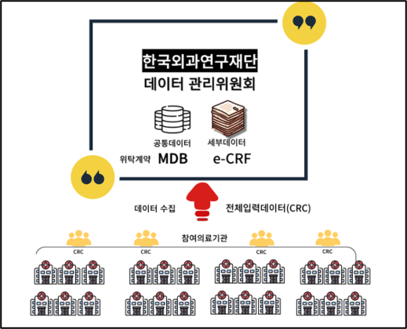


관련 기사 : 
- https://www.mt.co.kr/industry/2025/12/31/2025123115201260397
- https://www.mt.co.kr/industry/2025/12/19/2025121914430227349

  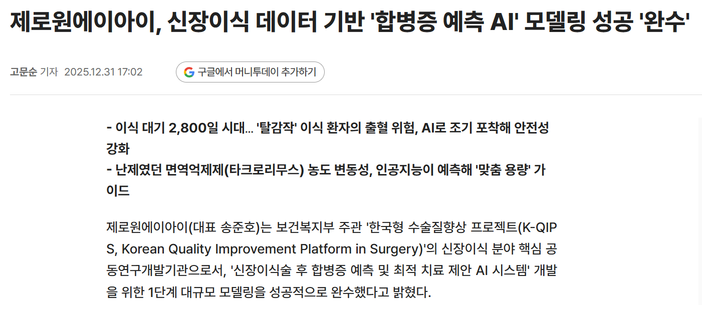

### 🔹 프로젝트 성과 
```
  -  유저 피드백 : 
    -  신장 (250) + 췌장 (200) 피드백
 
  - 테스트 시연
    -	주기적인 월 1회 미팅 및 온라인 시연 완료
    -	서울대 병원 오프라인 시연
 
  -	서비스 오픈 : 2024.04.25 
```
---

# 테크빌 (Techvile)

## 🔶 테크빌 (Techvile)

### 🔹 소속

 - 소프트웨어 개발팀

### 🔹 직위

 - 팀원

### 🔹 기간 

 - 2018.01 ~ 2020.01

### 🔹 담당 역활
```
 - 철도 관제 시스템 HMI 개발 (TCP/IP, UDP) 기반
 - Linux 철도 관제 서버 프로세스 개발 (DSP)
 - 요구사항 분석 및 설계 문서 작성 (V-Cycle)
 - 시스템 테스트 및 장애 분석
```
### 🔹 프로젝트 소개

철도 신호 관제 시스템(HMI) 개발

철도 신호 관제 시스템(ATS)은 열차의 안전한 운행을 위해 열차 위치 추적, 운행 계획 관리, 신호 제어, 장애 감시 및 경보 관리를 수행하는 철도 운영의 핵심 시스템입니다.

프로젝트에서는 ATS의 핵심 제어 장치인 TCC(Traffic Control Computer) 와 연동되는 운영자 콘솔(HMI) 개발에 참여하였습니다.

운영자 콘솔은 실시간으로 TCC에서 전달되는 데이터를 수신하여 열차 운행 상태와 신호 설비 정보를 화면에 표시하고, 사용자의 제어 명령을 다시 TCC로 전달하는 역할을 수행합니다.

저는 운영자 콘솔의 HMI 프로그램 개발과 통신 로직 구현, TCC 서버 프로세스(DSP) 개발을 담당하였습니다.

운영자, 감독자, 보수자 콘솔은 로그인 권한에 따라 기능 구성이 달라집니다.

  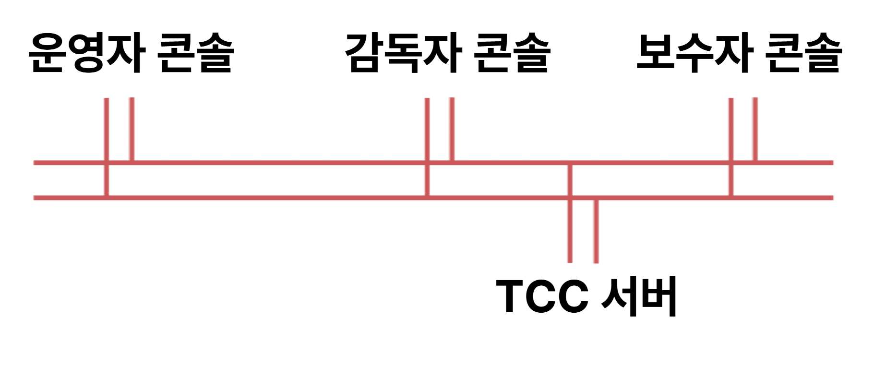

 - ATS : Automatic Train Supervision
 - TCC : Traffic Control Computer
 - HMI : Human Muchine Interface
 - DSP : DiSPlay

### 🔹 주요 프로젝트

 - 부산 다대선 유지보수
 - 서울 도시철도 7호선 연장
 - 서울 신림 경전철

####  요구사항 분석 및 설계
```
 - 고객 요구사항 분석
 - 기능 정의 및 요구사항 정리 V-Cycle
 - 기본 설계서 작성 및 문서 검증
 - PM과 협의하여 요구사항 변경 및 개선사항 제안
```

#### HMI 개발 (Windows)

  - 사용 기술 (Delphi 2007, MFC , C#)
  ```
  - 주요 업무
    - 기능별 데이터 흐름 정의
    - 철도 관제 화면(UI/UX) 설계 및 개발
    - 실시간 데이터 표시
    - 관제 메뉴 및 기능 구현
  ```
  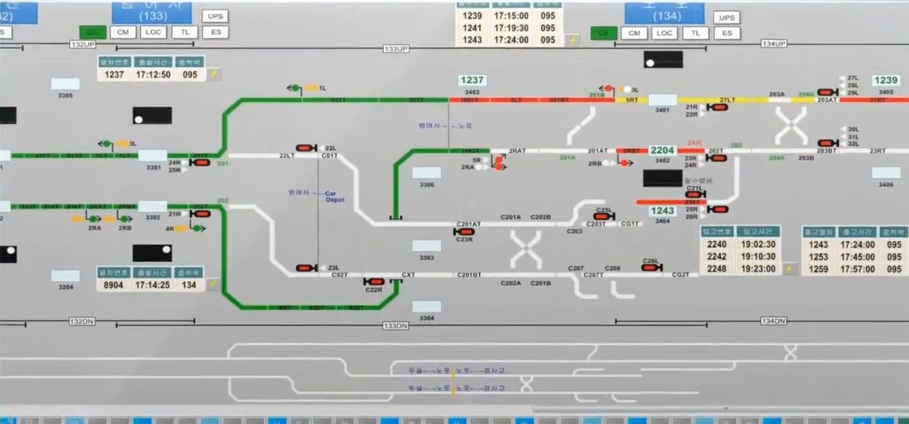

  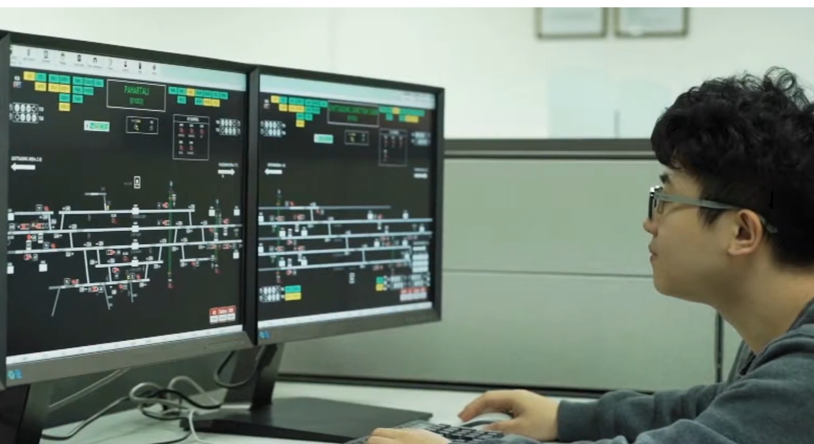

  사진 출처 
  - 유튜브 : 테크빌 - 고속철도 신호 차상검측 시스템국문
  - https://www.youtube.com/watch?v=B2PMqxlByO8

#### TCC 서버 개발 
  - 사용 기술 : C, C++, Linux (Centos 8)
  ```
  - 주요 업무 
    - DSP 모듈 설계
    - 데이터 수신 및 처리
    - 프로세스 제어 로직 구현
    - 로그 출력 및 분석
    - 장애 원인 분석
    - 서버 프로세스 유지보수
  ```

### 🔹 V-Cycle 예시

- 간단한 Serial과 Ethernet 통신을 수행할 수 있는 프로그램을 예시로 직접 작성하고 개발한 문서 입니다.

  - V-Cycle 그림
  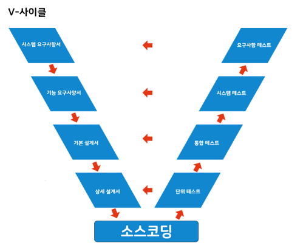

  - 예시 프로그램
  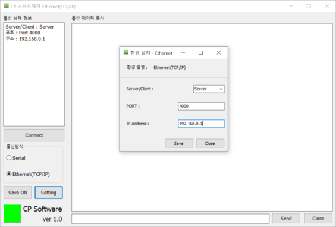

#### 기능 요구 사양서

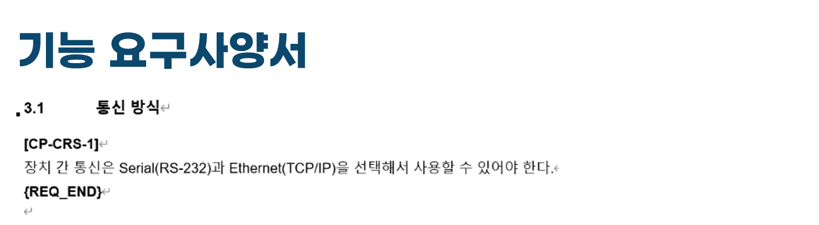

#### 기본 설계서 

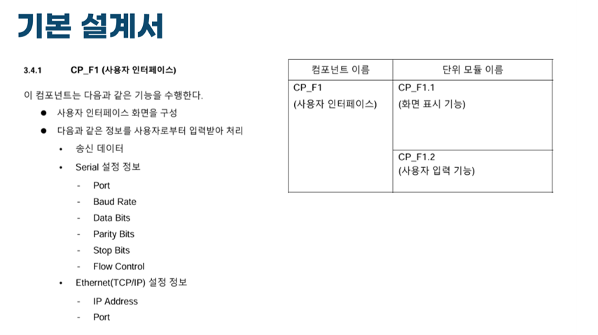

#### 상세 설계서

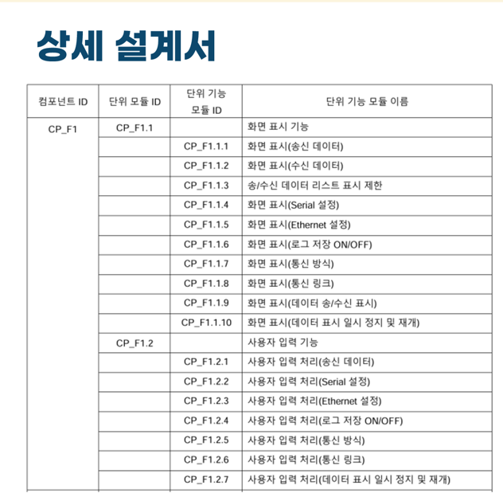

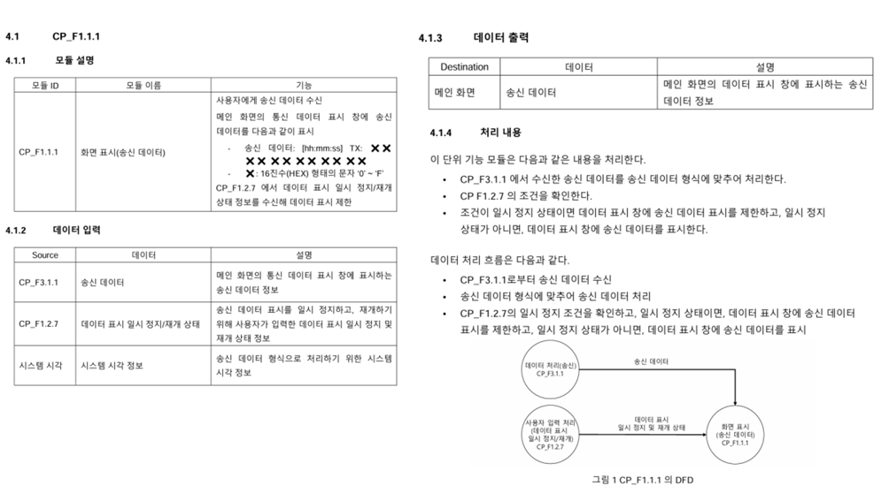

## Better-RE 

### 🔶 프로젝트 개요

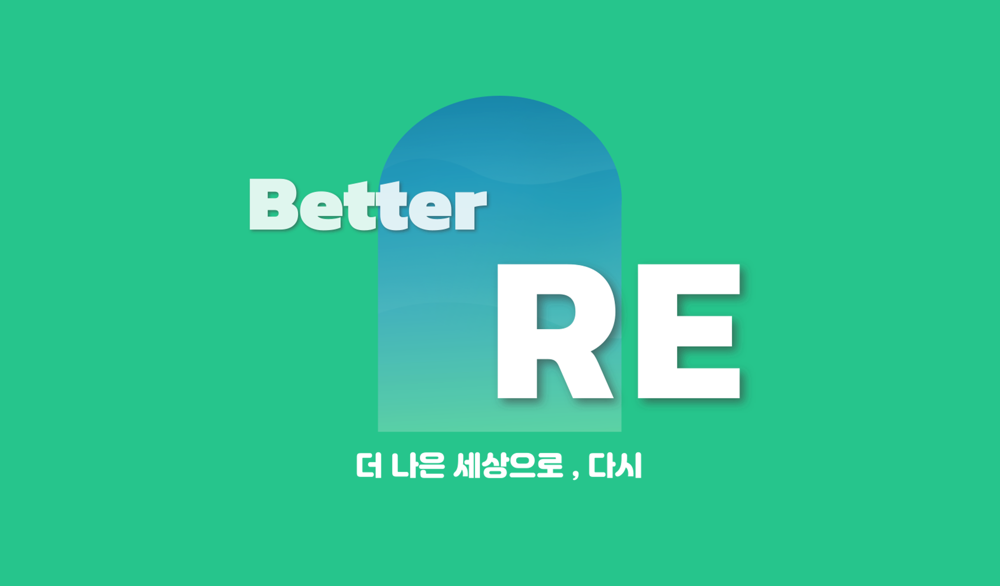 

```
전기차와 전자기기의 보급이 증가하면서 폐배터리 역시 빠르게 증가하고 있습니다.
 
하지만 폐배터리라고 해서 모두 사용할 수 없는 것은 아닙니다. 
대부분의 배터리는 자동차에서 요구하는 성능을 만족하지 못할 뿐, 
여전히 상당한 용량을 유지하고 있습니다.
 
이번 프로젝트에서는 잔존 수명을 가진 폐배터리를 활용하여,
휴대용 보조배터리로 재탄생시키는 업사이클링을 목표로 하였습니다.
```

---

### 🔶 왜 필요한가?

#### 🔹 전기차 배터리는 생각보다 친환경적이지 않을 수도 있습니다.

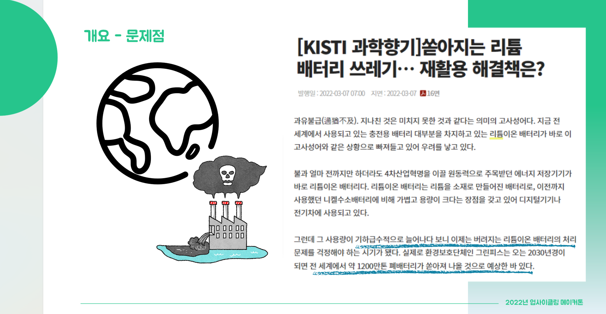
```
전기차는 운행 과정에서는 탄소 배출이 적지만,
 
배터리를 생산하는 과정에서는
 
- 리튬 채굴
- 니켈 채굴
- 코발트 채굴
- 대규모 전력 사용
- 배터리 제조
 
등 많은 자원과 에너지가 필요합니다.
 
따라서 아직 사용할 수 있는 배터리를 조기에 폐기한다면,
 
새로운 배터리를 계속 생산해야 하므로 오히려 환경 부담이 증가할 수 있습니다.
```

#### 🔹 아직 사용할 수 있는 배터리가 버려지고 있습니다.

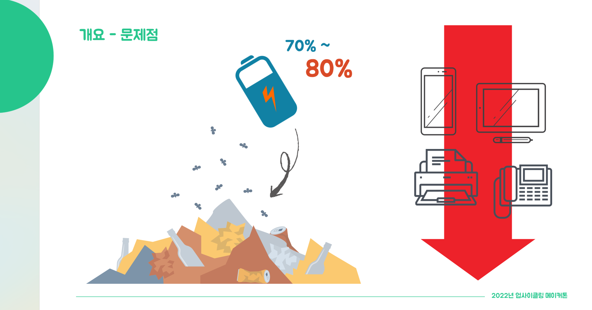

```
전기차 배터리는 일반적으로 성능이 약 70~80% 수준으로 감소하면 교체됩니다.

그러나 이는 자동차에서 요구하는 출력과 주행거리를 만족하지 못하는 기준일 뿐입니다.

휴대용 충전기와 같은 저전력 기기에서는 여전히 충분한 성능을 발휘할 수 있습니다.
```


> **수명이 끝난 배터리가 아니라 전자기기에서의 역할만 끝난 배터리**인 것입니다.


#### 🔹 여러 일회용기 폐기물도 함께 증가하고 있습니다.

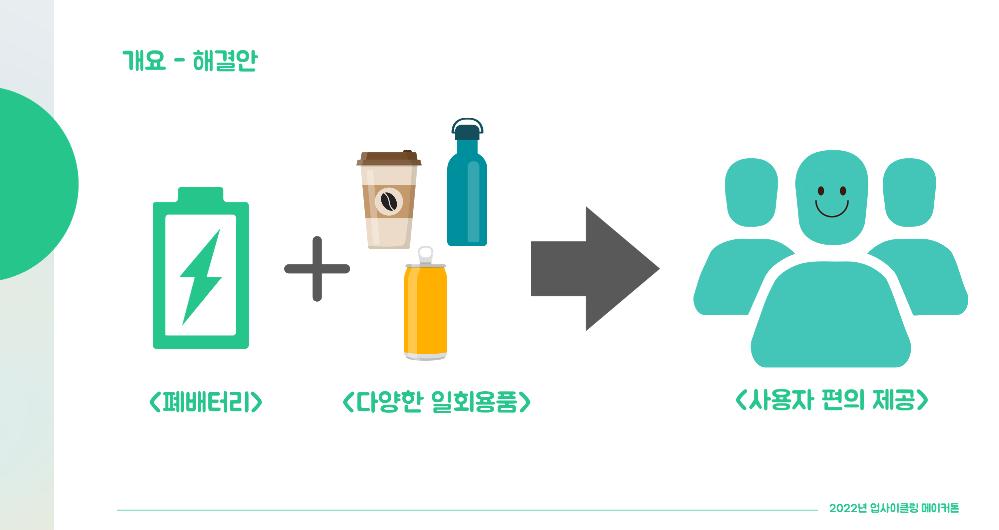

```
다양한 곳에서 하루에도 수많은

- 일회용 컵
- 플라스틱 용기
- 음료 용기

등이 버려집니다.

이러한 용기 역시 대부분 한 번 사용된 후 폐기됩니다.

저희는 이러한 폐플라스틱을 제품 외관으로 재활용하여 또 하나의 환경 문제를 함께 해결하고자 하였습니다.
```

---

### 🔶 해결방안

Better-RE는

전기차 폐배터리와 폐플라스틱을 동시에 업사이클링합니다.

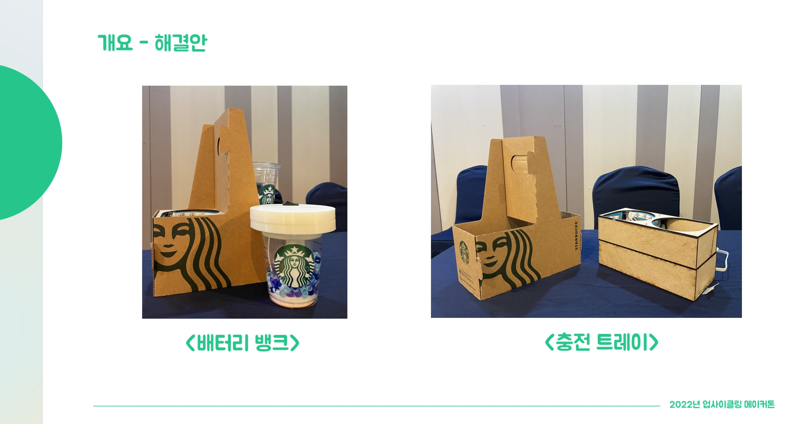 

```text
전기차 폐배터리

↓

잔존 용량 검사

↓

사용 가능한 셀 선별

↓

배터리 모듈 제작

+

카페 폐플라스틱 결합

↓

외관 제작

↓

휴대용 충전기 완성
```

이를 통해 새로운 플라스틱 생산과 새로운 배터리 생산을 모두 줄일 수 있습니다.


#### 🔹 삽입형 모듈 설계

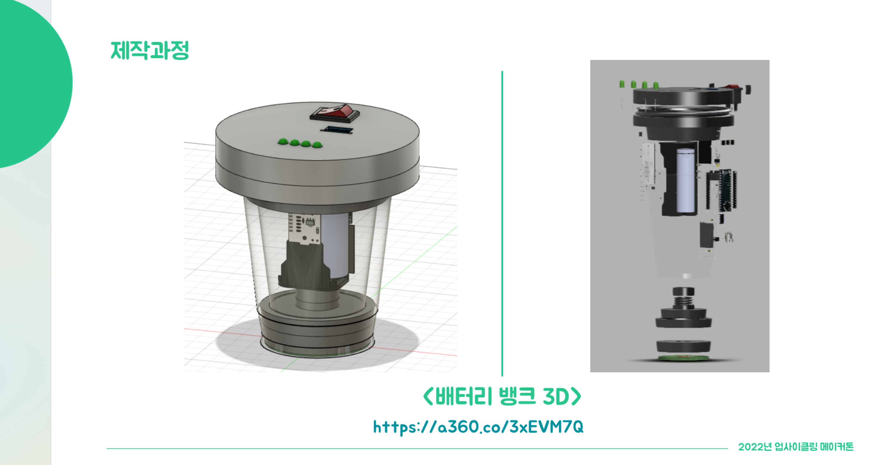 

```
제품은 삽입형(Built-in Module) 구조로 설계되었습니다.
 
배터리 모듈만 쉽게 교체할 수 있도록 제작하여
 
- 유지보수 용이
- 배터리 교체 시간 단축
- 재사용성 향상
- 다양한 장소에서 간편한 설치
 
가 가능하도록 설계하였습니다.
```

> 제품 전체를 버리는 것이 아니라 배터리 모듈만 교체하면 됩니다.

---

### 🔶 IoT 기반 관리 시스템

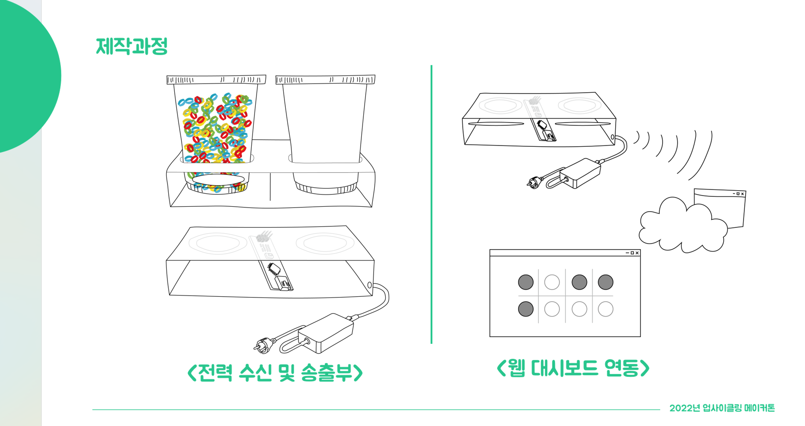

```
제품 내부에는 Wi-Fi 통신 기능을 적용하여
 
관리자가 실시간으로 제품 상태를 확인할 수 있도록 설계하였습니다.
 
관리 가능한 정보는 다음과 같습니다.
 
- 배터리 잔량
- 충전 상태
- 사용 횟수
- 충방전 이력
- 위치 정보(확장 가능)
 
이를 통해
 
- 충전 시기 관리
- 유지보수
- 이상 배터리 확인
 
등을 효율적으로 수행할 수 있습니다.
```

---

### 🔶 활용 방안

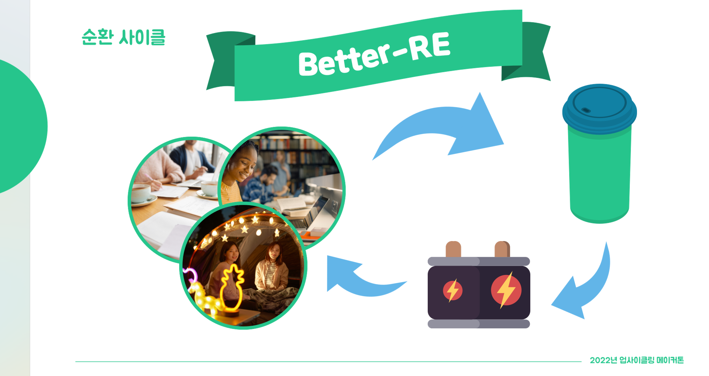

```
제작된 충전기는
 
- 카페
- 도서관
- 학교
- 공공기관
- 전시장
 
등에서 자유롭게 사용할 수 있습니다.
 
카페에서 발생한 폐플라스틱이 다시 카페에서 사용하는 휴대용 충전기로 재탄생하는
 순환 사이클(Circular Cycle)를 구현하는 것이 프로젝트의 목표입니다.
```
### 🔶 상장

#### 우수상 수상

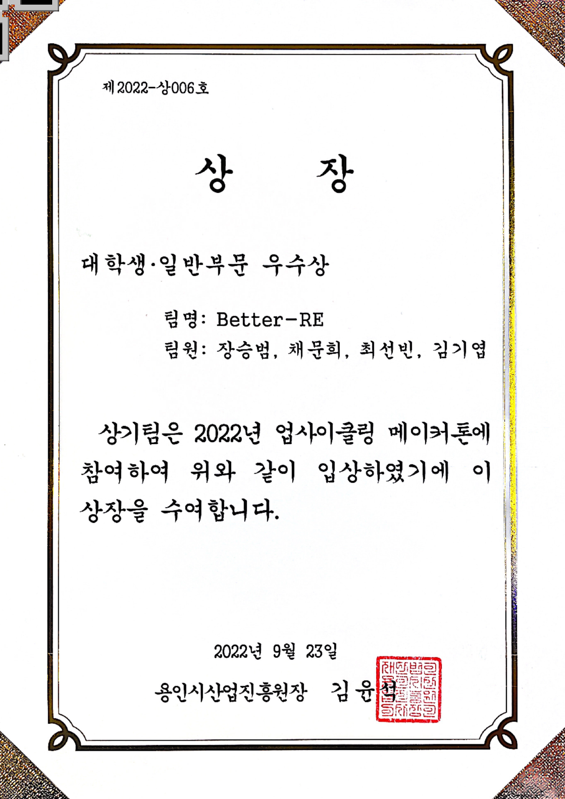