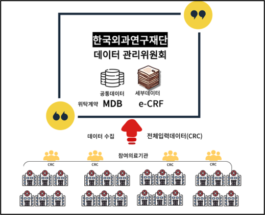
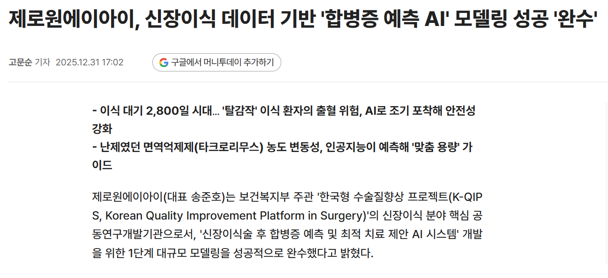

# 제로원에이아이 (ZerooneAI)

## 🔹 제로원에이아이 (ZerooneAI)

### 소속

 - 연구소

### 직위

 - 연구원

### 기간 

 - 2023.06 ~ 2024.04

### 담당 역활
```
 역할: 프로젝트 리더 / 웹 풀스택 개발자 
 

 -	프로젝트 리딩 및 개발 총괄 
    o	각 주관별 요건 정의 및 공통 기능 표준화
    o	데이터 구조 설계 및 API 아키텍처 구축
    o	일정 관리 및 고객 피드백 반영
  
  - 합병증 빅데이터 플랫폼 및 AI 예측 시스템 설계 
    o	공통 합병증 및 수술별 특이 합병증 데이터셋 설계
    o	CDSS(Clinical Decision Support System) 설계 참여
  
  -	풀스택 개발 (Next.js & Go) 
    o	e-CRF(전자 임상연구서식) 시스템 개발
    o	입력 데이터 보안 강화를 위한 Keystore 암호화 처리
    o	환자 증례기록서(CRF)와 자료입력 지침서(UI/UX) 구현
    o	사용자 역할에 따른 권한 기반 데이터 입력 시스템 구축
  
  -	개발 환경 자동화 
    o	Google Sheet 기반 DB 스키마 자동 파싱     
```

### 기술 스택

```
  프론트엔드 : Next.js (TypeScript)
  백엔드	: Go
  데이터베이스	: Oracle
  배포 환경	: Kubernetes
  협업/관리	: GitLab(CI/CD), Google Sheets
```

### 프로젝트 소개

```
한국형 수술질 향상 프로젝트
 
참여 인원 : 3명
 - PM 및 풀스택 (본인)
 - MLOps (1)
 - 웹 프론트 보조(1)
 
 
한국형 NSQIP(K-NSQIP)을 기반으로 명칭을 변경한 K-QIPS 프로젝트는 수술 후 합병증 관리를 위한
빅데이터 플랫폼과 AI 시스템 개발을 목표로 진행된 국가 주도 헬스케어 프로젝트

  - 한국형 수술질향상 프로젝트
  
  - 연구 내용
    -	수술 후 합병증 통합 빅데이터 플랫폼 구축
    -	환자 증례기록서 및 자료입력지침서 개발 및 웹 기반 자료관리시스템 구축(e-CRF)
    -	수술 후 공통 합병증 연구를 위한 데이터 셋 구축 및 데이터베이스 인프라 조성
    -	5개 외과적 수술의 공통합병증 빅데이터 플랫폼 개발


```

  


관련 기사 : 
- https://www.mt.co.kr/industry/2025/12/31/2025123115201260397
- https://www.mt.co.kr/industry/2025/12/19/2025121914430227349

  

### 프로젝트 성과 
```
  -  유저 피드백 : 
    -  신장 (250) + 췌장 (200) 피드백
 
  - 테스트 시연
    -	주기적인 월 1회 미팅 및 온라인 시연 완료
    -	서울대 병원 오프라인 시연
 
  -	서비스 오픈 : 2024.04.25 
```