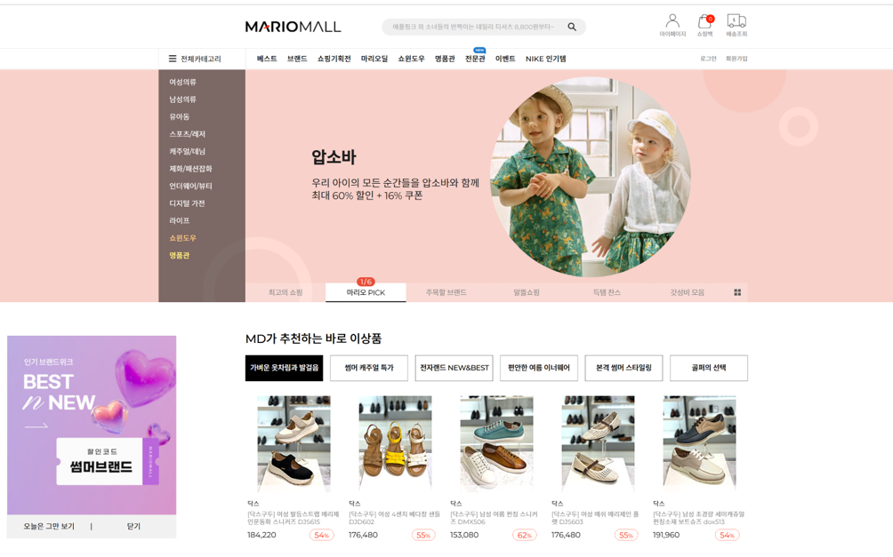
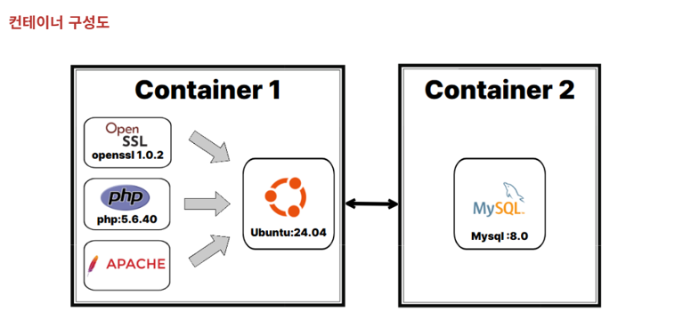
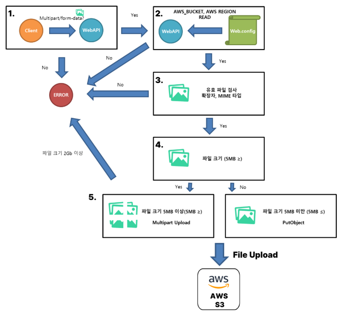
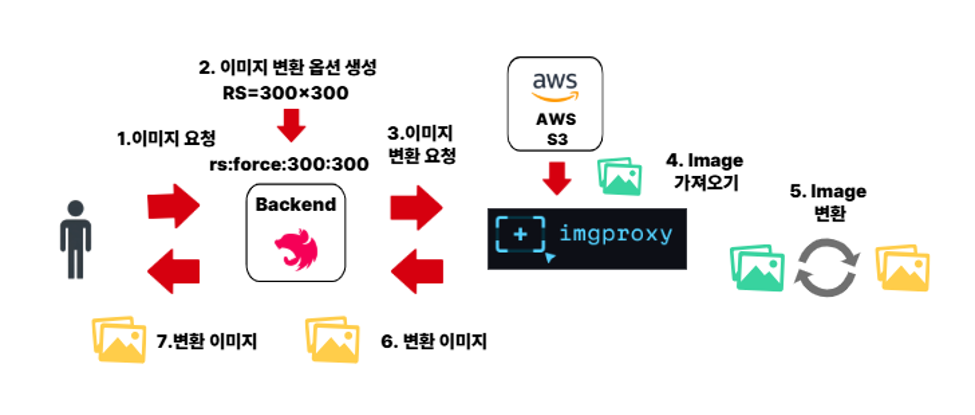

# 마리오 아울렛 (Mario Outlet)

## 🔹 마리오 아울렛 (Mario Outlet)

### 소속

 - 소프트웨어 개발팀

### 직위

 - 사원

### 기간 

 - 2024.10 ~ 2025.11

##  마리오몰 및 마리오아울렛 온라인 쇼핑몰 운영 업무

### 프로젝트 개요 
```
 - 온라인 쇼핑몰 유지보수 (ASP.NET, MSSQL)
 - ERP 상품 정보 동기화 (ASP.NET, MSSQL)
 - 상품 연동 오류 분석 및 수정 
 - IIS 로그 분석 (Windows Server 2014)
 - Bot Traffic 분석 및 대응 (Windows Server 2014 로그 분석 및 Robot.txt)
 - SSL 인증서(Gabia) 발급 및 적용
 - 서비스 장애 분석 및 대응
```

   

### 기술 스택

```
  프론트엔드 : ASP.NET (C#)
  백엔드	: ASP.NET (C#)
  데이터베이스	: MSSQL
  인프라 환경	: Windows Server 2014 (IIS 서버) - Cafe24(외부 온프레미스 서버 관리)
```


## 마리오 PHP 기반 레거시 허브빌리지 재구축


### 프로젝트 개요 

기존 서비스는 PHP 5.6 기반의 레거시 애플리케이션으로, 노후화된 서버 환경에 의존하고 있어 신규 환경 구축과 유지보수가 어려웠습니다.


서비스의 이식성과 재현성을 높이기 위해 Docker 기반 컨테이너 환경으로 재구축하였으며, 웹 애플리케이션과 데이터베이스를 분리하여 운영 환경을 표준화하였습니다.


기존 수동 설치 과정을 Shell Script로 자동화하여 동일한 개발 및 운영 환경을 손쉽게 구축할 수 있도록 개선하였습니다.


### 컨테이너 구성

   


```
•	Container 1: 웹 애플리케이션 서버
    o	베이스 이미지: Ubuntu Server
    o	OpenSSL 1.0.2: 보안 통신을 위한 암호화 모듈
    o	PHP 5.6.40: 웹 애플리케이션 실행을 위한 서버 사이드 스크립트 언어
    o	Apache: HTTP 웹 서버
 
•	Container 2 : 데이터 베이스 서버
    o	DBMS: MySQL 8.0

```

 - Shell Script 자동화

```

기존 수동 설치 과정을 Shell Script로 자동화하여 
운영 환경을 일관되게 구축할 수 있도록 개선하였습니다.
 
 1. 시스템 패키지 설치
 2. MySQL 초기 설정
 3. PHP 빌드
 4. OpenSSL 설치
 5. Apache 설정
 6. 서비스 배포
 
 RUN    bash ./01_update_system.sh && \
        bash ./02_mysql.sh && \
        bash ./03_openssl.sh && \
        bash ./04_php.sh && \
        bash ./05_apache.sh && \
        bash ./06_herbvillage.sh
```

## 이미지 서버 개발 

 - 이미지 저장 : AWS S3
 - 이미지 변환 : imgproxy
 - 백엔드 : NestJS

### 프로젝트 개요

기존 이미지 서비스는 온프레미스 서버에 파일을 저장하고 CDN으로 올려 사용하고 있었습니다.

기존 이미지 서비스를 사용하기 위해서는 지속적으로 연간 700 만원의 사용료를 지급하고 있었기 때문에, 해당 서비스를 구성하여, 비용을 절약할 수 있게 하였습니다.

기존 서버의 용량 부담을 줄이기 위해 AWS S3를 이미지 저장소로 사용하고, 이미지 제공 및 가공을 처리하는 기존 서버의 기능을 동일하게 구현하기 위해 imgproxy를 활용하여 동적 이미지 변환하도록 하였습니다.


### 이미지 업로드 구현

사용자가 업로드한 이미지는 서버에서 유효성 검사를 수행한 후 AWS S3에 저장됩니다. 파일 크기에 따라 일반 업로드(PutObject) 또는 Multipart Upload를 선택하여 처리하도록 구현하였습니다.




```
1. 이미지 업로드 요청
    - multipart/form-data 형식으로 이미지를 Web API에 업로드합니다.
 
2. AWS 환경 설정 확인
    - Web API는 Web.config에 저장된 AWS 설정 정보를 읽어 S3 접속 정보를 초기화합니다.
    - AWS Bucket, AWS Region, AWS Access
 
3. 업로드 파일 검증
    - 파일 존재 여부
    - 파일 확장자
    - MIME Type
    - 허용되지 않는 파일 여부
 
4. 파일 크기 확인
    - 파일 크기에 따라 업로드 방식을 결정합니다.
        - 5MB 이하 → 일반 업로드(PutObject)
        - 5MB 초과 → Multipart Upload
    - 2GB 이상의 파일은 업로드를 제한하도록 구현하였습니다.
```


### 이미지 요청 

이미지 요청 API는 클라이언트가 원하는 크기와 옵션에 맞는 이미지를 동적으로 생성하여 반환하는 기능을 제공합니다.

원본 이미지는 AWS S3에 저장되어 있으며, 실제 이미지 변환은 imgproxy가 수행합니다.

Backend는 변환 옵션을 생성하고 imgproxy에 요청을 전달하는 역할을 담당합니다.



```
1. 이미지 요청
    - 클라이언트는 이미지와 함께 원하는 변환 옵션을 Backend API로 요청합니다.

2. 이미지 변환 옵션 생성
    - 기존 이미지 서버에서 사용하던 옵션을 imgproxy에서 사용하는 URL 형식으로 변환합니다.

3. imgproxy 요청
    - 생성된 imgproxy URL을 이용하여 이미지 변환 요청을 전달합니다.

4. AWS S3 원본 이미지 조회
    - imgproxy는 Backend에서 전달받은 정보를 이용하여 AWS S3에서 원본 이미지를 가져옵니다.

5. 이미지 변환
    - imgproxy가 메모리 상에서 이미지를 변환합니다.
    - 원본 이미지는 변경되지 않습니다.

6. Backend 반환
    - 변환된 이미지를 Backend로 전달합니다.
    - Backend에서는 별도의 이미지 처리 없이 그대로 응답합니다.

7. Client 응답
    - 클라이언트는 요청한 옵션이 적용된 이미지를 전달받습니다.
```