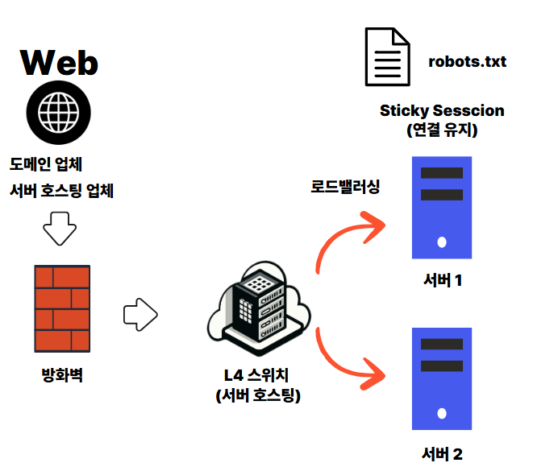

# IIS 웹 서버 (네트워크 흐름, 로그 구조, robots.txt)



## 웹 호스팅 주요 흐름

- **웹 접속**

  - 사용자가 웹주소 입력 → DNS 도메인 업체 (도메인 → 컴퓨터 주소(IP 주소))
  - 주소(IP) → 서버로 접속 시도 (서버 호스팅 업체)
    - 예시 카페24, AWS

- **방화벽**

  - 사용자 요청 방화벽 검사
    - 비허용 포트 접속
    - 특정 IP 접속 차단

- **L4 스위치 (로드밸런서 역할)**

  - L4(IP) 기반 로드 밸런싱 수행
  - 사용자 요청 **서버 1 or 서버 2** 분산

- **Sticky Session (연결 유지)**

  - 최초 접속한 서버(서버 1이라면 계속 서버 1로)로 고정

- **robots.txt 등 정적 파일은 개별 서버에 존재**

  - 로드된 서버에서 직접 응답

- 용어 설명
  - ※ Sticky Session : 한 번 연결된 사용자가 항상 같은 서버로 연결되도록 유지하는 방식
  - ※ L4 스위치 : IP/포트 기반으로 요청을 여러 서버로 분산시켜주는 장치


## IIS (Internet Information Services)

- 웹 서버 소프트웨어
- **Windows Server** 운영체제에 포함
- **ASP.NET** : .NET 기반 웹앱 실행

### IIS 로그

- 기본 경로 (Windows 기준)
  - C:\inetpub\logs\LogFiles\W3SVC[n]
    - W3SVC[n] : IIS에서 자동으로 부여한 사이트 ID
    - W3SVC1 = 첫 번째 웹사이트
- 로그 파일
  - 파일 : u_ex250528.log → 2025년 5월 28일 로그
  - 생성 기준 : 매일 UTC 기준 00시를 기준으로 새로 생성 (한국 오전 09:00)
    - 전 세계 환경에서 시간 충돌 방지
- 로그파일 형식

```sql
#Fields: date time s-ip cs-method cs-uri-stem cs-uri-query s-port cs-username c-ip cs(User-Agent) cs(Referer) sc-status sc-substatus sc-win32-status time-taken

데이터 예시
2025-05-28 00:00:00 192.168.123.1 GET /temp/test test=123&testB=Y 80 - 192.168.123.123 UserAgent - 200 0 0 109

```

| **Date**            | **요청이 발생한 날짜 (YYYY-MM-DD 형식)**                           |
| ------------------- | ------------------------------------------------------------------ |
| **Time**            | 요청 시간 (HH:MM:SS, UTC 기준)                                     |
| **s-ip**            | 요청을 처리한 서버의 IP 주소                                       |
| **cs-method**       | 요청 방식 (예: GET, POST, PUT, DELETE)                             |
| **cs-uri-stem**     | 요청된 URL의 경로 부분 (쿼리스트링 제외)                           |
| **cs-uri-query**    | 요청 URL의 쿼리 문자열 (물음표 ? 뒤 부분)                          |
| **s-port**          | 요청이 들어온 서버 포트 번호 (예: 80, 443)                         |
| **cs-username**     | 인증된 사용자 이름 (로그인이 필요한 요청에서만 기록됨, 익명이면 -) |
| **c-ip**            | 요청을 보낸 클라이언트의 IP 주소                                   |
| **cs(User-Agent)**  | 클라이언트의 사용자 에이전트 (브라우저, 봇, 앱 등)                 |
| **cs(Referer)**     | 요청 이전 페이지의 URL (리퍼러 헤더, 빈 값이면 -)                  |
| **sc-status**       | HTTP 응답 상태 코드 (예: 200, 404, 500)                            |
| **sc-substatus**    | IIS가 정의한 HTTP 하위 상태 코드 (0이 많음, 세부 원인 분석용)      |
| **sc-win32-status** | Windows 기반 상태 코드 (Winsock 오류 등, 0이면 정상)               |
| **time-taken**      | 요청 처리 시간 (밀리초 기준, 예: 109ms)                            |

## Robots.txt

- 위치 :
  - 서버 별 루트 디렉토리
- 역활

  - 웹사이트에 웹 크롤러 같은 로봇들의 접근을 제어하기 위한 규약
  - 권고 사항이기 때문에, 지켜야할 의무는 없다.

### User-agent

- 내용
  - robots.txt 에서 지정하는 크롤링 규칙이 적용되어야 할 크롤러를 지정합니다.
- 종류 예시
  - Googlebot
  - bingbot
  - Facebot
  - Microsoft Azure

```
# 모든 검색 엔진 봇에 적용
      User-agent: *
#   구글 봇에만 적용
      User-agent: Googlebot
```

### Disallow

- 지정한 경로를 크롤링 금지
- /는 사이트 전체 금지
- 공백이면 "제한 없음"

### Allow

- 크롤링을 허용할 경로

> [!WARNING]
>
> Disallow 와 Allow의 Url 링크는 대소문자를 구분하지 못합니다!! 꼭 주의해주세요.

```

# /admin/ 아래 모든 페이지 금지

    Disallow: /admin/

# /product/ 아래 모든 페이지 허용

    Allow: /product/

# 특정 파일 금지

    Disallow: /private.html

# 전체 사이트 금지

    Disallow: /

# 크롤링 금지 없음

    Disallow:

```

### 예시

- 모든 크롤러가 사이트 전체 접근 가능

```
    User-agent: *
    Disallow:
```

### 예시2

- 구글 봇의 /admin/ 하위 경로들 전부 차단

```

    User-agent: Googlebot
    Disallow: /admin/

```
