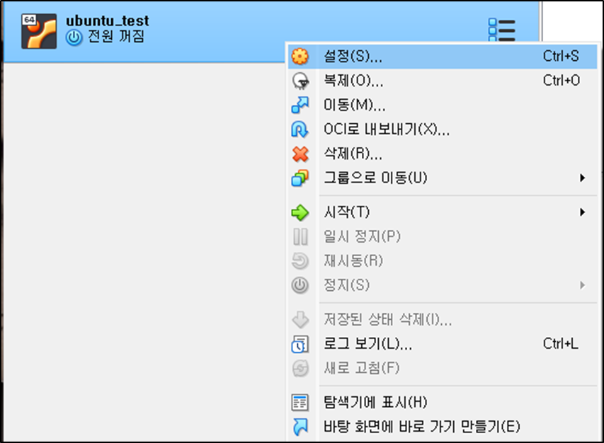

# Virtual 머신 - 디스크 마운트 방법 정리

## Ubuntu Server 버전 설치 (CLI 환경)

### Virtual 머신 설정

### 설정 / 공유폴더

## 공유 Shared 설치 (파일 업로드)

### Guest Additions CD 마운트

- sudo apt update
- sudo apt install build-essential dkms linux-headers-$(uname -r)

### 우분투에서 CD 마운트하고 실행:

- VirtualBox 메뉴 ➜ 장치 ➜ Guest Additions CD 이미지 삽입

### 게스트 확장 이미지를 마운트할 폴더 생성

- sudo mkdir /media/cdrom

### 게스트 확장 이미지 마운트

- sudo mount /dev/cdrom /media/cdrom

### 게스트 확장 이미지 설치 및 재부팅

- cd /media/cdrom
- sudo sh VBoxLinuxAdditions.run
- sudo reboot

### 현재 사용자 vboxsf 그룹에 추가

- sudo usermod -aG vboxsf $(whoami)
- sudo reboot

### 마운트할 폴더 생성

- sudo mkdir /mnt/shared

### 폴더 마운트(공유)

- sudo mount -t vboxsf shared /mnt/shared

### 마운트 폴더 이동

- cd /mnt/shared

### 전체 파일 복사해서 가져오기

- cp -r \* ~
